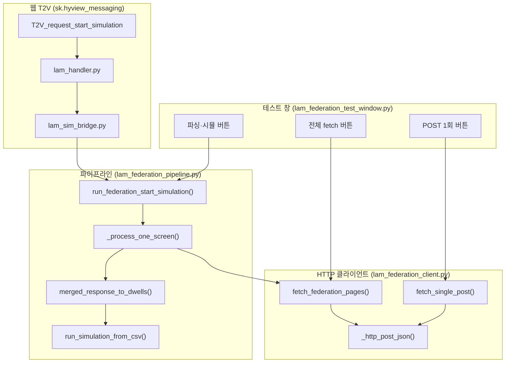

# LAM Federation API 테스트 창 가이드

> **대상:** `morph.lam_control_1` Federation 연동 개발·실무 검증  
> **관련 SSOT:** `docs/lam_control_1_web_connection_spec_ko.md`  
> **설정 SSOT:** `source/extensions/morph.lam_control_1/morph/lam_control_1/lam_sim_control_defaults.py`

---

## 1. 테스트 창이 하는 일

**LAM Federation API Test** 창은 HyView 웹 T2V 경로와 **동일한 HTTP client·pagination·parser·prerun·재생 파이프라인**을 Kit 안에서 단계별로 검증하기 위한 UI입니다.

웹·스트리밍 연결 전에도 이 창만으로 다음을 확인할 수 있습니다.

- Federation API POST 성공 여부
- `has_next` pagination 병합
- API `rows` → CSV 동등 파싱
- prerun 빌드
- 화면별 시뮬레이션 자동 재생

---

## 2. 창 여는 방법

### 2.1 수동

1. Kit 실행 (`morph.lam_control_1` 활성)
2. **LAM Multi-USD Load** 메인 창 열기
3. 하단 **도구** 영역 → **Federation API 테스트** 버튼 클릭

### 2.2 앱 시작 시 자동

`lam_sim_control_defaults.py`에서:

```python
FEDERATION_TEST_WINDOW_AUTO_SHOW: bool = True
```

| 값 | 동작 |
|----|------|
| `True` | 앱 시작 시 테스트 창 자동 표시 |
| `False` | 수동으로만 열기 (기본값) |

---

## 3. 입력 항목 상세

### 3.1 URL

Federation API POST 주소입니다.

- 기본값: `http://federation.digitaltwin.internal/queries/mcc-target-prev-lot-history/run`
- **fixture 체크 시:** 실제 HTTP에는 사용되지 않음 (로컬 JSON 사용)
- **fixture 해제 시:** 이 주소로 실제 POST 요청

### 3.2 Request body (JSON)

웹 T2V payload의 `configs[n]` **한 화면 분량**에 해당하는 본문을 입력합니다.

예시:

```json
{
  "fab_id": "FAB01",
  "mt": "SC2HM",
  "eqp_id": "EQP_SAMPLE",
  "lot_id": "TAGUB84",
  "mt_from": "2026-06-01 00:00:00",
  "mt_to": "2026-06-02 00:00:00"
}
```

**중요:**

- `파싱·시뮬` 실행 시 **`eqp_id`는 필수**입니다.
- API 응답 `rows`에는 `eqp_id` 컬럼이 없으므로, body의 `eqp_id`가 **모든 행에 주입**됩니다.
- `limit` / `offset`은 웹 body에 넣지 않습니다. Kit가 pagination 시 자동으로 붙입니다.

### 3.3 limit

한 번의 API 요청에서 가져올 최대 row 수 (페이지 크기)입니다.

동작 예 (`limit=1000`):

1. `offset=0`, `limit=1000` 으로 POST
2. 응답 `pagination.has_next == true` 이면 `offset` 증가 후 반복
3. `has_next == false` 가 될 때까지 수집
4. 모든 페이지의 `rows`를 순서대로 이어 붙임

웹 T2V 경로의 limit SSOT는 `sk.hyview_messaging/lam_handler_config.py`의 `FEDERATION_FETCH_LIMIT`입니다. 테스트 창에서는 UI에서 override 가능합니다.

### 3.4 screen

`파싱·시뮬` 버튼이 **어느 화면에서 시뮬레이션할지** 지정합니다.

| 값 | 의미 |
|----|------|
| `1` | 화면1만 사용 (`[{body}, {}]` 와 동일) |
| `2` | 화면2만 사용 (`[{}, {body}]` 와 동일) |

**주의:**

- `파싱·시뮬`에서 screen=2를 선택하면 화면1은 숨기고 화면2만 표시·재생합니다.
- `POST 1회` / `전체 fetch`에서는 **로그에 기록할 화면 번호** 정도의 의미이며, 화면 표시·시뮬에는 영향을 주지 않습니다.

### 3.5 fixture (체크박스)

실제 API 대신 **로컬 샘플 JSON**을 쓸지 선택합니다.

| 상태 | 동작 |
|------|------|
| **체크** | 네트워크 없이 fixture JSON 사용 (오프라인 파서·pagination 검증) |
| **해제** | URL로 실제 HTTP POST |

Fixture 파일 위치:

```
source/extensions/morph.lam_control_1/data/federation_fixture/
├── sample_mcc_target_prev_lot_history.json   # 단일 페이지 샘플
├── page_0.json                             # pagination 1페이지 (has_next=true)
└── page_2.json                             # pagination 2페이지 (offset=2, has_next=false)
```

fixture 모드에서는 **URL, Bearer, headers가 실제 요청에 쓰이지 않습니다.**

기본값은 `lam_sim_control_defaults.py`의 `FEDERATION_USE_FIXTURE` (현재 `False`)이며, 테스트 창 체크박스가 우선 적용됩니다.

### 3.6 Bearer

API 인증 토큰입니다.

- 값이 있으면 `Authorization: Bearer <token>` 헤더가 자동 추가됩니다.
- **비우면** 인증 헤더 없이 POST합니다 (인증 불필요 환경).
- 입력창은 password 형태이며, **로그에 토큰 전체를 출력하지 않습니다.**

입력 시 `Bearer ` 접두어는 넣지 말고 **토큰 값만** 입력하세요.

코드 기본값: `lam_sim_control_defaults.py` → `FEDERATION_BEARER_TOKEN`

### 3.7 headers (JSON)

Bearer 외 추가 HTTP 헤더입니다. JSON 객체 형태로 입력합니다.

예시:

```json
{
  "X-API-Key": "secret-key",
  "X-Tenant-ID": "FAB01"
}
```

비우거나 `{}` 이면 추가 헤더 없음.

코드 기본값: `lam_sim_control_defaults.py` → `FEDERATION_EXTRA_HEADERS`

---

## 4. 버튼 역할

### 4.1 POST 1회

API를 **정확히 1번만** 호출합니다.

| 수행 | 미수행 |
|------|--------|
| HTTP POST 1회 | pagination 반복 |
| 응답 원문 표시 | 파싱 |
| | prerun |
| | 시뮬레이션 |

**용도:** URL·인증·body 형식이 맞는지 **가장 먼저** 확인할 때 사용합니다.

### 4.2 전체 fetch

`has_next=false` 가 될 때까지 **모든 페이지를 수집·병합**합니다.

```
POST → pagination 반복 → rows 병합 → 결과 표시
```

| 수행 | 미수행 |
|------|--------|
| 전체 pagination | dwell 파싱 |
| rows 병합 | prerun |
| 병합 결과 로그 표시 | 시뮬레이션 |

**용도:** 대량 데이터·pagination 동작만 확인할 때 사용합니다. `파싱·시뮬` 전에 반드시 누를 필요는 없습니다.

### 4.3 파싱·시뮬

**실무 운영과 동일한 전체 파이프라인**을 한 번에 실행합니다.

```
전체 pagination fetch
  → rows 병합
  → API rows 파싱 (eqp_id 주입)
  → ParsedCsvRow / DwellRecord 생성
  → build_csv_playback_plan (prerun)
  → 선택한 screen 에서 자동 재생
```

| 수행 |
|------|
| 전체 fetch |
| 파싱 |
| prerun |
| 화면 표시 규칙 적용 (screen 1 또는 2) |
| 시뮬레이션 자동 시작 |

**용도:** 최종 통합 테스트. `전체 fetch`를 먼저 누르지 않아도 됩니다.

---

## 5. 버튼별 비교표

| 항목 | POST 1회 | 전체 fetch | 파싱·시뮬 |
|------|:--------:|:----------:|:---------:|
| HTTP POST | 1회 | N회 (pagination) | N회 (pagination) |
| rows 병합 | ✗ | ✓ | ✓ |
| 파싱 | ✗ | ✗ | ✓ |
| prerun | ✗ | ✗ | ✓ |
| 시뮬 재생 | ✗ | ✗ | ✓ |
| screen 영향 | 로그만 | 로그만 | 표시·재생 대상 |

---

## 6. 권장 테스트 순서

### 6.1 오프라인 (fixture)

1. **fixture 체크** + **POST 1회** — fixture JSON 구조 확인
2. **fixture 체크** + **전체 fetch** — `page_0` + `page_2` pagination 병합 확인
3. **fixture 체크** + **파싱·시뮬** — 파서·prerun·Kit 재생 확인

### 6.2 실 API (Live)

1. **fixture 해제** + URL/body 입력
2. (필요 시) Bearer / headers 설정
3. **POST 1회** — 연결·인증·응답 형식 확인
4. **전체 fetch** — 실제 pagination·row 수 확인
5. **파싱·시뮬** — 실 API 통합 테스트

---

## 7. 로그 확인 위치

### 7.1 테스트 창

창 하단 **응답 / 로그** 영역에 HTTP status, pagination 요약, JSON 샘플, 오류 메시지가 표시됩니다.

### 7.2 Kit 콘솔

| 접두어 | 구간 |
|--------|------|
| `[LAM/federation]` | HTTP 요청·pagination·fetch 완료 |
| `[LAM/api-parser]` | rows → dwell 파싱 통계 |
| `[LAM/federation-pipe]` | 화면 표시·prerun·재생 오케스트레이션 |
| `[LAM/csv-prerun]` | prerun 타임라인 빌드 |
| `[LAM/sim]` | CSV 재생 (dwell·블록·배속) |

토큰 값은 콘솔에도 **마스킹**되어 출력됩니다.

---

## 8. 코드 기본 설정 (`lam_sim_control_defaults.py`)

| 설정 | 설명 | 기본값 |
|------|------|--------|
| `FEDERATION_QUERY_URL` | POST URL | 내부 Federation URL |
| `FEDERATION_FETCH_LIMIT` | 페이지당 limit | `1000` |
| `FEDERATION_FETCH_TIMEOUT_SEC` | 화면당 전체 fetch 타임아웃 [s] | `300.0` |
| `FEDERATION_USE_FIXTURE` | fixture 기본 사용 여부 | `False` |
| `FEDERATION_TEST_WINDOW_AUTO_SHOW` | 시작 시 테스트 창 자동 표시 | `False` |
| `FEDERATION_BEARER_TOKEN` | Bearer 토큰 (비우면 무인증) | `""` |
| `FEDERATION_EXTRA_HEADERS` | 추가 HTTP 헤더 | `{}` |
| `FEDERATION_LOG_ROW_SAMPLE` | 응답 로그 rows 샘플 수 | `5` |
| `FEDERATION_LOG_FULL_RESPONSE` | 응답 JSON 전체 콘솔 출력 | `False` |

테스트 창 UI 값은 위 기본값을 **초기값**으로 채우며, 창에서 변경한 값이 해당 세션 요청에 우선 적용됩니다.

---

## 9. 자주 묻는 질문

### Q. fixture를 켜도 URL을 바꿔야 하나요?

아니요. fixture 모드에서는 URL·Bearer·headers가 실제 HTTP에 사용되지 않습니다.

### Q. `전체 fetch` 후에 `파싱·시뮬`을 또 눌러야 하나요?

아니요. `파싱·시뮬`이 fetch부터 재생까지 전부 수행합니다. `전체 fetch`는 중간 결과만 보고 싶을 때 별도로 쓰는 버튼입니다.

### Q. screen=1과 screen=2의 차이는?

`파싱·시뮬` 시 어느 viewport에서 시뮬할지, 그리고 다른 화면을 숨길지 결정합니다. HyView `configs` 배열에서 한 칸만 채운 경우와 동일합니다.

### Q. 인증이 필요 없는 환경인가요?

네, 기본은 **인증 없이 POST**합니다. Bearer 또는 headers JSON에 값을 넣으면 해당 헤더가 추가됩니다.

---

## 10. 관련 소스 파일 (전체 경로)

| 파일 | 역할 |
|------|------|
| `source/extensions/morph.lam_control_1/morph/lam_control_1/lam_sim_control_defaults.py` | URL·limit·인증·fixture 등 **기본 설정 SSOT** |
| `source/extensions/morph.lam_control_1/morph/lam_control_1/lam_federation_client.py` | **HTTP POST·pagination·헤더 조립** (핵심) |
| `source/extensions/morph.lam_control_1/morph/lam_control_1/lam_federation_test_window.py` | 테스트 창 UI → client/pipeline 호출 |
| `source/extensions/morph.lam_control_1/morph/lam_control_1/lam_federation_pipeline.py` | fetch → 파싱 → prerun → 재생 오케스트레이션 |
| `source/extensions/morph.lam_control_1/morph/lam_control_1/lam_api_timeline_parser.py` | API `rows` → `ParsedCsvRow` / `DwellRecord` |
| `source/extensions/sk.hyview_messaging/sk/hyview_messaging/lam_sim_bridge.py` | 웹 T2V → 동일 pipeline 호출 |
| `source/extensions/sk.hyview_messaging/sk/hyview_messaging/lam_handler_config.py` | 웹 경로 `limit` override |
| `source/extensions/morph.lam_control_1/data/federation_fixture/` | 오프라인 테스트용 JSON |

---

## 11. Kit에서 API 요청이 일어나는 전체 흐름

Kit 안에서 Federation API를 호출하는 경로는 **두 가지**입니다. 둘 다 최종적으로 `lam_federation_client.py`의 같은 함수를 사용합니다.



### 11.1 테스트 창 경로

| 버튼 | 호출 함수 | 파일 |
|------|-----------|------|
| POST 1회 | `fetch_single_post()` | `lam_federation_test_window.py` → `lam_federation_client.py` |
| 전체 fetch | `fetch_federation_pages()` | 동일 |
| 파싱·시뮬 | `run_federation_start_simulation()` | `lam_federation_test_window.py` → `lam_federation_pipeline.py` → 내부에서 `fetch_federation_pages()` |

### 11.2 웹 T2V 경로 (실무 런타임)

```
웹 버튼 클릭
  → T2V_request_start_simulation { "configs": [ {...}, {...} ] }
  → sk/hyview_messaging/extension_handlers/lam_handler.py
  → sk/hyview_messaging/lam_sim_bridge.py :: handle_start_simulation()
  → lam_federation_pipeline.py :: run_federation_start_simulation()
  → lam_federation_client.py :: fetch_federation_pages()  (화면별 병렬)
```

테스트 창과 웹 T2V는 **HTTP client·pagination·parser 코드를 공유**합니다. 테스트 창에서 검증한 내용이 실무 경로에도 그대로 적용됩니다.

---

## 12. 실제 HTTP 요청 형태 (Wire 레벨)

Kit는 Python 표준 라이브러리 `urllib.request`로 POST합니다. 외부 HTTP 라이브러리는 사용하지 않습니다.

### 12.1 POST 1회 (`fetch_single_post`)

웹/테스트 창에서 입력한 body를 **그대로** 1회 전송합니다. `limit`/`offset`은 붙이지 않습니다.

```http
POST /queries/mcc-target-prev-lot-history/run HTTP/1.1
Host: federation.digitaltwin.internal
Content-Type: application/json
Authorization: Bearer <토큰>          ← FEDERATION_BEARER_TOKEN 또는 테스트 창 Bearer (있을 때만)
X-API-Key: <값>                       ← FEDERATION_EXTRA_HEADERS (있을 때만)

{
  "fab_id": "FAB01",
  "mt": "SC2HM",
  "eqp_id": "EQP_SAMPLE",
  "lot_id": "TAGUB84",
  "mt_from": "2026-06-01 00:00:00",
  "mt_to": "2026-06-02 00:00:00"
}
```

### 12.2 전체 fetch / 파싱·시뮬 (`fetch_federation_pages`)

Kit가 **매 페이지마다** body에 `limit`과 `offset`을 **덮어써서** 추가합니다.

**1페이지 (offset=0):**

```json
{
  "fab_id": "FAB01",
  "mt": "SC2HM",
  "eqp_id": "EQP_SAMPLE",
  "lot_id": "TAGUB84",
  "mt_from": "2026-06-01 00:00:00",
  "mt_to": "2026-06-02 00:00:00",
  "limit": 1000,
  "offset": 0
}
```

**2페이지 (응답 `pagination.has_next=true` 일 때):**

```json
{
  "...": "...",
  "limit": 1000,
  "offset": 1000
}
```

`offset` 증가 규칙 (`lam_federation_client.py` 180행 근처):

```python
offset += int(pag.get("limit") or limit or 1)
```

즉, 이전 응답의 `pagination.limit` 값(없으면 요청 limit)만큼 offset을 증가시킵니다.

### 12.3 기대 응답 형식

```json
{
  "query_id": "mcc-target-prev-lot-history",
  "columns": ["lot_flag", "module_nm", "lot_id", "..."],
  "rows": [
    ["prev", "AtmArm-EndEffector11", "TAGUB84", "..."]
  ],
  "pagination": {
    "limit": 1000,
    "offset": 0,
    "has_next": true
  }
}
```

`has_next`가 `false`가 될 때까지 반복한 뒤, 모든 `rows`를 순서대로 이어 붙입니다.

---

## 13. 핵심 코드 구현 (파일별 · 실무 수정용)

아래는 **현재 저장소의 실제 구현**입니다. 실무에서 수정할 때 이 함수들을 직접 열면 됩니다.

### 13.1 기본 설정 — `lam_sim_control_defaults.py`

실무 배포 시 **가장 먼저 수정하는 파일**입니다.

```python
# source/extensions/morph.lam_control_1/morph/lam_control_1/lam_sim_control_defaults.py

FEDERATION_QUERY_URL: str = (
    "http://federation.digitaltwin.internal/queries/mcc-target-prev-lot-history/run"
)
FEDERATION_FETCH_LIMIT: int = 1000
FEDERATION_FETCH_TIMEOUT_SEC: float = 300.0
FEDERATION_USE_FIXTURE: bool = False

# 인증 — 비우면 헤더 없이 POST
FEDERATION_BEARER_TOKEN: str = ""
FEDERATION_EXTRA_HEADERS: dict = {}   # 예: {"X-API-Key": "..."}
```

| 수정 목적 | 수정할 상수 |
|-----------|-------------|
| API 주소 변경 | `FEDERATION_QUERY_URL` |
| 페이지 크기 변경 | `FEDERATION_FETCH_LIMIT` |
| fetch 전체 타임아웃 | `FEDERATION_FETCH_TIMEOUT_SEC` |
| Bearer 토큰 | `FEDERATION_BEARER_TOKEN` |
| API Key 등 추가 헤더 | `FEDERATION_EXTRA_HEADERS` |
| 오프라인 fixture 강제 | `FEDERATION_USE_FIXTURE = True` |

웹 T2V 경로의 limit만 별도로 바꾸려면:

```python
# source/extensions/sk.hyview_messaging/sk/hyview_messaging/lam_handler_config.py
FEDERATION_FETCH_LIMIT: int = 1000
```

### 13.2 HTTP 헤더 조립 — `build_request_headers()`

파일: `lam_federation_client.py` (28~47행)

```python
def build_request_headers(*, bearer_token="", extra_headers=None):
    headers = {"Content-Type": "application/json"}
    tok = str(bearer_token or "").strip()
    if tok:
        headers["Authorization"] = f"Bearer {tok}"
    for k, v in dict(extra_headers or {}).items():
        if str(k).strip():
            headers[str(k)] = str(v)
    return headers
```

**실무 수정 예 — API Key만 쓰는 환경:**

```python
FEDERATION_BEARER_TOKEN = ""
FEDERATION_EXTRA_HEADERS = {
    "X-API-Key": "실무_API_KEY",
    "X-Fab-Id": "FAB01",
}
```

Bearer와 API Key를 **동시에** 쓰는 환경이면 둘 다 채우면 됩니다.

### 13.3 실제 POST 1회 — `_http_post_json()`

파일: `lam_federation_client.py` (84~109행)

```python
def _http_post_json(url, body, *, headers, timeout_sec):
    payload = json.dumps(body, ensure_ascii=False).encode("utf-8")
    req = urllib.request.Request(url, data=payload, headers=headers, method="POST")
    with urllib.request.urlopen(req, timeout=float(timeout_sec)) as resp:
        status = int(resp.status)
        raw = resp.read().decode("utf-8", errors="replace")
    return status, json.loads(raw), raw
```

| 항목 | 값 |
|------|-----|
| Method | 항상 `POST` |
| Body encoding | UTF-8 JSON |
| Timeout (POST 1회) | 60초 고정 (`fetch_single_post`) |
| Timeout (전체 fetch) | `FEDERATION_FETCH_TIMEOUT_SEC` (기본 300초) |
| HTTP 4xx/5xx | `RuntimeError`로 상위 전달 (전체 fetch 시) |

SSL/인증서 문제, 프록시 등이 있으면 **이 함수**를 수정하는 지점입니다.

### 13.4 Pagination 루프 — `fetch_federation_pages()`

파일: `lam_federation_client.py` (112~204행)

```python
while True:
    page_body = dict(body or {})
    page_body["limit"] = int(limit)
    page_body["offset"] = int(offset)

    status, data, raw = _http_post_json(url, page_body, headers=headers, timeout_sec=timeout_sec)

    merged_rows.extend(data.get("rows") or [])
    pag = data.get("pagination") or {}
    has_next = bool(pag.get("has_next"))

    if not has_next:
        break
    offset += int(pag.get("limit") or limit or 1)
```

**실무에서 pagination 규칙이 다를 때 수정하는 곳:**

| 상황 | 수정 위치 |
|------|-----------|
| `has_next` 키 이름이 다름 | `pag.get("has_next")` |
| offset 증가 방식이 다름 | `offset += ...` 한 줄 |
| limit/offset을 query string으로 보내야 함 | `_http_post_json()` 또는 URL 조립 로직 추가 |
| 응답이 `{ "data": { "rows": ... } }` 중첩 구조 | `data.get("rows")` → 실제 경로로 변경 |

### 13.5 테스트 창 버튼 → client 연결

파일: `lam_federation_test_window.py`

**POST 1회** (`_on_fetch_once`, 123~151행):

```python
status, data, raw = fetch_single_post(
    url=vals["url"],
    body=body,                        # Request body JSON
    bearer_token=vals["token"],
    extra_headers=vals["headers"],
    use_fixture=vals["use_fixture"],
)
```

**전체 fetch** (`_on_fetch_all`, 153~183행):

```python
merged, meta = fetch_federation_pages(
    url=vals["url"],
    body=body,
    limit=vals["limit"],
    screen=vals["screen"],
    bearer_token=vals["token"],
    extra_headers=vals["headers"],
    use_fixture=vals["use_fixture"],
)
```

**파싱·시뮬** (`_on_parse_sim`, 185~211행):

```python
payload = {"configs": [{}, {}]}
payload["configs"][screen - 1] = body   # screen=1 → [body, {}], screen=2 → [{}, body]

run_federation_start_simulation(
    self._ext, payload, auto_play=True,
    limit_override=vals["limit"],
    url_override=vals["url"],
    use_fixture_override=vals["use_fixture"],
    bearer_token_override=vals["token"],
    extra_headers_override=vals["headers"],
)
```

테스트 창 UI 값이 `lam_sim_control_defaults.py` 기본값보다 **우선**합니다 (`*_override` 인자).

### 13.6 파이프라인 — `_process_one_screen()`

파일: `lam_federation_pipeline.py` (63~140행 근처)

```python
def _process_one_screen(ext, lam_window, screen, body, *, url, limit, ...):
    eqp_id = str(body.get("eqp_id") or "").strip()
    if not eqp_id:
        return ScreenPipelineResult(screen, False, "eqp_id missing in config body", meta)

    # 1) API fetch (pagination 포함)
    merged, fetch_meta = fetch_federation_pages(url=url, body=body, limit=limit, ...)

    # 2) rows → dwell 파싱
    dwells, parse_stats = merged_response_to_dwells(merged, eqp_id=eqp_id)

    # 3) prerun 빌드
    cached = build_and_cache_from_dwells(vpath, dwells)
    prerun = build_prerun_result_from_cached(cached, screen=screen)

    # 4) 자동 재생 (백그라운드 스레드)
    run_simulation_from_csv(registry, scheduler, prepared=cached, play_screen=screen, ...)
```

화면이 2개이면 `ThreadPoolExecutor(max_workers=2)`로 **병렬 fetch**합니다.

### 13.7 eqp_id 주입 — `rows_to_parsed_csv_rows()`

파일: `lam_api_timeline_parser.py` (49~98행)

API 응답 `rows`에는 `eqp_id` 컬럼이 없습니다. body의 `eqp_id`를 모든 행에 넣습니다.

```python
parsed.append(ParsedCsvRow(
    eqp_id=eqp,                    # ← body에서 주입 (eqp_id 인자)
    module_nm=mod,
    lot_id=lot,
    cassette_slot=cs,
    eqp_start_tm=float(start),
    eqp_end_tm=float(end),
    process_tm=parse_time_to_seconds(pt_raw),
))
```

**실무 수정 예 — API에 `eqp_id` 컬럼이 추가된 경우:**

```python
eqp = str(raw.get("eqp_id") or eqp_id or "").strip()
```

행 값 우선, 없으면 body fallback.

### 13.8 웹 T2V 연결 — `handle_start_simulation()`

파일: `sk/hyview_messaging/lam_sim_bridge.py` (22~61행)

```python
run_federation_start_simulation(
    ext,
    dict(payload or {}),
    on_complete=_on_complete,
    auto_play=True,
    limit_override=int(FEDERATION_FETCH_LIMIT),  # lam_handler_config.py
)
```

웹 payload 예:

```json
{
  "configs": [
    { "fab_id": "FAB01", "eqp_id": "EQP_A", "lot_id": "LOT1", "mt_from": "...", "mt_to": "..." },
    { "fab_id": "FAB01", "eqp_id": "EQP_B", "lot_id": "LOT2", "mt_from": "...", "mt_to": "..." }
  ]
}
```

`configs[0]` → 화면1, `configs[1]` → 화면2. `{}`이면 해당 화면 스킵.

---

## 14. 실무 수정 체크리스트

### 14.1 인증 없이 POST (현재 기본)

```python
FEDERATION_BEARER_TOKEN = ""
FEDERATION_EXTRA_HEADERS = {}
```

### 14.2 Bearer 토큰 추가

```python
FEDERATION_BEARER_TOKEN = "eyJhbGciOiJIUzI1NiIsInR5cCI6IkpXVCJ9..."
```

→ `Authorization: Bearer eyJ...` 헤더 자동 추가. 로그에는 마스킹 출력.

### 14.3 API Key 헤더 추가

```python
FEDERATION_EXTRA_HEADERS = {"X-API-Key": "your-api-key-here"}
```

### 14.4 API URL 변경

```python
FEDERATION_QUERY_URL = "http://새-호스트/queries/새-query-id/run"
```

테스트 창 URL 필드로도 당장 override 가능 (재시작 없이).

### 14.5 limit / timeout 변경

| 항목 | 수정 위치 |
|------|-----------|
| Kit 기본 limit | `lam_sim_control_defaults.py` → `FEDERATION_FETCH_LIMIT` |
| 웹 T2V limit | `lam_handler_config.py` → `FEDERATION_FETCH_LIMIT` |
| 테스트 1회성 | 테스트 창 `limit` 입력 필드 |
| 전체 fetch 타임아웃 | `FEDERATION_FETCH_TIMEOUT_SEC` (기본 300초) |

### 14.6 Request body 필드 추가

1. 웹·테스트 창 body JSON에 필드 추가
2. Federation API가 해당 필드를 받는지 **POST 1회**로 먼저 확인
3. Kit는 body를 API에 **그대로 전달** (`page_body = dict(body)`)
4. 응답 파싱만 바꾸면 됨 → `lam_api_timeline_parser.py`

### 14.7 응답 형식이 다를 때

| 변경 내용 | 수정 파일·함수 |
|-----------|----------------|
| 컬럼명 매핑 | `lam_api_timeline_parser.py` → `rows_to_parsed_csv_rows()` |
| 중첩 JSON 구조 | `merged_response_to_dwells()` 진입 전 전처리 추가 |
| `module_nm` 스킵 | `simulation_play.py` → `parse_module_nm_to_slot_key()` |

### 14.8 fixture로 오프라인 검증

```python
FEDERATION_USE_FIXTURE = True
```

실 API 응답을 `data/federation_fixture/sample_mcc_target_prev_lot_history.json`에 복사하면 동일 파서로 재현 테스트 가능.

---

## 15. 디버깅 — 어느 단계에서 실패했는지

| 증상 | 확인할 로그 | 의심 구간 |
|------|-------------|-----------|
| 연결 자체 실패 | `HTTP 0:` 또는 timeout | URL, 방화벽, `FEDERATION_QUERY_URL` |
| 401/403 | `HTTP 401:` / `HTTP 403:` | Bearer, `FEDERATION_EXTRA_HEADERS` |
| 200인데 rows=0 | `page 1 ... rows=0` | body 조건 (mt_from/mt_to 등) |
| pagination 무한 | `pagination exceeded 10000 pages` | `has_next` 응답 값 |
| 파싱 후 dwell=0 | `[LAM/api-parser] dwells=0` | `module_nm` 매핑 |
| prerun OK, 재생 안 됨 | prerun 로그 이후 없음 | Master USD, registry/scheduler |
| eqp_id 오류 | `eqp_id missing in config body` | Request body에 `eqp_id` 추가 |

콘솔 로그 예:

```
[LAM/federation] fetch start screen=1 url='http://...' limit=1000 token=(none) body={...}
[LAM/federation] page 1 offset=0 status=200 rows=50 has_next=True meta={...}
[LAM/federation] fetch done screen=1 pages=3 rows=1250 elapsed=2.34s
[LAM/api-parser] parse: rows=1250 parsed=1250 dwells=1180 skip=70 dup=0
[LAM/federation-pipe] prerun screen=1 items=420 duration=3600.0s
```
