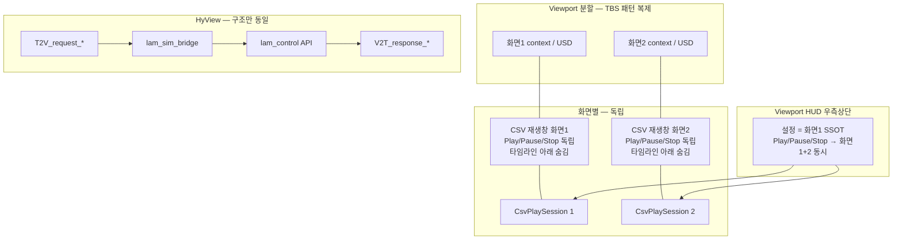

# LAM Control — TBS Control 2 패턴 포팅 기획 (피드백용)

> **상태:** v1.1 — Q1~Q10 피드백 전부 확정 (구현 착수 대기)  
> **구현 대상 확장:** `morph.lam_control_1` (`morph.lam_control` 은 롤백용·미수정)  
> **다음 단계:** 본 문서 피드백 확정 → 구현 착수

---

## 1. 핵심 원칙 (합의 전제)

| 원칙 | 내용 |
|------|------|
| **독립 확장** | `morph.lam_control`은 `morph.tbs_control_2`를 **import·참조하지 않음** |
| **패턴 포팅** | Dock 분할, ViewportWidget 50:50, 화면별 제어, HUD, HyView 브리지 **구조**는 TBS와 동일하게 **새 모듈로 재구현** |
| **엔진 차이 유지** | LAM 시뮬은 **SimPy 없음** — CSV dwell 파싱 → wall-clock 스케줄 → `LamSequenceRunner` JSON 실행 (현행 유지) |
| **피드백 후 구현** | Q1~Q8 확정 완료 → §9 순서대로 구현 |

---

## 2. 현재 상태 요약 (코드 기준)

### 2.1 LAM (`morph.lam_control`) — 오늘

| 영역 | 현재 | 주요 파일 |
|------|------|-----------|
| 시뮬 엔진 | **CSV 파싱 + 실시간 재생** (SimPy 없음) | `simulation_play.py`, `lam_sequence_engine.py` |
| 재생 UI | **단일** `LamSimulationCsvPlayWindow` + 전역 play/pause/stop 상태 | `simulation_play.py`, `lam_window.py` |
| Viewport | **단일** (default 또는 `LAM Viewport` fallback) | `lam_viewport.py` |
| Viewport HUD | **우측 상단** CSV 미니 패널 (`csv_play_hud` frame) | `lam_csv_viewport_hud.py` |
| HUD 타임라인 | 본문 창에는 ScrollingFrame 타임라인 **표시** / HUD 하단은 **이미 주석 처리(숨김)** | `simulation_play.py`, `lam_csv_viewport_hud.py` |
| 웹 연동 | `remote_api.py` + `morph.lam_web_bridge` (HTTP, **HyView 아님**) | `remote_api.py` |
| 듀얼 화면 | **없음** (VTM dual EE는 장비 클립이지 모니터 분할 아님) | — |

### 2.2 TBS (`morph.tbs_control_2`) — 참고 패턴

| 영역 | 패턴 | 주요 파일 |
|------|------|-----------|
| 화면 분할 | Dock 분할 **또는** ViewportWidget 50:50 + aux USD context | `sim_multi_view.py`, `sim_multi_view_widget.py` |
| 화면별 설정 | CASE A(화면1) / CASE B(화면2) 모델 분리 | `ebs_case_models.py`, `control_window.py` |
| 시뮬 엔진 | **SimPy** prerun → `SimTimelinePlayer` wall-clock 재생 | `simulation_engine.py`, `control_sim_prerun_playback.py` |
| 화면별 재생 | `ScreenPlaybackSession` × N, `tbs_sim_screen` 태그 | `control_sim_screen_playback.py` |
| 제어창 HUD | Viewport **좌측 상단** EBS 패널 (compact) | `tbs_viewport_control_hud.py` |
| 전체 제어창 | Dock `TBS 제어창` — 바 그래프·타임테이블·모니터 등 | `control_window.py` |
| HyView | `hyview_messaging` → `tbs_sim_bridge` → `control_window` | `morph.hyview_messaging/...` |

---

## 3. 요구사항별 이해

### 3.1 화면 분할 및 각자 시뮬레이션

**이해한 내용**

- TBS와 **동일한 분할 방식**을 LAM에도 적용:
  - Dock 기반 aux viewport **또는**
  - 단일 Viewport 창 내 **ViewportWidget 50:50** + named USD context (`""` / `morph_lam_split_aux_*`)
- **USD 2개** — 화면1·화면2 **서로 다른 stage / 서로 다른 USD 파일** (TBS `split_dual_usd_paths` 패턴과 동일)
  - 화면1: `default_load_usd_path` (TBS `tbs_usd_window.py` 대응)
  - 화면2: `default_aux_load_usd_path` — 설정 시 런타임 clone 생략, **독립 Discover+Extract** (TBS `tbs_split_composed_loader.py` 참고)
  - LAM에도 `lam_usd_window` 또는 defaults 모듈에 **화면별 경로 SSOT** 필요
- **시뮬 실행 엔진만 다름:**
  - TBS: SimPy discrete-event → prerun 타임라인 → 재생
  - LAM: **CSV dwell 타임라인** → `run_csv_timed_playback` → JSON `LamSequenceRunner`

**확인 (맞는지)**

> ✅ **맞습니다.** LAM 코드베이스에 `simpy` 사용 없음. “각자 시뮬레이션”은 **화면 단위로 독립 CSV 재생 세션**을 두는 방향으로 이해했습니다 (SimPy 엔진 포팅이 아님).

**LAM에 새로 필요한 것 (개념)**

```
lam_multi_viewport.py          ← sim_multi_view 역할
lam_multi_viewport_widget.py   ← widget split 역할 (선택)
lam_split_stage_loader.py      ← tbs_split_composed_loader 역할 (dual-path + aux context)
lam_usd_window / defaults      ← default_load_usd_path + default_aux_load_usd_path
ext._lam_viewport_split_count  ← split SSOT
```

---

### 3.2 CSV 시뮬 재생창 — 화면별 제어 + 하단 숨김

**이해한 내용**

| 항목 | 방향 |
|------|------|
| 재생창 개념 | TBS **제어창이 화면별 CASE 설정**을 나누는 것과 같이, LAM **CSV 시뮬 재생창도 화면(1/2)별로 분리** |
| 재생창 UI 개수 | ✅ **확정(Q4-A):** `ui.Window` **2개** — 화면1용 / 화면2용 |
| Play / 일시정지 / 정지 | **각 화면 독립** — 화면1 재생 중이어도 화면2는 별도 pause/stop 가능 |
| 타임라인 **아래** 영역 | **전부 숨김** — 이벤트 함수 목록, 매크로 편집기, 빌드 진행 등 **타임라인 ScrollingFrame 아래 전체** |
| 숨기는 범위 | ✅ **확정(Q7-A):** ScrollingFrame **타임라인 행은 유지**, 그 **아래만** 숨김 |
| CSV 파일 | ✅ **확정(Q1):** 화면별 **서로 다른 CSV** 선택 (TBS CASE A/B와 동일 개념) |

**현재와의 차이**

- 오늘 LAM: 재생창 **1개**, play 상태 **전역 싱글톤**
- HUD: 타임라인 하단은 **이미 숨김** 상태 (주석 처리)
- 본창 `ui.Window`: 타임라인 + **아래 영역 모두 표시 중** → **여기를 숨겨야 함**

**LAM에 새로 필요한 것 (개념)**

```
LamSimulationCsvPlayWindow × per-screen (또는 screen 인자)
CsvPlaySession per screen (전역 _csv_play_* 분리)
UI: show(screen) — timeline 아래 build flag OFF
```

---

### 3.3 Viewport HUD — 우측 상단, 공통 재생 + 화면1 설정 동기화

**이해한 내용**

| 항목 | 방향 |
|------|------|
| 위치 | Viewport **우측 상단** (`lam_csv_viewport_hud` — 현 위치 유지) |
| TBS 대응 | TBS **좌측 상단 EBS HUD**와 **역할 유사** (compact 제어·설정), 위치만 다름 |
| HUD 재생 버튼 | ✅ **확정(Q2):** Play / Pause / Stop → **화면1·2 동시** 적용 (한 번 누르면 양쪽 동일 transport) |
| HUD 나머지 설정 | **화면1(CASE A) SSOT** — 오버레이 체크, 배속, CSV 경로 등 **화면1 값과 동기화** (범위는 Q3) |

**해석 상세 (Q2 확정)**

- **화면별 재생창** = fine-grained per-screen transport (해당 화면만 Play/Pause/Stop)
- **Viewport HUD** = **설정·표시는 화면1 기준**, **transport 버튼만 양쪽 동시**
- **충돌 규칙 (제안):**
  - HUD Play → 화면1·2 **동시** Play (각자 CSV·타임라인 유지)
  - HUD Pause/Stop → 화면1·2 **동시** Pause/Stop
  - 재생창 버튼 → **해당 화면만** (HUD와 독립; 한쪽만 pause 가능)
  - HUD 설정 변경 → **화면1만** 반영 (화면2 CSV·배속 등은 재생창에서 별도)

---

### 3.4 웹 통신 (HyView)

**이해한 내용**

- TBS와 **동일 계층 구조** (이벤트명·기능 목록은 **미확정**):
  ```text
  Web T2V → hyview_messaging handler (LAM 전용 또는 ebs_handler 확장)
         → lam_sim_bridge (신규, tbs_sim_bridge 패턴 복제)
         → schedule_on_main_thread
         → lam_control 공개 API
         → V2T 응답
  ```
- ✅ **확정(Q5):** TBS와 **동일 HyView 브리지 구조**로 진행. `case: 0|1` ↔ 화면1|2 매핑은 TBS seek 등과 **호환 가능**하게 설계
- **`morph.tbs_control_2` import 금지** — `lam_sim_bridge.py`는 `morph.lam_control`만 참조
- 기존 `morph.lam_web_bridge` (HTTP 8720)는 **별도 레거시** — 본 포팅 범위의 HyView( livestream / `hyview_messaging`)와 **공존** 가능. 장기 통합 여부는 별도 결정

---

### 3.5 TBS ↔ LAM 역할 대응 (Q8 확정)

| TBS (`tbs_control_2`) | LAM (`lam_control`) | 비고 |
|------------------------|---------------------|------|
| Viewport **좌측 상단** HUD | Viewport **우측 상단** HUD (`lam_csv_viewport_hud`) | 위치만 다름, 규칙 동일 |
| HUD 설정 → 화면1 | HUD 설정 → 화면1 | 전 항목 동기화 |
| HUD Start/Stop → 양쪽 | HUD Play/Pause/Stop → 양쪽 | transport broadcast |
| **제어창** CASE A/B 패널 | **CSV 시뮬 재생창** 화면1/2 | 화면별 독립 설정·Start |
| `default_load_usd_path` / `default_aux_load_usd_path` | 동일 개념의 LAM defaults | 서로 다른 USD |
| `tbs_sim_bridge` + HyView | `lam_sim_bridge` + HyView | 이벤트명만 추후 |
| SimPy + prerun | CSV dwell + wall-clock | **엔진만 다름** |

---

### 3.6 CSV 프리런 — 2단계 재생 (✅ 확정)

TBS `sim_prerun`과 **동일 생명주기**. SimPy는 없고 **CSV plan 빌드**가 프리런이다.

| 항목 | 확정 내용 |
|------|-----------|
| 저장 폴더 | `morph.lam_control/data/csv_prerun/` |
| Play 흐름 | **Play 클릭 → 프리런(백그라운드) → 완료 후 자동 재생** (TBS Start와 동일) |
| 프리런 중 UI | 계산 중 표시·Play 비활성 (TBS `_sim_prerun_ui_busy` 패턴) |
| 디스크 저장 | **True/False 선택 가능** (TBS `SIM_PRERUN_EXPORT_JSON`과 동일 개념) |
| False일 때 | 메모리에만 `CsvPreRunResult` 유지, `data/csv_prerun/`에는 쓰지 않음 |
| True일 때 | `csv_prerun/prerun_screen{N}_{timestamp}.json` 저장 |
| 화면별 | 화면1·2 각각 독립 프리런·독립 JSON (CSV가 다름) |

**프리런 단계 (1단계)** — CSV → dwell 파싱 → `build_csv_playback_plan` → 시간순 schedule/blocks 전개  
**재생 단계 (2단계)** — 프리런 결과만 소비 (`CsvTimelinePlayer`), Play 중 plan 재빌드 없음

**JSON 저장 형식 (Q9 확정: A + 확장 가능)**

- v1은 **재생·타임라인에 필요한 최소 필드만** 저장
- `version` 필드 + **선택적 확장 섹션** (`extensions`, `extra` 등)으로 추후 필드 추가 가능 — 기존 로더는 모르는 키 무시
- TBS 대형 export 틀(B)은 쓰지 않음

**프리런 재실행 규칙 (Q10 확정)**

| 상황 | 처리 |
|------|------|
| CSV 경로·파일 내용 변경 | **다시 프리런** (Play 시) |
| `config_tag` 변경 (VTM swap 등 plan 빌드에 영향) | **다시 프리런** |
| 배속·오버레이 등 **재생 UI만** 변경 | 프리런 결과 **재사용** (재생 파라미터만 적용) |
| Stop 후 동일 조건에서 Play | **다시 프리런** (매 Play마다 프리런 → 재생 흐름) |

> Play 클릭마다 프리런이 선행되므로, 입력(CSV·빌드 설정)이 바뀌면 **당연히 새로 계산**한다.  
> 디스크 JSON은 참고·디버그용이며, **유효성은 `csv_path` + `mtime` + `config_tag` fingerprint**로 판단.

**v1 JSON 골격 (예시, 구현 시 SSOT 모듈로 고정)**

```json
{
  "version": 1,
  "screen": 1,
  "source": {
    "csv_path": "...",
    "mtime_ns": 0,
    "config_tag": "vtm_swap=0"
  },
  "summary": {
    "final_csv_time_sec": 120.5,
    "item_count": 42,
    "build_ms": 350.0
  },
  "timeline": [
    {
      "t": 3.0,
      "kind": "event",
      "label": "pick(...)",
      "json_path": "lam/event_sequences/....json",
      "schedule_row_id": "..."
    }
  ],
  "extensions": {}
}
```

---



---

## 5. TBS 대비 LAM 포팅 모듈 맵 (구현 예정, 참고)

| TBS (참고만) | LAM (신규·확장) | 비고 |
|--------------|-----------------|------|
| `sim_multi_view` + widget | `lam_multi_viewport*` | 독립 구현 |
| `ebs_case_models` | `lam_case_models` | screen 1/2 설정 SSOT |
| `control_sim_screen_playback` | `lam_screen_playback` | CSV 세션 per screen |
| `control_window` (sim slice) | `lam_sim_control` / `lam_window` 확장 | 14k monolith 지양 |
| `tbs_viewport_control_hud` | `lam_csv_viewport_hud` 확장 | 우측 상단 유지 |
| `tbs_sim_bridge` | `lam_sim_bridge` | hyview_messaging 내 |
| `kit_main_dispatch` | `lam_kit_main_dispatch` (기존 `lam_sequence_engine` 패턴 활용 가능) | |
| `simulation_engine` (SimPy) | **포팅 안 함** | CSV 엔진 유지 |

---

## 6. 예상 문제점 (피드백 시 검토)

### P1. 전역 재생 상태 vs 화면별 독립

오늘 `simulation_play.py`의 `_csv_play_stop_event`, pause checkpoint, progress snap은 **모듈 전역 1벌**.  
화면별 독립 재생은 **세션 객체 분리**가 필수 — 변경 범위 큼.

### P2. HUD 공통 transport vs 재생창 화면별 transport — ✅ Q2로 규칙 확정

- HUD transport = **양쪽 동시**
- 재생창 transport = **해당 화면만**
- 구현 시 `CsvPlaySession`마다 독립 pause 가능 + HUD는 **broadcast** API 필요
- 잔여 리스크: 한쪽만 pause된 상태에서 HUD Play → **양쪽 resume**인지, **양쪽 restart**인지 (Q3 또는 구현 시 기본값 결정)

### P3. 단일 Master stage vs 듀얼 USD — ✅ Q6로 방향 확정

- TBS `split_dual_usd_paths_enabled` 와 동일: **화면별 다른 USD 경로**, 각각 독립 Master stage/context
- LAM `lam_master_stage.py` 단일 전제를 **화면 단위 `SplitScreenRuntime`** (TBS `SplitScreenRuntime` dataclass 패턴)으로 확장
- 화면2는 clone 폴백도 가능하나, **기본은 `default_aux_load_usd_path` 직접 open** (TBS 주석과 동일 정책)

### P4. 웨이퍼 visibility / prim hide

화면별로 FOUP·prim hide 상태가 갈라지면 overlay·`lam_play_prim_hide`도 screen 태그 필요할 수 있음 (범위 확대).

### P5. HyView CASE 0/1 vs LAM 화면

TBS HyView `case: 0|1` ↔ screen 1|2 매핑을 LAM bridge에서 **동일하게** 쓸지, LAM 전용 이벤트 네임스페이스를 둘지 결정 필요.

### P6. `morph.hyview_messaging` 의존

`lam_control` 본체는 TBS 무참조 가능하나, HyView는 **`morph.hyview_messaging` 확장**에 `lam_sim_bridge` 추가가 필요 — 이 확장이 `lam_control`을 import하는 것은 **허용** (역방향만 금지).

---

## 7. 피드백 질문

### ✅ Q1. 화면별 CSV — **확정: 화면별 서로 다른 CSV**

- TBS CASE A/B처럼 **화면1·화면2 각각 다른 CSV 폴더/파일** 선택
- `lam_case_models`에 screen별 `csv_path` / dwell 캐시 분리
- 각 화면은 **독립 타임라인·독립 재생 시각** (동일 파일 강제 아님)

---

### ✅ Q2. HUD 재생 버튼 — **확정: 설정=화면1, transport=양쪽 동시**

| 구분 | 동작 |
|------|------|
| HUD **설정 UI** | 화면1(CASE A) SSOT — 화면1 재생창과 동기화 |
| HUD **Play/Pause/Stop** | 화면1·2 **동시** 적용 |
| 재생창 **Play/Pause/Stop** | **해당 화면만** (3.2 유지) |

---

### ✅ Q3. HUD 설정 동기화 범위 — **확정: 전부 화면1 (transport만 예외)**

HUD 우측 상단 패널의 **모든 설정 UI**는 화면1(CASE A) SSOT와 동기화:

- 오버레이 체크 (prim숨김, 탑뷰, 웨이퍼번호, FOUP상태, …)
- CSV 파일/폴더 선택
- 배속 (speed)
- 공정만보기 (process_only)
- 카메라 fly / Play 시점
- 기타 HUD에 노출되는 설정 전부

**예외:** Play / Pause / Stop 버튼만 화면1·2 **동시** (Q2와 동일)

**화면2:** 재생창(`ui.Window` 2)에서 **독립 설정·독립 transport** 가능 — HUD 설정은 화면1 미러이므로 화면2 재생창이 화면2 전용 SSOT

---

### ✅ Q4. CSV 재생창 UI — **확정: A (Window 2개)**

- `LamSimulationCsvPlayWindow` 화면1 / 화면2 **각각 독립 `ui.Window`**
- TBS **제어창의 화면별 CASE 패널**과 **역할 대응** (TBS UI 자체를 가져오는 것은 아님)
- 각 창: 해당 화면 CSV·타임라인·Play/Pause/Stop 독립

---

### ✅ Q5. 웹 통신 — **확정: TBS와 동일 HyView 구조**

| 항목 | 방향 |
|------|------|
| Transport | `morph.hyview_messaging` (TBS와 동일) |
| Bridge | `lam_sim_bridge` (`tbs_sim_bridge` 패턴 복제) |
| Contract | `hyview_event_contract.py`에 LAM 이벤트 추가 (이름·payload 추후 확정) |
| `lam_web_bridge` | 기존 8720 HTTP — 본 작업과 별도, 당장 통합하지 않음 |

---

### ✅ Q6. 듀얼 USD — **확정: TBS `split_dual_usd_paths` 구조**

TBS 참고 (`tbs_usd_window.py`, `tbs_split_composed_loader.py`):

| 화면 | USD 경로 SSOT | 동작 |
|------|---------------|------|
| 화면1 | `default_load_usd_path` | 메인 viewport context |
| 화면2 | `default_aux_load_usd_path` | 보조 context — **다른 파일**, 독립 Discover+Extract |

- clone(화면1 복제)은 aux 경로 **미설정 시** 폴백 (TBS와 동일)
- LAM: `lam_split_stage_loader` + 화면별 `SplitScreenRuntime` 도입

---

### ✅ Q7. 타임라인 숨김 범위 — **확정: A (타임라인 유지, 아래만 숨김)**

- 본창 `LamSimulationCsvPlayWindow`: ScrollingFrame 타임라인 **표시**
- 이벤트 함수 목록·매크로·빌드 패널 등 **타임라인 아래 전부** `visible=False` 또는 build 생략
- HUD: 기존처럼 compact (타임라인 하단 이미 숨김 상태 유지 가능)

---

### ✅ Q8. TBS 포팅 범위 — **확정: 방식만 참고, TBS UI 전체 포팅 아님**

| TBS (참고 패턴) | LAM (구현 대상) |
|-----------------|-----------------|
| 좌측 상단 HUD — 설정=화면1, transport=양쪽 | **우측 상단 HUD** — 동일 규칙 |
| 제어창 — 화면별 CASE 설정·독립 Start | **CSV 시뮬 재생창 2개** — 화면별 독립 설정·Play |
| Dock/ViewportWidget 분할 + dual USD | **동일 분할·dual path 구조** |
| HyView bridge | **동일 bridge 구조** (`lam_sim_bridge`) |

**포팅하지 않음:** TBS EP 바 그래프, 타임테이블, XML, 모니터 등 **제어창 전용 대량 UI**

---

### ✅ Q9. 프리런 JSON — **확정: A (최소 필드) + 확장 가능 구조**

| 항목 | 내용 |
|------|------|
| v1 범위 | 시각·kind·label·json_path·schedule 메타·총 재생시간·fingerprint |
| 확장 | `version` + `extensions` (또는 동급 optional 블록) — 추후 seek·웹·상태 스냅샷 등 **추가 필드 삽입** |
| 호환 | 로더는 **알 수 없는 top-level 키 무시** (forward-compatible) |
| 비목표 | TBS 대형 `bar_graph` / `timetable_rows` envelope 전체 복제 |

---

### ✅ Q10. 프리런 재실행 — **확정: 입력 변경 시 반드시 다시 프리런**

- CSV 경로·내용·plan 빌드 설정(`config_tag`)이 바뀌면 **이전 결과 폐기 → Play 시 새 프리런**
- Play마다 **프리런 → 재생** 순서 (Stop 후 재Play 포함)
- 배속·오버레이 등 재생만 영향 주는 UI는 **프리런 없이** 기존 결과로 재생 가능
- 디스크에 남은 예전 JSON은 fingerprint 불일치 시 **로드하지 않음**

---

## 8. SimPy / CSV 차이 — FAQ (피드백용)

**Q: “각자 시뮬레이션”이 TBS처럼 SimPy prerun이 필요한가?**  
**A:** SimPy는 없지만, **Play → CSV 프리런 → 재생** 2단계는 TBS와 동일하게 간다 (§3.6).

**Q: 프리런 결과는 어디에?**  
**A:** 메모리 `CsvPreRunResult` + (옵션 ON 시) `data/csv_prerun/prerun_screen{N}_*.json`.

**Q: `tbs_control_2` 문서/코드를 읽는 것도 금지인가?**  
**A (현재 이해):** **참조( import ) 금지**이지, 패턴 **벤치마크**는 허용. 본 문서도 그 전제.

---

## 9. 구현 순서 (v1.0 + 프리런)

1. ~~Q1~Q8 확정~~ → **완료**  
2. `lam_csv_prerun_playback.py` — 프리런 빌드·`CsvTimelinePlayer`·Play 시 프리런→재생  
3. `data/csv_prerun/` export + **저장 ON/OFF** 설정 (`CSV_PRERUN_EXPORT_JSON` 등)  
4. `lam_usd_window` / defaults + `lam_multi_viewport` + `lam_split_stage_loader`  
5. `lam_case_models` + 화면별 `CsvPlaySession` + 재생창 2개  
6. HUD — 설정=화면1, transport broadcast  
7. `lam_sim_bridge` + HyView contract 초안  
8. 통합 테스트

---

## 10. 관련 기존 문서

| 문서 | 관련성 |
|------|--------|
| `source/extensions/morph.lam_control/docs/LAM_Independent_Playback_Plan.md` | 멀티 인스턴스 USD (TBS dual과 교차 검토) |
| `source/extensions/morph.lam_control/docs/LAM_Prerun_Seek_UI_PortGuide.md` | Seek UI (TBS 타임테이블 seek 패턴 참고) |
| `docs/tbs_control_2_viewport_widget_split_*` | TBS 분할 구현 상세 |
| `docs/tbs_control_2_hyview_debug_http_ko.md` | HyView HTTP 테스트 (LAM bridge 검증 시 재사용 가능) |

---

## 11. 변경 이력

| 날짜 | 내용 |
|------|------|
| 2026-07-13 | 초안 — 요구 설명 기반 이해 정리 + Q1~Q8 |
| 2026-07-13 | Q1(화면별 다른 CSV)·Q2(HUD 설정=화면1, transport=양쪽)·Q7(타임라인 아래만 숨김) 확정 |
| 2026-07-13 | Q4(Window 2개)·Q5(HyView=TBS 동일 구조)·Q6(dual USD path=TBS split 패턴) 확정 |
| 2026-07-13 | Q3(HUD 설정 전부 화면1)·Q8(방식만 참고, TBS UI 전체 포팅 아님) 확정 → v1.0 |
| 2026-07-13 | §3.6 CSV 프리런 — `data/csv_prerun`, Play→프리런→재생, 저장 ON/OFF 확정 |
| 2026-07-13 | Q9(A+extensions 확장)·Q10(입력 변경 시 재프리런) 확정 → v1.1 |
