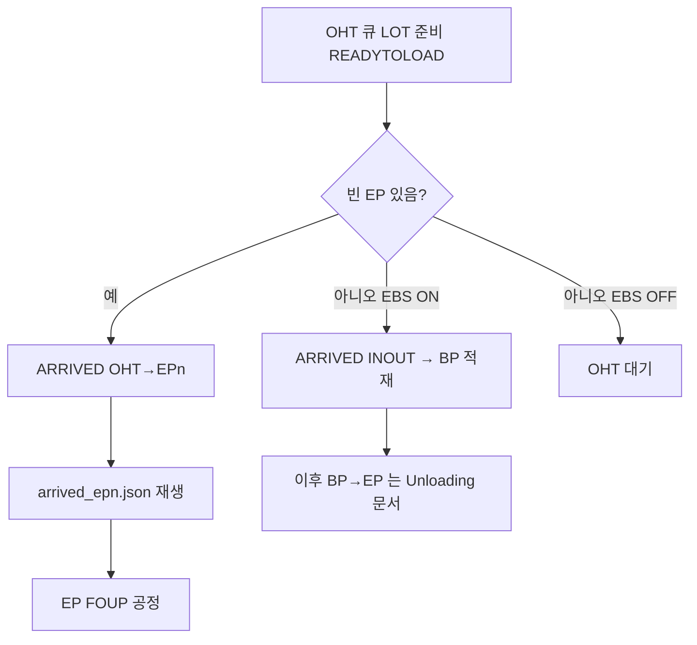

# TBS Control 2 — Loading 시나리오 분석 (OHT → EP 안착)

> **대상 확장:** `morph.tbs_control_2`  
> **문서 목적:** EBS 장비 이송 관점에서 **Loading(반입·적재)** 흐름을 정리하고, 현행 시뮬레이터 구현과의 대응 관계를 한눈에 보이게 한다.  
> **핵심 경로:** **OHT → EP 포트 안착(적재)**  
> **작성 기준:** 현재 확장 코드 As-Is (`simulation_engine.py`, `control_window.py`, `sim_control_defaults.py`)

---

## 1. 한 줄 요약

**Loading**은 OHT(천장 반송)가 들고 온 FOUP/LOT을 **EP 포트에 안착**시키는 시나리오다.  
시뮬에서는 빈 EP가 있으면 **직접 `ARRIVED`(OHT→EPn)** 로 처리하고, 3D에서는 `arrived_ep{n}.json` 모션을 재생한다.

EBS가 켜져 있고 EP가 모두 차 있으면, 같은 “반입”이라도 일단 **IN/OUT·버퍼(BP)** 로 받아 두었다가 나중에 EP로 옮긴다.  
그 **버퍼 → EP** 구간은 Unloading 문서(BP→EP)에서 다루며, 본 문서는 **OHT가 EP(또는 그 앞단)에 넣는 Loading**에 초점을 둔다.

---

## 2. 용어 (이 확장에서 쓰는 의미)

| 용어 | 의미 |
|------|------|
| **OHT** | 외부 반송(가상 캐리어). 포트 occupancy 목록에는 없고, 이벤트 from/to 로만 등장 |
| **EP (EP1~EP3)** | 공정(안착) 포트. FOUP 공정·회수 대상 |
| **IN/OUT (INOUT)** | EBS ON일 때 OHT가 EP 대신 먼저 내릴 수 있는 경유 포트 |
| **BP (BP1~BP4)** | 상단 버퍼. EP가 비면 BP→EP로 채움 (Loading의 “직접 경로”는 아님) |
| **EBS** | IN/OUT+BP 버퍼를 쓰는 모드. OFF면 EP만 존재하고 OHT→EP 직행만 가능 |
| **ARRIVED** | 안착/도착 이벤트. Loading의 대표 seq |
| **FOUP 공정** | EP 안착 **이후** EP 위에서 하는 공정(±Y). JSON MOVE와 별개 |

---

## 3. 장비 관점 Loading 시나리오

### 3.1 정상(직접) Loading — OHT → EP

```
OHT (FOUP 보유)
    │
    │  이송·안착
    ▼
EPn 포트에 FOUP 적재 완료
    │
    ▼
EP에서 FOUP 공정 시작 (Loading 이후 단계)
```

**의도**
- 빈 EP가 있으면 버퍼를 거치지 않고 **바로 EP에 적재**한다.
- 현장/EBS 이송 데이터에서 “OHT가 EP로 직접 내린다”에 해당하는 구간이다.

### 3.2 EBS ON · EP가 가득 찬 경우 (관련 반입 경로)

```
OHT
    │
    ▼
IN/OUT 안착 (ARRIVED, port=INOUT)
    │
    ▼
IN/OUT → BPn 이송 (MOVE_TRANSFERING)
    │
    ▼
BPn 대기 ──(나중에)──► EPm   ← 이 마지막 칸은 Unloading 문서의 BP→EP
```

본 문서의 **주 분석 대상은 3.1(OHT→EP)** 이다.  
3.2는 “Loading이 EP에 바로 못 들어갈 때 EBS가 어떻게 받는지”를 이해하기 위한 **연관 경로**다.

---

## 4. 현행 시뮬레이터 대응 (`tbs_control_2`)

### 4.1 엔진이 Loading을 고르는 위치

메인 루프: `simulation_engine.py` → `_run_serial_flow()`

실제 시도 순서(코드 기준):

| 순위 | 단계 | Loading과의 관계 |
|------|------|------------------|
| 0 | INOUT → BP | EBS 반입 후 버퍼 적재 (연관) |
| 1 | EP → OHT 회수 | Unloading |
| 2 | BP → EP | Unloading(버퍼 출고→EP 안착) |
| 3 | **OHT 투입** | **본 Loading** |
| 4 | idle | 대기 |

OHT 투입 (`_step_oht_input`):

1. OHT 큐 head LOT이 투입 준비(`ready_to_load`) 상태인지 확인  
2. **빈 EP 있음** → `_load_lot_to_ep_direct` (**OHT→EP 직접 Loading**)  
3. EBS ON + INOUT 사용 가능 → `_load_lot_to_inout` (버퍼 경유 반입)

### 4.2 OHT → EP 직접 Loading (핵심 구현)

| 항목 | 내용 |
|------|------|
| **함수** | `_load_lot_to_ep_direct(lot, ep_port)` |
| **조건** | `_can_load_to_ep_direct()` — 빈 EP 존재 (EBS ON이면 INOUT 적재 중이면 제한) |
| **엔진 이벤트** | `seq=ARRIVED`, `from_port_id=OHT`, `to_port_id=EPn`, `port_id=EPn` |
| **XML 별칭** | `EAPEIS_PORT_ARRIVED` |
| **3D JSON** | `data/sim_sequences/arrived_ep{n}.json` |
| **매핑 키** | `EVENT_JSON_CASE_MAP` → `OHT->EP{n}` (`control_window.py`) |
| **공정 시간 UI** | 「**OHT→EP**」 (`oht_to_bp1_min/max`, 기본 5~10초) |
| **완료 후** | EP FULL → `_run_ep_foup_process` (FOUP 공정) |

이벤트 payload 예시:

```json
{
  "seq": "ARRIVED",
  "from_port_id": "OHT",
  "to_port_id": "EP1",
  "port_id": "EP1",
  "lot_id": "LOT_001",
  "proc_sec": "7.500"
}
```

### 4.3 애니·재생 파이프라인 (Loading)

```
엔진 emit(ARRIVED)
    → 프리런 타임라인 녹화
    → 재생 시 handle_sim_event_for_animation
    → EVENT_JSON_CASE_MAP / event_animation_rules.json
    → arrived_ep{n}.json 실행 (SequenceRunner)
```

요구사항(코드 주석과 동일):  
**OHT 이동 연출은 ARRIVED에서만** 한다. 별도의 OHT→EP “MOVE” JSON은 쓰지 않는다.

### 4.4 Loading 직후 FOUP 공정 (경계)

EP 안착이 끝나면 곧바로 FOUP 공정이 붙는다.

```
ARRIVED (OHT→EP) 완료
    → FOUP_PROCESS_START / PROCESS / END  (±Y, JSON MOVE 아님)
    → 회수 대기(_ep_awaiting_pickup)     ← 이후는 Unloading(EP→OHT)
```

Loading 문서 범위는 **안착(ARRIVED)까지**이며, FOUP·회수는 “다음 단계”로만 표기한다.

---

## 5. EBS ON / OFF 에서 Loading이 달라지는 점

| | EBS ON (기본) | EBS OFF |
|--|---------------|---------|
| 포트 | INOUT + BP + EP | **EP만** |
| Loading | 빈 EP → **OHT→EP 직접** / EP full → INOUT·BP 경유 | **OHT→EP 직접만** |
| EP 전부 FULL | 버퍼로 수용 | OHT **대기만** |
| Loading JSON | `arrived_ep*`, (경유 시) `arrived_inout`, `move_inout_bp*` | **`arrived_ep*`만** |

상세 모드 스펙: `docs/tbs_control_2_ebs_apply_mode_ko.md`

---

## 6. 이송 시간·모션 개발 관점 체크리스트

현장 EBS 이송 데이터를 시뮬에 맞출 때 Loading 쪽에서 볼 항목:

1. **OHT→EP 안착 시간** — UI 「OHT→EP」 / `oht_to_bp1_*` (필드명은 구버전 잔재, 의미는 OHT→EP)  
2. **안착 모션 JSON** — `arrived_ep1.json` ~ `arrived_ep3.json`  
3. **매핑** — `from=OHT`, `to=EPn` 이 `EVENT_JSON_CASE_MAP`에 있는지  
4. **공정시간 ↔ JSON 길이** — `proc_sec`로 재생 배속 동기  
5. (선택) LOT별 고정 시간 — `fix_oht_ep` (`sim_lot_fix_proc.py`)

---

## 7. 관련 소스 인덱스

| 파일 | 역할 |
|------|------|
| `morph/tbs_control_2/simulation_engine.py` | `_step_oht_input`, `_load_lot_to_ep_direct` |
| `morph/tbs_control_2/control_window.py` | `EVENT_JSON_CASE_MAP` ARRIVED 키 |
| `morph/tbs_control_2/sim_control_defaults.py` | `oht_to_bp1_min/max` 기본값 |
| `data/sim_sequences/arrived_ep*.json` | OHT→EP 안착 모션 |
| `config/event_animation_rules.json` | rules fallback |

---

## 8. 시나리오 한눈에 (Loading)



---

## 9. 문서 이력

| 날짜 | 내용 |
|------|------|
| 2026-07-29 | 초안 — OHT→EP Loading 시나리오 + 현행 `tbs_control_2` 대응 |
