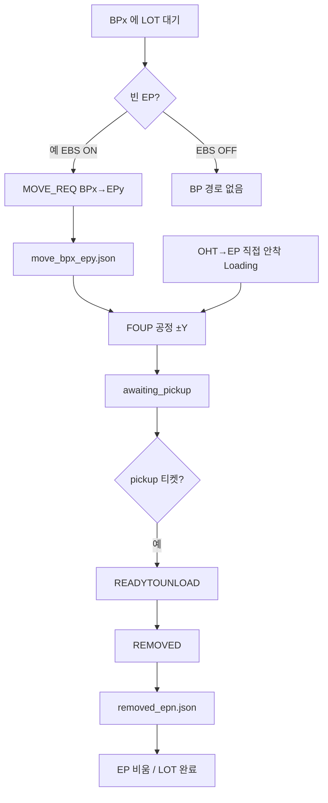

# TBS Control 2 — Unloading 시나리오 분석 (BP → EP · EP → OHT)

> **대상 확장:** `morph.tbs_control_2`  
> **문서 목적:** EBS 장비 이송 관점에서 **Unloading(버퍼 출고·EP 안착·OHT 회수)** 흐름을 정리하고, 현행 시뮬레이터 구현과의 대응 관계를 한눈에 보이게 한다.  
> **핵심 경로:**  
> 1) **BP → EP** 포트 안착(적재)  
> 2) **EP → OHT** 회수(반출)  
> **작성 기준:** 현재 확장 코드 As-Is (`simulation_engine.py`, `control_window.py`, `sim_control_defaults.py`)

---

## 1. 한 줄 요약

이 문서의 Unloading은 두 구간으로 나뉜다.

| 구간 | 의미 | 시뮬 대표 이벤트 | 3D JSON |
|------|------|------------------|---------|
| **BP → EP** | 버퍼에 있던 FOUP을 EP에 안착 | `MOVE_REQ` | `move_bp{x}_ep{y}.json` |
| **EP → OHT** | EP 공정이 끝난 FOUP을 OHT로 회수 | `REMOVED` | `removed_ep{n}.json` |

둘 사이에는 반드시 **EP FOUP 공정**이 끼어 있다.  
BP→EP로 안착한 뒤 FOUP 공정을 끝내야만 EP→OHT 회수가 가능하다.

> Loading 문서의 **OHT→EP 직접 투입**으로 안착한 LOT도, 회수 구간(EP→OHT)은 **이 문서와 동일**하다.

---

## 2. 용어

| 용어 | 의미 |
|------|------|
| **BP (BP1~BP4)** | EBS 상단 버퍼. EP가 비면 가장 오래된 BP부터 EP로 보냄 |
| **EP** | 공정 포트. BP→EP 안착 또는 OHT→EP 안착 후 FOUP 공정·회수 |
| **OHT** | 회수 시 도착 측(가상). `REMOVED` 후 LOT은 `completed_lots`로 집계 |
| **MOVE_REQ** | 버퍼→EP 이송 요청/실행 이벤트 (BP→EP 모션의 트리거) |
| **READYTOUNLOAD** | 회수 직전 준비 이벤트 (애니 JSON 없음) |
| **REMOVED** | EP에서 FOUP/LOT 회수 완료 연출·공정 대기 |
| **pickup 티켓** | FOUP 종료 후 주기적으로 쌓이는 “회수 가능” 신호. 있어야 `_execute_pickup` 실행 |

---

## 3. 장비 관점 Unloading 시나리오

### 3.1 BP → EP (버퍼 출고 → EP 안착)

```
BPx (FOUP 대기)
    │
    │  이송·안착
    ▼
EPy 포트에 FOUP 적재
    │
    ▼
EP FOUP 공정
```

**의도**
- EP가 비었을 때, 버퍼에 먼저 받아 둔 LOT을 EP로 옮겨 공정을 돌린다.
- EBS가 “EP 병목을 버퍼로 흡수한 뒤 다시 EP를 채우는” 핵심 내부 이송이다.
- **EBS OFF** 모드에서는 BP가 없으므로 **이 구간 자체 없음**.

### 3.2 EP → OHT (회수·반출)

```
EPn (FOUP 공정 완료, 회수 대기)
    │
    │  READYTOUNLOAD (준비)
    ▼
REMOVED — EP에서 FOUP 회수 → OHT
    │
    ▼
LOT 완료(completed)
```

**의도**
- 공정이 끝난 FOUP을 EP에서 걷어 OHT로 넘긴다.
- Loading으로 들어왔든 BP→EP로 들어왔든, **회수 절차는 동일**하다.

### 3.3 전체 Unloading 타임라인 (한 LOT 기준, EBS 버퍼 경유)

```
… (Loading 쪽에서 INOUT→BP 까지 반입)
    → BP 대기
    → MOVE_REQ (BP→EP) + move_bp*_ep*.json
    → FOUP_PROCESS_* (±Y)
    → awaiting_pickup + pickup 티켓
    → READYTOUNLOAD (애니 없음)
    → REMOVED + removed_ep*.json
    → EP EMPTY / completed_lots
```

---

## 4. 현행 시뮬레이터 대응 (`tbs_control_2`)

### 4.1 엔진 우선순위에서의 위치

`_run_serial_flow()` 실제 순서:

| 순위 | 단계 | 본 문서 |
|------|------|---------|
| 0 | INOUT → BP | Loading 연관 |
| 1 | **EP → OHT 회수** | **§3.2** |
| 2 | **BP → EP** | **§3.1** |
| 3 | OHT 투입 | Loading 문서 |
| 4 | idle | — |

회수(1)가 버퍼→EP(2)보다 **먼저** 시도된다.  
즉 EP를 비울 수 있으면 채우기보다 회수를 우선한다.

---

### 4.2 BP → EP 구현

| 항목 | 내용 |
|------|------|
| **스텝** | `_step_buffer_to_ep` → `_move_bp_to_ep` |
| **선택** | `_find_oldest_bp` (적재 시각 FIFO) + `_find_empty_ep` |
| **이벤트** | `seq=MOVE_REQ`, `from_port_id=BPx`, `to_port_id=EPy` |
| **XML** | `EISEAP_PORT_MOVE_REQ` |
| **JSON** | `data/sim_sequences/move_bp{x}_ep{y}.json` |
| **매핑** | `EVENT_JSON_CASE_MAP` 키 `BPx->EPy` |
| **공정 시간 UI** | 「**BP→EP**」 (`bp_to_ep_min/max`, 기본 30~35초) |
| **EBS OFF** | 스텝 early-return (경로 없음) |
| **완료 후** | EP FULL(`emit_arrived_event=False`) → `_run_ep_foup_process` → BP 비움 |

주의:
- BP→EP 완료 시 **추가 ARRIVED를 emit하지 않는다**.  
  (OHT→EP 직접 Loading의 `ARRIVED`와 구분)
- 이동 중 BP·EP는 잠금(`_lock_port`)으로 중복 선택 방지.

이벤트 payload 예시:

```json
{
  "seq": "MOVE_REQ",
  "from_port_id": "BP2",
  "to_port_id": "EP1",
  "lot_id": "LOT_002",
  "proc_sec": "33.400"
}
```

지원 JSON 조합(케이스맵): BP1~4 × EP1~3 → `move_bp1_ep1.json` … `move_bp4_ep3.json`

---

### 4.3 EP FOUP 공정 (두 Unloading 구간의 다리)

| 항목 | 내용 |
|------|------|
| **함수** | `_run_ep_foup_process` |
| **호출** | `_load_lot_to_ep_direct` 완료 후, `_move_bp_to_ep` finally |
| **이벤트** | `FOUP_PROCESS_START` → progress → `FOUP_PROCESS_END` |
| **연출** | EP FOUP prim **±Y** (JSON ARRIVED/MOVE/REMOVED 파이프 아님) |
| **시간** | `foup_process_min/max` (기본 30~60초) |
| **회수 게이트** | END 후 `_ep_awaiting_pickup[ep]=True` |

FOUP이 끝나기 전에는 REMOVED가 나가지 않는다.

---

### 4.4 EP → OHT 회수 구현

| 항목 | 내용 |
|------|------|
| **함수** | `_execute_pickup` (`_step_pickup_to_oht`) |
| **전제** | `_ep_awaiting_pickup` + `_pickup_tickets > 0` (FIFO EP 선택) |
| **①** | `READYTOUNLOAD` emit — **애니 없음** |
| **②** | `REMOVED` emit + 공정/애니 대기 |
| **JSON** | `data/sim_sequences/removed_ep{n}.json` |
| **매핑 키** | `EVENT_JSON_CASE_MAP` → `EP{n}` |
| **공정 시간 UI** | 「**EP→OHT**」 (`ep_to_oht_min/max`, 기본 30~35초) |
| **완료** | EP 비움 → `completed_lots` |

회수 간격: `pickup_min/max` (기본 50~70초)로 티켓이 쌓인다.

이벤트 예시:

```json
{"seq": "READYTOUNLOAD", "port_id": "EP1", "lot_id": "LOT_001"}
```

```json
{
  "seq": "REMOVED",
  "port_id": "EP1",
  "lot_id": "LOT_001",
  "proc_sec": "31.200"
}
```

재생 시 참고 (`docs/tbs_control_2_worklog_2026-06-29_ko.md`):  
REMOVED renewal 때 **포트 패널은 즉시 비우고**, 3D FOUP 숨김은 **JSON `proc_end`까지 보류**하는 정책이 있다.

---

## 5. EBS ON / OFF

| | EBS ON | EBS OFF |
|--|--------|---------|
| BP → EP | 있음 (`MOVE_REQ` + move_bp*_ep*) | **없음** |
| EP FOUP | 동일 | 동일 |
| EP → OHT | 동일 (`REMOVED` + removed_ep*) | 동일 |
| Unloading JSON | move_bp* + removed_ep* | **removed_ep*만** |

EBS OFF에서는 Unloading이 사실상 **「EP 공정 후 OHT 회수」만** 남는다.  
(투입은 Loading 문서의 OHT→EP만)

---

## 6. 이송 시간·모션 개발 체크리스트

### BP → EP
1. UI 「BP→EP」 / `bp_to_ep_*`  
2. 포트 조합별 JSON `move_bp{x}_ep{y}.json` 존재·품질  
3. 케이스맵 `BPx->EPy` 키  
4. `proc_sec` ↔ JSON 길이 동기  

### EP → OHT
1. UI 「EP→OHT」 / `ep_to_oht_*`  
2. `removed_ep1~3.json`  
3. 케이스맵 `EPn` 키  
4. (선택) LOT 고정 회수시간 `fix_ep_oht`  
5. pickup 간격이 현장 회수 주기와 맞는지  

### 공통
- FOUP 공정 시간·±Y 리프트가 현장 “EP 상 작업”과 맞는지  
- 회수는 FOUP END **이후**만 가능한지 데이터와 일치하는지  

---

## 7. 관련 소스 인덱스

| 파일 | 역할 |
|------|------|
| `simulation_engine.py` | `_step_buffer_to_ep`, `_move_bp_to_ep`, `_run_ep_foup_process`, `_execute_pickup` |
| `control_window.py` | `EVENT_JSON_CASE_MAP` MOVE_REQ / REMOVED |
| `sim_control_defaults.py` | `bp_to_ep_*`, `ep_to_oht_*`, `foup_process_*`, `pickup_*` |
| `data/sim_sequences/move_bp*_ep*.json` | BP→EP 모션 |
| `data/sim_sequences/removed_ep*.json` | EP→OHT 회수 모션 |
| `sim_lot_fix_proc.py` | `fix_ep_oht` |

---

## 8. 시나리오 한눈에 (Unloading)



---

## 9. Loading 문서와의 역할 분담

| 문서 | 범위 |
|------|------|
| [Loading — OHT→EP](tbs_control_2_loading_scenario_oht_ep_ko.md) | 외부 반입·EP 직접 안착 (`ARRIVED`) |
| **본 문서 (Unloading)** | 버퍼→EP 안착 (`MOVE_REQ`) + EP→OHT 회수 (`REMOVED`) |

한 LOT의 전체 생애(EBS ON·버퍼 경유 예):

```
OHT → INOUT → BP → EP(MOVE_REQ) → FOUP → OHT(REMOVED)
         ↑ Loading 연관        ↑ 본 문서 BP→EP    ↑ 본 문서 회수
```

직접 Loading 예:

```
OHT → EP(ARRIVED) → FOUP → OHT(REMOVED)
  ↑ Loading 문서              ↑ 본 문서 회수
```

---

## 10. 문서 이력

| 날짜 | 내용 |
|------|------|
| 2026-07-29 | 초안 — BP→EP + EP→OHT Unloading 시나리오 + 현행 `tbs_control_2` 대응 |
