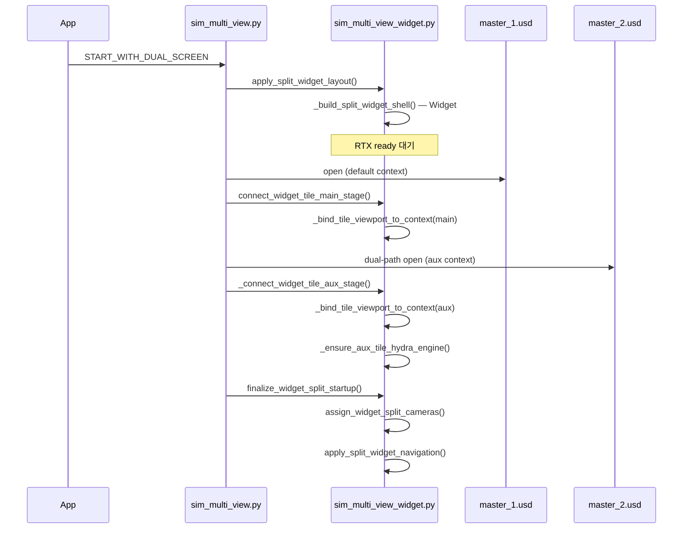

# TBS Control 2 — ViewportWidget 2분할 구현 상세 (ChatGPT 문의용)

> **작성 목적**: 코드 추가 수정 없이, **현재까지 구조 변경·작업 진행 내역**을 상세 코드 설명과 함께 정리하여 외부(예: ChatGPT)에 공유  
> **작성일**: 2026-07-06  
> **최종 갱신**: 2026-07-06 01:10 (RP 파괴 수정 후 — **카메라 coupling·배경 톤 미해결**, 증상 완화 패치 무효 확인)  
> **대상 확장**: `morph.tbs_control_2`  
> **플랫폼**: NVIDIA Omniverse Kit (RTX - Real-Time 2.0)  
> **관련 문서**: `docs/tbs_control_2_viewport_widget_split_status_ko.md` (요약 스냅샷, 상세는 본 문서 우선)

---

## 0. ChatGPT에 물어볼 핵심 질문 (2026-07-06 01:10 기준)

**RenderProduct 파괴는 수정되어 양쪽 화면이 렌더되지만, 아래 두 가지는 여전히 100% 재현된다. 증상 완화(입력 차단·render_mode 복사·manipulator 폴링)는 효과 없었음.**

### P0-A. 카메라 coupling (미해결)

화면2(우측, `morph_tbs_split_aux_1` / `master_2.usd`)에서 orbit·zoom 하면 **화면1(좌측, 기본 ctx / `master_1.usd`) 카메라가 같이 움직인다.**

- Stage isolation 로그: `main_id ≠ aux_id`, `master_1` vs `master_2` — **USD 분리는 확인됨**
- READY 시 양쪽 `api.camera_path`는 각각 `/OmniverseKit_Persp` (컨텍스트별 독립 prim이어야 함)
- READY 시 **`scene_view.camera_model=None`** (양쪽 모두) — `ViewportCameraManipulator` 미부착 추정
- `ViewportWidget.get_instances=count=3` (#0,#1 ctx= 네이티브, #2 ctx=aux) — 고아 인스턴스가 입력을 가로채는가?

**질문**: `ViewportWindow.get_frame` HStack 안 embedded `ViewportWidget` 2개일 때, 화면2 orbit이 화면1 카메라를 움직이는 **Kit 공식 입력 경로**는 무엇인가? (`get_active_viewport`, 네이티브 `ViewportWindow.viewport_widget`, orphan `get_instances` 등)

### P0-B. 렌더/배경 톤 불일치 (미해결 — **“비슷”이 아니라 “동일”** 요구)

- 화면1: 어두운 그리드·환경 (RTX Real-Time 2.0 기본 뷰포트 톤)
- 화면2: 밝은 회색 배경 — **완전히 다른 뷰포트 렌더 결과**
- 사용자 요구: **배경·그리드·ambient·HDR·톤이 화면1과 픽셀 단위로 동일**해야 함. `render_mode`만 복사하거나 DomeLight 추가 수준의 “유사화”는 **불가**

**질문**: 두 `ViewportWidget`(서로 다른 `usd_context_name`)이 **동일한 Viewport 렌더 프로필**(그리드, IBL, RTX env, tone mapping)을 공유하려면 Kit에서 **공식적으로 지원하는 메커니즘**은? (`set_hd_engine` 공유 금지 조건 하에서) 네이티브 `Viewport` API 프로필을 aux Widget에 **완전 복제**하는 API/이벤트 체인은?

### 이미 해결됨 (참고 — 더 이상 질문 불필요)

- ~~RenderProduct 미생성 / READY 시 hydra=None~~ → **이름 충돌 destroy 수정으로 해결** (§18.10, §19.1)
- ~~깜빡임~~ → 네이티브 presenter 숨김 + destroy 스킵으로 해소

### 증상 완화 코드는 더 추가하지 말 것 (사용자 명시)

다음류 패치는 **효과 없음이 확인**됨 — 근본 메커니즘 답을 먼저 요청할 것:

- `_wire_tile_input` return True/False 토글
- `_suspend_orphan_viewport_manipulators` / native guard 매 프레임
- `_copy_visual_render_profile_only` (render_mode + `_RENDER_PROFILE_ATTRS` 일부)
- `assign_widget_split_cameras` 조건부 스킵/실행
- post-READY `_bootstrap_tile_viewport_render_async` (aux fps=0)

---

## 1. 현재 증상 (2026-07-06 01:01 로그 — **최신 사용자 실행**)

### 1.1 화면 (스크린샷 + 사용자 확인)

| 영역 | 관측 |
|------|------|
| 좌측 (화면1) | `master_1.usd` 정상 렌더, **어두운 그리드/환경** |
| 우측 (화면2) | `master_2.usd` 렌더됨 (검정 아님), **밝은 회색 톤** — 화면1과 **다름** (사용자: “비슷” 수준 불가, **동일**해야 함) |
| Workspace | `Viewport` 탭 **1개** ✓ |
| `TBS_SimSplit_1` 창 | 없음 ✓ |
| 깜빡임 | **없음** ✓ (이전 대비 개선) |
| 화면2 orbit/zoom | **화면1 카메라도 같이 움직임** ✗ (미해결) |

### 1.2 **01:01 로그 — RP 정상, coupling·톤만 실패**

```
create_total=2
화면1 RP: .../ViewportTexture_1  hydra=rtx  fps≈0.58
화면2 RP: .../ViewportTexture_2  hydra=rtx  fps=0

[TBS/rp-finalize] after-destroy-aux-windows  HAS_RP=True  ← destroy 수정 적용됨
stage isolation OK  main=master_1.usd  aux=master_2.usd

READY:
  화면1 scene_view.camera_model=None
  화면2 scene_view.camera_model=None
  ViewportWidget.get_instances=count=3  (#0,#1 ctx= | #2 ctx=morph_tbs_split_aux_1)

[TBS/hydra-diag] finalize: aux render_product OK — skip main→aux profile copy
[TBS/hydra-diag] finalize: skip assign_widget_split_cameras (aux hydra alive)
```

| 시점 | 화면2 `HAS_RP` | `hydra` | `fps` | 비고 |
|------|----------------|---------|-------|------|
| `widget-create` | ✓ Texture_2 | rtx | 0 | |
| `connect-aux-done` | ✓ | rtx | 0 | |
| `after-destroy-aux-windows` | ✓ | rtx | — | **이전 버그(§18.10) 수정 확인** |
| `READY` | ✓ | rtx | 0 | 렌더는 되나 pump 느림/0 |

**결론**: RenderProduct·Hydra 생존 문제는 **해결**. 남은 것은 (1) **입력/카메라 coupling**, (2) **렌더 프로필 완전 동기화 실패**.

### 1.3 이전(00:36) 로그와의 차이

| 항목 | 00:36 | 01:01 (최신) |
|------|-------|--------------|
| 화면2 READY `get_render_product_path()` | **None** | **ViewportTexture_2** ✓ |
| `after-destroy-aux-windows` | HAS_RP=False | **HAS_RP=True** |
| 화면2 표시 | 검정 | **장면 보임** (톤 다름) |
| 깜빡임 | 있음 | **없음** |
| 카메라 coupling | 있음 | **여전히 있음** |

---

## 2. 절대 요구사항 (Hard Constraints)

사용자가 반복 강조. **이 조건을 깨는 해결책은 채택 불가.**

1. Workspace **`Viewport` 탭 1개** — 내부 `get_frame` HStack 50:50
2. **`TBS_SimSplit_*` Workspace 창 / Dock / `create_viewport_window` 사용 금지** (Widget 모드)
3. 화면1·2 모두 **`omni.kit.widget.viewport.ViewportWidget`**
4. Widget 분할 실패 시 **Dock 자동 폴백 금지**
5. `USE_VIEWPORT_WIDGET_SPLIT=False` (Dock + `create_viewport_window`) 경로는 **건드리지 않음**

설정 SSOT — `sim_control_defaults.py`:

```python
START_WITH_DUAL_SCREEN: bool = True
USE_VIEWPORT_WIDGET_SPLIT: bool = True
MAX_VIEWPORT_SPLIT_COUNT: int = 2
```

환경변수 `TBS_SIM_VIEWPORT_WIDGET_SPLIT=0` → Widget 모드 off.

---

## 3. 목표 아키텍처 (2026-07-06 00:40 — **deferred aux 생성**)

```
Workspace "Viewport" 탭 (1개)
└─ get_frame("morph.tbs_control_2:00_split_viewport_widgets")
    └─ HStack 50:50
        ├─ ZStack — 화면1
        │     ├─ Rectangle (#101010)
        │     ├─ ViewportWidget #1  (shell 시 즉시 생성, hd_engine=omitted)
        │     └─ SceneView
        └─ ZStack — 화면2
              ├─ Rectangle (#101010)   ← shell 시점 (master_2 전)
              └─ ViewportWidget #2     ← master_2 settled 후 deferred 1회 생성
                    usd_context_name="morph_tbs_split_aux_1"
                    viewport_api="morph.tbs_control_2:widget_tile_2"
                    hd_engine 생략 (Widget 자체 Hydra)
```

**Widget 생성 횟수**: startup 동안 정확히 **2회** (`create_total=2`).  
**재생성 아님**: shell에 Widget #2가 없었고, master_2 후 **최초 1회** 생성.

### 3.1 Startup 시퀀스 (현재 코드)

```
apply_split_widget_layout()
  └─ _build_split_widget_shell()
        ├─ ViewportWidget #1 (ctx="", hd_engine=passed)
        └─ _new_aux_tile_slot_record() — widget=None, _deferred_create=True

master_1.usd open → connect_widget_tile_main_stage()

master_2.usd open (dual-path, morph_tbs_split_aux_1)

_connect_widget_tile_aux_stage()
  ├─ _wait_aux_usd_stage_settled()  — Stage busy 완화
  ├─ _create_deferred_aux_viewport_widget()  — ViewportWidget #2
  ├─ _bind_tile_viewport_to_context()
  └─ (profile copy / kick — RenderProduct 있으면 보호)

finalize_widget_split_startup()
  ├─ sync_split_widget_fill_frame()
  ├─ aux_hydra_ok ? skip destructive steps : legacy bootstrap
  └─ READY hydra-diag
```

---

## 4. 목표 아키텍처 (현재 코드 기준)

```
Workspace "Viewport" 탭 (Kit 기본 ViewportWindow, 1개)
│
├─ [네이티브 Viewport API]  ← 입력만 차단(enable_input=False), 렌더는 뒤에서 돌 수 있음
│
└─ get_frame("morph.tbs_control_2:00_split_viewport_widgets")
    └─ ui.HStack (width 50% : 50%)
        ├─ ui.ZStack (Fraction 0.5)  ← 화면1
        │     ├─ ui.Rectangle (배경 #101010)
        │     ├─ ViewportWidget #1
        │     │     usd_context: "" (기본 omni.usd)
        │     │     viewport_api: morph.tbs_control_2:widget_tile_1
        │     │     hd_engine: **omitted** (Widget 자체 Hydra)
        │     └─ omni.ui.scene.SceneView + (준비 후) ViewportCameraManipulator
        │
        └─ ui.ZStack (Fraction 0.5)  ← 화면2
              ├─ ui.Rectangle (배경 #101010)
              ├─ ViewportWidget #2
              │     usd_context_name: "morph_tbs_split_aux_1"
              │     viewport_api: morph.tbs_control_2:widget_tile_2
              │     hd_engine: **omitted** (메인과 Hydra 인스턴스 공유 안 함)
              └─ SceneView + manipulator (hydra 준비 후)
```

### 논리 타일 식별자 (Workspace 창 이름 ≠ 논리 키)

| 화면 | 논리 `win_name` | USD 컨텍스트 | 스테이지 파일 |
|------|-----------------|--------------|---------------|
| 화면1 | `Viewport` | `""` (기본 `omni.usd`) | `data/usd/master_1.usd` |
| 화면2 | `TBS_SimSplit_1` | `morph_tbs_split_aux_1` | `data/usd/master_2.usd` |

> `TBS_SimSplit_1`은 `_tbs_split_widget_tiles` 딕셔너리 키일 뿐, **실제 Workspace 창을 만들지 않음**.

---

## 5. 핵심 소스 파일

| 파일 | 역할 |
|------|------|
| `sim_control_defaults.py` | `USE_VIEWPORT_WIDGET_SPLIT`, `START_WITH_DUAL_SCREEN` SSOT |
| `sim_multi_view_widget.py` | ViewportWidget shell·Stage 연결·Hydra·카메라·manipulator·lifecycle 로그 |
| `sim_multi_view.py` | 분할 오케스트레이션, layout-first startup, dual-path USD, Dock 경로(Widget off) |
| `tbs_split_composed_loader.py` | dual-path 화면2 Discover/Extract/런타임 registry |
| `kit_chrome_visibility.py` | Viewport·TBS_SimSplit 보호 |

---

## 6. Extension 상태 플래그 (`ext` 속성)

| 속성 | 의미 |
|------|------|
| `_tbs_split_used_widget_layout` | Widget 분할 활성 |
| `_tbs_split_widget_tiles` | `{"Viewport": rec, "TBS_SimSplit_1": rec}` |
| `_tbs_widget_create_total` | ViewportWidget 생성 횟수 (expect=2) |
| `_tbs_main_stage_connected` | 화면1 Stage 연결 완료 |
| `_tbs_aux_stage_connected` | 화면2 Stage 연결 완료 |
| `_tbs_active_widget_tile` | 마우스 포커스 타일 (`Viewport` or `TBS_SimSplit_1`) |
| `_tbs_widget_shell_hstack` | HStack UI 참조 |
| `_sim_multi_context_names` | `["morph_tbs_split_aux_1"]` |
| `_sim_viewport_split_count` | 실제 적용된 분할 수 (2) |

### 타일 레코드 (`rec`) 구조

```python
{
    "widget": ViewportWidget,           # UI 위젯
    "api": viewport_api,                # vw_tile.viewport_api
    "scene_view": sc.SceneView,
    "camera_manipulator": None | Manipulator,
    "manip_pending": True,              # projection 준비 후 manipulator 부착
    "context_name": "" | "morph_tbs_split_aux_1",
    "cell_index": 0 | 1,
    "camera_path": "/OmniverseKit_Persp",
    "stage_connected": bool,
    "_bound_stage_id": int,             # bind 시 Stage 객체 id
    "_bound_stage_file": str,           # bind 시 Stage root layer 경로
    "_last_w", "_last_h": int,          # 타일 픽셀 크기
    "_widget_create_index": 1 | 2,
}
```

---

## 7. Startup 시퀀스 (layout-first, 상세)

### 7.1 타임라인

```
~6s   app ready
      → START_WITH_DUAL_SCREEN: layout-first shell (n=2)
      → apply_split_widget_layout()          # RTX ready 전후
           └─ _build_split_widget_shell()    # Widget #1+#2 1회 생성

~10s  RTX ready
      → layout-first: 2분할 배치 완료 — USD 로드 대기

~10.4s master_1.usd open (기본 omni.usd)
      → connect_widget_tile_main_stage()
      → Discover/Extract (OmniGraph → bake 필요, 부수적)

~13.6s master_2.usd open (morph_tbs_split_aux_1, dual-path)
      → [Error] Stage opening or closing already in progress (경합 경고)
      → screen2 Discover+Extract, runtime registry

~17s  _connect_widget_tile_aux_stage()
      → bind master_2, hydra 부트스트랩 시도
      → finalize_widget_split_startup() → READY
```

### 7.2 Mermaid 시퀀스



---

## 8. 함수별 상세 코드 설명

### 8.1 `sim_multi_view.py` — 오케스트레이션

#### `_build_multi_split_async()` / layout-first 진입

- `START_WITH_DUAL_SCREEN=True`이면 **USD 로드 전**에 레이아웃(shell)을 먼저 적용.
- `sim_viewport_split_widget_enabled()` → `apply_split_widget_layout()` 호출.
- `widget_only=True`이고 `widget_ok=False`이면 **Dock 폴백하지 않음** (의도적).

```python
# sim_multi_view.py (요약)
widget_only = sim_viewport_split_widget_enabled()
if widget_only:
    widget_ok = await apply_split_widget_layout(ext, token, n)
    if not widget_ok:
        print("Dock/create_viewport_window 폴백 금지")
if not widget_ok and not widget_only:
    docked_ok = await _apply_split_dock_layout(...)  # Widget off일 때만
```

#### dual-path 보조 USD 로드

- 화면2: `morph_tbs_split_aux_1` 컨텍스트에 `master_2.usd` 직접 open (파일 복제 생략 로그: `dual-path USD (복제 생략)`).
- 화면1 런타임 registry 메타·baked layer를 화면2에 동기화 (`screen2 sync metadata from screen1`).
- Widget 모드: `_provision_aux_split_tile()`에서 `kind: "widget_aux"` entry만 등록, **`create_viewport_window` 호출 안 함**.

#### `finalize_widget_split_startup()` 호출

- dual-path hydrate 완료 후 `sim_multi_view.py`에서 `await finalize_widget_split_startup(ext, tok, sn)` 호출.

---

### 8.2 `sim_multi_view_widget.py` — Widget 분할 핵심

#### `apply_split_widget_layout(ext, token, n)`

1. `ViewportWidget` import
2. `_resolve_main_viewport_window(ext)` — Workspace `Viewport` ViewportWindow 획득 (최대 24프레임 대기)
3. `_destroy_split_widget_host_ui()` — 이전 shell 정리
4. `_build_split_widget_shell()` — **Widget 2개 1회 생성**
5. `ext._tbs_split_widget_tiles` 등 플래그 설정
6. 화면1에 `_copy_viewport_render_profile(ref_api, main_api, share_hydra_engine=True)`
7. `_set_native_viewport_input_blocked(ext, True)` — 네이티브 입력만 차단
8. `_start_native_viewport_input_guard()` — 매 post_update 재적용
9. `sync_split_widget_fill_frame()` — 해상도 동기화

#### `_build_split_widget_shell(ext, vw_host, half_w, th)`

```python
# get_frame 슬롯에 HStack 50:50
with vw_host.get_frame("morph.tbs_control_2:00_split_viewport_widgets"):
    with ui.HStack(spacing=0):
        with ui.ZStack(width=ui.Fraction(0.5)):
            rec_main = _create_viewport_tile(..., ctx="", hd_engine=native_eng)
        with ui.ZStack(width=ui.Fraction(0.5)):
            rec_aux = _create_viewport_tile(..., ctx="morph_tbs_split_aux_1",
                                              hd_engine=_duplicate_hd_engine(native_eng))
```

- `ref_api_for_eng = _reference_viewport_render_api(ext, {})` — 네이티브 Viewport API 우선.
- 화면1: 네이티브와 **동일 Hydra 엔진 인스턴스** 공유.
- 화면2: `type(ref_eng)()`로 **새 Hydra 엔진 인스턴스** 생성 시도 (공유 시 양쪽 같은 USD 보이는 문제 방지).

#### `_create_viewport_tile(ext, wn, ctx_name, cell_idx, half_w, th, ...)`

```python
vw_kw = {
    "camera_path": "/OmniverseKit_Persp",
    "resolution": (tile_w, tile_h),
}
if ctx_name:
    vw_kw["usd_context_name"] = ctx_name
if hd_engine is not None:
    vw_kw["hd_engine"] = hd_engine

with ui.ZStack():
    ui.Rectangle(style={"background_color": 0xFF101010})  # 네이티브 bleed 차단
    vw_tile = ViewportWidget(**vw_kw)
    vw_tile.fill_frame = False
    scene_view = sc.SceneView(...)
```

- `api = vw_tile.viewport_api`
- manipulator는 즉시 부착하지 않음 (`manip_pending=True`).

#### `connect_widget_tile_main_stage(ext, token)` — master_1 open 후

```python
_bind_tile_viewport_to_context(main_rec, "", cam_path="/OmniverseKit_Persp")
_copy_viewport_render_profile(ref_api, api, share_hydra_engine=True)
_kick_viewport_widget_render(main_rec)
ext._tbs_main_stage_connected = True
```

#### `_connect_widget_tile_aux_stage(ext, token, sn)` — master_2 ready 후

```python
_bind_tile_viewport_to_context(aux_rec, "morph_tbs_split_aux_1", cam_path="/OmniverseKit_Persp")
_copy_viewport_render_profile(ref_api, api, share_hydra_engine=False)
_ensure_aux_tile_hydra_engine(aux_rec, ref_api)
_kick_viewport_widget_render(aux_rec)
await _bootstrap_tile_viewport_render_async(aux_rec, frames=6)
await assign_widget_split_cameras(...)
```

- `_materialize_aux_viewport_widget()`는 레거시 이름 → 내부적으로 `_connect_widget_tile_aux_stage()`만 호출 (**Widget 재생성 없음**).

---

### 8.3 Stage 바인딩 메커니즘 (중요)

#### `_bind_tile_viewport_to_context(rec, ctx_name, cam_path)`

**`api.stage = stage` 직접 대입 금지** (Kit이 무시하거나 메인으로 폴백).

대신:

```python
api.usd_context_name = ctx_key          # 보조만; 화면1은 ""
api.camera_path = resolved_cam
api.viewport_changed(resolved_cam, stage) # stage = ctx.get_stage()
rec["context_name"] = ctx_key
rec["_bound_stage_id"] = id(stage)
```

#### `_tile_stage(rec)` — Stage 조회 SSOT

```python
def _tile_stage(rec):
    ctx = _named_usd_context(rec["context_name"])
    return ctx.get_stage()
```

**`api.stage` 사용 금지** — 보조 API의 `api.stage`는 기본 컨텍스트 Stage로 폴백하는 Kit 동작이 있음 (과거 "같은 USD" 버그 원인).

#### `_kick_viewport_widget_render(rec)`

```python
widget.set_resolution((w, h))
api.resolution = (w, h)
api.fill_frame = False

stage = _tile_stage(rec)                    # api.stage 아님!
cam = _tile_camera_for_stage(rec, api)
api.viewport_changed(cam, stage)
api.request_render() / wake_up() / invalidate()
```

- `sync_split_widget_fill_frame()` → `_refresh_tile_viewport_api()` → `_kick` 경로로 **매 프레임 해상도 동기화 시에도 올바른 Stage 유지**.

---

### 8.4 Hydra 엔진 전략

| 타일 | 생성 시 `hd_engine` | connect 시 | `share_hydra_engine` |
|------|---------------------|------------|----------------------|
| 화면1 | 네이티브 Viewport 엔진 (공유) | ref_api에서 복사 | `True` |
| 화면2 | `type(native_eng)()` 새 인스턴스 | `_ensure_aux_tile_hydra_engine()` | `False` |

```python
def _duplicate_hd_engine(ref_eng):
    return type(ref_eng)()   # 단순 생성자 호출

def _ensure_aux_tile_hydra_engine(rec, ref_api):
    new_eng = _duplicate_hd_engine(_read_viewport_hydra_engine(ref_api))
    api.set_hd_engine(new_eng, render_mode)
```

**현재 실패**: 최신 로그에서 화면2 `hydra=None` — `type(ref_eng)()` 또는 `set_hd_engine`이 **실제 RTX 루프를 시작하지 못함**.

Dock 경로(`create_viewport_window`)에서는 Kit ViewportWindow 백엔드가 Hydra를 자동 관리하여 화면2 렌더 성공.

---

### 8.5 네이티브 Viewport 처리

```python
def _set_native_viewport_input_blocked(ext, blocked):
  # get_viewport_from_window_name("Viewport")
  api.enable_input = False
  api.inputs_enabled = False
  # updates_enabled / enabled 는 건드리지 않음 (렌더 펌프 유지 시도)
```

- `_start_native_viewport_input_guard()`: 매 post_update마다 입력 차단 재적용.
- `_destroy_all_aux_workspace_windows()`: 잔여 `TBS_SimSplit_*` Workspace 창 파괴.
- `_workspace_show_named_window("TBS_SimSplit_1", False)`: show 차단.

---

### 8.6 카메라·Manipulator

- 양 타일 모두 **`/OmniverseKit_Persp`** (컨텍스트가 다르므로 물리적으로 다른 prim).
- 커스텀 `SplitAux` 카메라 prim 복제 → `GfQuatf/GfQuatd` manipulator 오류로 **포기**.
- `_schedule_tile_manipulators_when_ready()`: `_api_projection_ready(api)` (resolution > 0) 확인 후:
  ```python
  api.add_scene_view(scene_view)
  manip = ViewportCameraManipulator(api)
  ```
- 화면2 `cam=None`, `res=None` → manipulator **부착 실패** → 우측 드래그 시 화면1 카메라가 움직일 수 있음.

---

## 9. Dock 경로 vs Widget 경로 비교

| | Widget (`USE_VIEWPORT_WIDGET_SPLIT=True`) | Dock (`False`) |
|--|--|--|
| UI | Viewport 탭 1개, get_frame HStack | Viewport + TBS_SimSplit_1 Dock |
| 뷰포트 생성 | `ViewportWidget` × 2 (1회) | `create_viewport_window` |
| Hydra 백엔드 | Widget 자체 `viewport_api` + `hd_engine` | ViewportWindow 내장 |
| 화면2 렌더 | **실패** (hydra=None) | **성공** |
| 별도 창 | 없음 ✓ | TBS_SimSplit_1 (허용) |

---

## 10. 해결된 이슈 vs 미해결 이슈

### 해결됨 ✓

| 이슈 | 해결 방법 |
|------|-----------|
| `TBS_SimSplit_1` 별도 창/탭 출현 | `create_viewport_window`·`viewport_api` 브리지 제거, show 차단 |
| Widget 3회 생성 / shell 크래시 | create-once shell, materialize 시 재생성 금지 |
| 양쪽 같은 USD (Stage 객체 공유) | `_tile_stage(rec)` + `viewport_changed`에 컨텍스트 Stage 사용; stage isolation OK 확인 |
| `weakref.ProxyType` 크래시 | native_api 브리지 제거 |
| Dock 폴백으로 두 번째 창 재발 | `widget_only` 시 폴백 금지 |

### 미해결 ✗ (ChatGPT 질문 대상)

| # | 이슈 | 로그/증상 |
|---|------|-----------|
| **P0** | 화면2 RTX 미렌더 | `hydra=None`, `res=None`, `fps=0`, 검정 화면 |
| **P1** | 화면2 카메라 manipulator | `cam=None` → projection 미준비 |
| **P2** | 화면2 조작 → 화면1 카메라 coupling | manipulator 없을 때 입력 누수 |
| **P3** | 화면1 fps ~0.3 (네이티브 대비 극저) | Widget-only 렌더 경로 성능 |
| **P4** | `Stage opening or closing already in progress` | master_2 open 타이밍 경합 |

---

## 11. ChatGPT 질문 리스트 (우선순위)

### Q1 (P0). 보조 UsdContext + ViewportWidget Hydra 부트스트랩

`create_viewport_window` 없이 `ViewportWidget(usd_context_name="morph_tbs_split_aux_1", hd_engine=...)`만으로 RTX Hydra texture를 돌리려면?

- `set_hd_engine(new_eng, render_mode)` 호출 후에도 `hydra=None`인 경우, Kit에서 필요한 추가 단계는?
- `type(native_hydra_engine)()` 인스턴스 생성이 유효한 패턴인가, 아니면 factory/registry API가 필요한가?
- `RenderProduct` / `omni.kit.hydra_texture` / viewport registry 명시 등록이 필요한가?

### Q2. get_frame 슬롯 내 두 번째 ViewportWidget

- 동일 `ViewportWindow.get_frame` HStack에 두 `ViewportWidget`이 있을 때, **첫 번째만 Hydra가 살아있는** Kit 제한/버그 사례?
- shell이 RTX ready **전** (~6s)에 생성되는 것이 화면2 실패 원인일 수 있는가? defer recreate 없이 **connect만**으로 해결 가능한가?

### Q3. viewport_changed(cam, stage) 이후에도 hydra=None

- `bind` 로그상 `stage=master_2.usd`, `api_ctx='morph_tbs_split_aux_1'` 정상.
- `viewport_changed` 후 `request_render`/`wake_up`을 호출해도 `fps=0`.
- ViewportWidget이 **named context**용 Hydra를 lazy-init하는 조건은?

### Q4. hidden backend without visible window

- `create_viewport_window`를 **숨김/비표시**로만 쓰고 그 `viewport_api`를 Widget에 넘기면 창이 뜨는 문제를 피할 수 있는가? (현재는 사용자가 **완전 금지**)
- 대안: `omni.kit.viewport.registry` 등으로 **headless viewport API** 생성?

### Q5. Widget 타일 manipulator + 입력 격리

- `api.add_scene_view` + `ViewportCameraManipulator`가 `get_frame` 내 embedded ViewportWidget에서 공식 지원되는 패턴인가?
- 검정 타일(렌더 없음) 클릭 시 입력이 네이티브 Viewport로 가는 것을 막는 방법?

---

## 12. 재현 절차

1. `sim_control_defaults.py`: `START_WITH_DUAL_SCREEN=True`, `USE_VIEWPORT_WIDGET_SPLIT=True`
2. extension **빌드** 후 `_build/.../exts/morph.tbs_control_2/` 에 반영 확인 (소스만 수정하고 앱 재시작만 하면 **구버전** 실행 가능)
3. `morph.editor` (또는 해당 kit app) 실행
4. 자동 dual-path: `master_1.usd` → `master_2.usd`
5. Viewport 탭 좌우 50:50 확인
6. 우측 검정 확인
7. 콘솔에서 다음 로그 확인:
   - `shell-built tile='TBS_SimSplit_1' widget=None` (deferred 슬롯)
   - `deferred aux ViewportWidget create DONE create_total=2 has_render_product=True`
   - `connect-aux-done` 시 `get_render_product_path()=...ViewportTexture_2`
   - **finalize 보호 빌드**라면: `finalize: aux render_product OK — skip main→aux profile copy`
   - `READY` 시 화면2 `get_render_product_path()` / `hydra_engine` — **None이면 여전히 실패**

---

## 13. 검색 키워드

```
Omniverse Kit ViewportWidget multiple UsdContext HStack get_frame
omni.kit.widget.viewport ViewportWidget set_hd_engine secondary context fps 0
ViewportWidget usd_context_name hydra_engine None
create_viewport_window vs ViewportWidget hydra render loop named context
Kit viewport_api viewport_changed stage hydra bootstrap
ViewportCameraManipulator add_scene_view embedded widget
```

---

## 14. 코드 수정 시 금지 사항 (다음 작업자 / ChatGPT)

1. Widget 경로에 **`create_viewport_window` 재도입 금지** → `TBS_SimSplit_1` 창 재발
2. **`viewport_api=native_api` 브리지 금지** → `weakref.ProxyType` 크래시
3. Widget 실패 시 **Dock 자동 폴백 금지**
4. Placeholder → **ViewportWidget 재생성(materialize) 패턴 금지** → create_count>2
5. `_kick_viewport_widget_render`에서 **`api.stage` 사용 금지** → 메인 Stage 폴백
6. 화면1·2 **Hydra 엔진 인스턴스 공유 금지** (같은 USD 재발)

---

## 15. 부록: 로그 타임라인

### 15.1 구버전 (00:22 — 동시 shell 생성)

| 상대 시각 | 이벤트 | 비고 |
|-----------|--------|------|
| startup | ViewportWidget #1·#2 **동시** 생성 | aux `ctx_stage=None` |
| connect-aux | `stage isolation OK` | |
| connect-aux | aux `hydra=None` | RenderProduct **미생성** |
| READY | 화면2 `hydra=None fps=0` | 검정 |

### 15.2 최신 사용자 실행 (00:36 — **deferred 생성**, finalize 보호 **미포함** 추정)

| 상대 시각 | 이벤트 | 비고 |
|-----------|--------|------|
| shell | ViewportWidget #1, 화면2 `widget=None` | deferred 슬롯 |
| master_1 | `connect-main` | 화면1 OK |
| master_2 | dual-path open | `Stage opening already in progress` 간헐 |
| aux settled | `aux stage settled` | 6 stable frames |
| deferred | `ViewportWidget #2` 생성 | `has_render_product=True` |
| connect-aux-done | `ViewportTexture_2`, `hydra=rtx` | **성공** |
| READY | `get_render_product_path()=None`, `hydra=None` | **붕괴** — finalize 구간 의심 |
| GPU | `gpu.foundation.plugin` semaphore mismatch | aux connect 직후 |

> 00:36 로그에 `finalize: aux render_product OK` / `skip assign_widget_split_cameras` 가 **없음** → 해당 실행은 finalize Hydra 보호 패치 **이전** 빌드일 가능성 높음.

---

## 16. 부록: `_bind_tile_viewport_to_context` 전체 의사코드

```python
def _bind_tile_viewport_to_context(rec, ctx_name, cam_path="/OmniverseKit_Persp"):
    api = rec["widget"].viewport_api
    ctx_key = ctx_name.strip()
    rec["context_name"] = ctx_key

    ctx = omni.usd.get_context(ctx_key) if ctx_key else omni.usd.get_context()
    stage = ctx.get_stage()

    if ctx_key:
        api.usd_context_name = ctx_key

  resolved_cam = stage.GetPrimAtPath(cam_path) 가 유효한 경로
    api.camera_path = resolved_cam
    api.viewport_changed(resolved_cam, stage)

    log(f"bind ctx tile={wn} stage={stage.rootLayer} stage_id={id(stage)}")
    return cam and stage valid
```

---

## 17. 구현 변경 이력 및 현재 코드 상세 (2026-07-06 00:40)

이 절은 **실제로 소스에 반영된 수정**을 시간순·함수별로 정리한다. 사용자가 “아무것도 안 바뀐다”고 느끼는 이유는 (1) 빌드 미반영, (2) 화면은 여전히 검정이기 때문일 수 있다. **코드는 여러 차례 수정되었으나 READY 시점 Hydra 붕괴는 00:36 로그 기준 미해결.**

### 17.1 수정 파일

| 파일 | 역할 |
|------|------|
| `sim_multi_view_widget.py` | Widget shell, deferred 생성, bind/kick/finalize, Hydra 진단 |
| `sim_multi_view.py` | layout-first startup, dual-path USD open 후 aux connect 호출 |
| `sim_control_defaults.py` | `START_WITH_DUAL_SCREEN`, `USE_VIEWPORT_WIDGET_SPLIT` 플래그 |

### 17.2 아키텍처 변천 (폐기 → 현재)

| 단계 | 시도 | 결과 | 상태 |
|------|------|------|------|
| 1 | Dock + `create_viewport_window` | 화면2 렌더 OK | Widget 모드에서 **금지** |
| 2 | hidden window + `viewport_api` 브리지 | `TBS_SimSplit_1` 창 노출 | **제거** |
| 3 | `viewport_api=native_api` on screen1 | `weakref.ProxyType` 크래시 | **제거** |
| 4 | Placeholder → USD 후 Widget **재생성** | Widget #3, 불안정 | **폐기** |
| 5 | `_duplicate_hd_engine()` / `set_hd_engine()` | aux `hydra=None` | **제거** |
| 6 | shell에서 Widget #1·#2 **동시** 생성 | aux `stage=None` → RP 없음 | **폐기** |
| 7 | **deferred aux 생성** (현재) | `connect-aux-done`에서 RP·rtx OK | **부분 성공** |
| 8 | finalize Hydra 보호 가드 (현재) | 00:36 로그에는 미검증 | **코드만 반영** |

### 17.3 현재 startup 흐름 (코드 기준)

```
apply_split_widget_layout()
  └─ _build_split_widget_shell()
        ├─ ViewportWidget #1  (ctx="", hd_engine=네이티브에서 resolve)
        └─ _new_aux_tile_slot_record()  → widget=None, Rectangle만, _deferred_create=True

master_1 open → connect_widget_tile_main_stage()

master_2 open (morph_tbs_split_aux_1)
  └─ _connect_widget_tile_aux_stage()
        ├─ _wait_aux_usd_stage_settled()     # Stage busy 6프레임 안정
        ├─ _create_deferred_aux_viewport_widget()  # ViewportWidget #2 최초 1회
        ├─ _bind_tile_viewport_to_context()
        ├─ profile copy (RP 없을 때만)
        ├─ _kick_viewport_widget_render()
        ├─ _bootstrap_tile_viewport_render_async(frames=6)
        └─ assign_widget_split_cameras()     # RP 있으면 viewport_changed 스킵

finalize_widget_split_startup()
  ├─ aux_hydra_ok = _api_has_render_product(aux_api)
  ├─ aux_hydra_ok → skip _sync_aux main→aux profile, skip assign_widget_split_cameras
  ├─ aux_hydra_ok → skip _bootstrap on aux_rec
  ├─ apply_split_widget_navigation()
  ├─ _destroy_all_aux_workspace_windows()
  └─ READY hydra-diag
```

### 17.4 핵심 함수 구현 요약

#### `_new_aux_tile_slot_record()` — 화면2 빈 슬롯

- `widget=None`, `api=None`, `_deferred_create=True`
- `_aux_zstack`에 나중에 Widget #2를 넣을 ZStack 참조 보관
- shell 시 `widget=None` 로그는 **파괴가 아니라 의도된 deferred 상태**

#### `_build_split_widget_shell()` — HStack 50:50

- 좌: `_create_viewport_tile(..., hd_engine=hd_engine)` — 화면1만 네이티브 Hydra 엔진 공유
- 우: `ui.Rectangle` + `_new_aux_tile_slot_record(aux_zstack=z2)` — **ViewportWidget 없음**

#### `_create_deferred_aux_viewport_widget()` — ViewportWidget #2

```python
# sim_multi_view_widget.py — 요지
built = _create_viewport_tile(
    ext, aux_wn, aux_ctx, 1, half_w, th,
    ViewportWidget=ViewportWidget,
    hd_engine=None,              # aux는 Widget 자체 Hydra 생성
    ui_container=zstack,         # 기존 z2 안에 삽입
    include_background_rect=False,  # Rectangle은 shell에 이미 있음
)
aux_rec.update(built)
aux_rec["_deferred_create"] = False
```

- `_WIDGET_CREATE_COUNT` 전역으로 **생성 횟수 2회** 강제 추적
- 생성 직후 `_api_has_render_product()` → 00:36 로그에서 `True`

#### `_wait_aux_usd_stage_settled()` — Stage 경합 완화

- `is_stage_loading` 등 busy 플래그 + renderable content 확인
- **6연속 안정 프레임** 후 deferred create 허용
- `Stage opening already in progress` 완화 목적

#### `_api_has_render_product()` — RenderProduct 존재 판별

```python
fn = getattr(api, "get_render_product_path", None)
if callable(fn) and fn(): return True
return bool(getattr(api, "render_product_path", None))
```

- 이후 모든 “파괴적” API 호출의 **가드 조건**으로 사용

#### `_bind_tile_viewport_to_context()` — Stage 연결

- `api.usd_context_name = ctx_key` (named context)
- `viewport_changed(cam, stage)` — **`_api_has_render_product(api)`가 False일 때만** 호출
- RP 있으면 `camera_path`만 갱신 + `bind skip viewport_changed` 로그

#### `_kick_viewport_widget_render()` — 해상도·렌더 깨우기

- `widget.fill_frame = False`, `widget.set_resolution((w,h))`
- `api.resolution = (w,h)`
- `viewport_changed` — 역시 **RP 없을 때만**
- `wake_up` / `request_render` / `invalidate` 시도

#### `_sync_aux_tile_render_from_main()` — 메인→aux 프로필

- RP **있으면**: render_mode만 맞추고 `_kick` — **`_copy_viewport_render_profile` 호출 안 함**
- RP **없으면**: legacy 경로로 profile copy (`share_hydra_engine=False`)

#### `assign_widget_split_cameras()` — 카메라 할당

- 타일별 `api.camera_path` 설정
- `viewport_changed` — **`not _api_has_render_product(api)`일 때만**

#### `finalize_widget_split_startup()` — READY 직전 (최신 가드)

```python
aux_hydra_ok = (
    aux_rec.get("widget") is not None
    and _api_has_render_product(aux_rec.get("api"))
)

if not aux_hydra_ok:
    _sync_aux_tile_render_from_main(ext)
else:
  # "finalize: aux render_product OK — skip main→aux profile copy"
    _kick_viewport_widget_render(aux_rec)

# bootstrap: aux_hydra_ok이면 aux_rec에 _bootstrap_tile_viewport_render 스킵
if not aux_hydra_ok:
    await assign_widget_split_cameras(...)
    await _bootstrap_tile_viewport_render_async(aux_rec, frames=8)
else:
  # "finalize: skip assign_widget_split_cameras (aux hydra alive)"
    pass

apply_split_widget_navigation(ext, sn, token)
_destroy_all_aux_workspace_windows(ext)
# READY hydra-diag
```

### 17.5 `_create_viewport_tile()` 파라미터 (deferred vs shell)

| 파라미터 | 화면1 (shell) | 화면2 (deferred) |
|----------|---------------|------------------|
| `hd_engine` | 네이티브 resolve 값 전달 | `None` (Widget 자체 생성) |
| `ui_container` | 기본 (z1 내부) | `z2` (기존 ZStack) |
| `include_background_rect` | `True` | `False` |
| 생성 시점 | RTX ready 직후 | `master_2` settled 후 |

### 17.6 Stage 분리 (확인됨)

- `_tile_stage(rec)`: **항상** `context_name` → `omni.usd.get_context(name).get_stage()` — `api.stage` 폴백 **금지**
- 00:36: `stage isolation OK` — `main_id` ≠ `aux_id`, 경로 `master_1` vs `master_2`
- “같은 USD가 양쪽에 보임” 문제는 **해결된 상태** (현재는 검정)

### 17.7 00:36 로그가 증명하는 것 / 아직 모르는 것

**증명됨**

1. deferred 생성은 올바른 접근 — `master_2` 위에서 Widget #2를 만들면 `ViewportTexture_2` + `rtx` 생성
2. `connect-aux-done`까지는 Hydra 파이프라인 **정상**
3. 단일 Viewport 탭, `create_total=2`, 보조 Workspace 창 없음 — 구조 요구사항 충족

**아직 모름 (ChatGPT 질문 핵심)**

1. `connect-aux-done` → `READY` 사이 **어느 호출**이 `get_render_product_path()`를 `None`으로 만드는가?
   - 후보: `apply_split_widget_navigation`, `_destroy_all_aux_workspace_windows`, `sync_viewport_hud_when_ready`, manipulator 스케줄, `_bootstrap` on **다른** 타일이 aux에 간접 영향
2. RP가 있는데 `fps=0` — texture pump / present 경로가 `get_frame` embedded aux에서 지원되는가?
3. GPU semaphore mismatch가 teardown의 **원인**인지 **결과**인지

### 17.8 빌드 반영 확인 (중요)

소스 수정만으로는 Kit 앱이 갱신되지 않을 수 있다. 다음을 확인해야 한다:

- extension 빌드 후 `_build/windows-x86_64/release/exts/morph.tbs_control_2/` (또는 해당 플랫폼 경로)의 `sim_multi_view_widget.py`에
  - `_new_aux_tile_slot_record`
  - `_create_deferred_aux_viewport_widget`
  - `finalize: aux render_product OK`
  문자열이 존재하는지

**최신 가드가 반영된 실행**이면 READY 직전에 반드시 다음 로그가 나와야 한다:

```
[TBS/hydra-diag] finalize: aux render_product OK — skip main→aux profile copy
[TBS/hydra-diag] finalize: skip assign_widget_split_cameras (aux hydra alive)
```

00:36 사용자 로그에 위 문구가 **없음** → finalize 보호 패치 **미적용 빌드**로 추정.

### 17.9 다음 디버깅 제안 (코드 미적용 — ChatGPT·다음 작업용)

1. `finalize_widget_split_startup()` 내부 **각 단계마다** `_log_hydra_pipeline_diag(aux, phase=...)` 삽입해 teardown 지점 특정
2. `apply_split_widget_navigation` / `_destroy_all_aux_workspace_windows` 를 일시 no-op 하고 aux Hydra 생존 여부 A/B
3. aux에 대해 `resolution`만 설정하고 `viewport_changed`·profile copy·bootstrap **전부 금지**한 minimal path 실험
4. `omni.kit.viewport.registry` 등 **headless viewport API**로 RP만 빌려 Widget에 연결 가능한지 (사용자는 `create_viewport_window` 금지)

### 17.10 절대 금지 (재확인)

1. `create_viewport_window` Widget 경로 재도입
2. Widget 실패 시 Dock 자동 폴백
3. ViewportWidget **재생성** (create_total > 2)
4. 화면1·2 Hydra 엔진 인스턴스 **공유**
5. `USE_VIEWPORT_WIDGET_SPLIT=False` Dock 경로 변경

---

## 18. RenderProduct 근본 원인 조사 (2026-07-06 01:00)

**방향 전환**: camera / manipulator / kick_render / viewport_changed 등 **증상 완화 코드는 더 이상 수정하지 않음**.  
목표는 **Widget #2가 RenderProduct를 생성하지 못하는 근본 원인** 규명.

### 18.1 이미 정상으로 확인된 항목

| 항목 | 상태 |
|------|------|
| ViewportWidget 생성 횟수 | startup 동안 정확히 2회 |
| Workspace 구조 | Viewport 탭 1개, Dock/`create_viewport_window` 미사용 |
| USD Context 분리 | main→master_1, aux→master_2, `ctx_stage==api_stage` |
| Widget #2 생존 | destroy 없음, parent/frame 정상 |
| Camera bind | 경로 설정됨 — **원인 아님** |

### 18.2 실제 실패 체인 (증상)

```
Widget #2 alive
  → Context OK → Stage OK → Camera OK
  → RenderProduct == None
  → hydra == None → resolution == None → fps == 0
  → 검정 화면
```

**핵심**: `request_render` / `wake_up` / `viewport_changed` / manipulator 는 RenderProduct **이후**에만 의미 있음.

### 18.3 가설 (공식 파이프라인)

```
ViewportWidget → ViewportScene → RenderProduct → HydraTexture → Renderer → ViewportAPI
```

현재 코드는 `ViewportWidget` + `set_hd_engine`(화면1만) 까지이며, **ViewportScene / RenderProduct 생성 경로가 코드·로그에 명시적으로 보이지 않음**.

### 18.4 추가된 조사 코드 (`sim_viewport_rp_diag.py`)

| 기능 | 로그 접두사 | 설명 |
|------|-------------|------|
| `probe_render_product_chain()` | — | RP/Hydra/Scene/viewport_id 전체 스냅샷 |
| `log_rp_investigation()` | `[TBS/rp-invest]` | 위 probe를 그룹별 다줄 출력 |
| `observe_rp_timeline()` | `[TBS/rp-timeline]` | N프레임 RP/Hydra 변화만 관측 (API 수정 없음) |
| `run_isolated_viewport_widget_test()` | `[TBS/rp-isolated]` | 독립 `ui.Window` + aux ViewportWidget CASE A/B |
| `log_finalize_rp_step()` | `[TBS/rp-finalize]` | finalize 각 단계 직후 HAS_RP 기록 |

**플래그** (`sim_control_defaults.py`):

```python
VIEWPORT_RP_DIAG_ENABLED = True          # 상세 RP 조사 로그
VIEWPORT_RP_ISOLATED_WINDOW_TEST = True  # 독립 Window 실험
VIEWPORT_RP_TIMELINE_FRAMES = 12         # 타임라인 관측 프레임 수
```

### 18.5 조사 시점 (자동 로그)

| phase | 시점 |
|-------|------|
| `isolated-create+0` | embedded #2 생성 **전** — 독립 Window 실험 |
| `widget-create` | embedded ViewportWidget #2 ctor 직후 |
| `connect-bind` / `connect-aux-done` | Stage/Context bind 후 |
| `[TBS/rp-timeline]` | connect-aux-done 후 12프레임 |
| `[TBS/rp-finalize] step=...` | finalize 내부 각 단계 |
| `READY` | startup 완료 |

finalize step 이름: `finalize-enter`, `after-fill-frame`, `after-aux-sync`, `after-bootstrap-loop`, `after-assign-cameras`, `after-navigation`, `after-destroy-aux-windows`, `after-hud-sync`

### 18.6 독립 Window 실험 (CASE A/B)

embedded Widget #2 생성 **전**에 실행:

```
ui.Window("TBS_RP_Isolated_Test")
  └─ ViewportWidget(usd_context_name="morph_tbs_split_aux_1", hd_engine=omitted)
       └─ master_2.usd (이미 로드된 aux context)
```

| 결과 | 해석 |
|------|------|
| 독립 Window에서 `HAS_RENDER_PRODUCT=True` | **CASE 1** — ViewportWindow+HStack 내부 다중 Widget 제약 |
| 독립 Window에서도 `HAS_RENDER_PRODUCT=False` | **CASE 2** — aux Context / Stage open 순서 / Widget ctor 조건 |

로그: `[TBS/rp-isolated] INTERPRETATION: CASE-1-candidate` 또는 `CASE-2-candidate`

### 18.7 NVIDIA Kit SDK 조사 결과 (문서)

1. **ViewportWidget** — `usd_context_name`으로 UsdContext에 바인딩; `get_instances()`로 전역 인스턴스 열거 가능 ([공식 문서](https://docs.omniverse.nvidia.com/kit/docs/omni.kit.widget.viewport/latest/omni.kit.widget.viewport/omni.kit.widget.viewport.ViewportWidget.html))
2. **ViewportWindow** — 내부에 ViewportWidget **1개** (`viewport_widget` 프로퍼티) ([공식 문서](https://docs.omniverse.nvidia.com/kit/docs/omni.kit.viewport.window/latest/omni.kit.viewport.window/omni.kit.viewport.window.ViewportWindow.html))
3. **Stage Preview 패턴** — `omni.ui.Window` + `ViewportWidget(usd_context_name=...)` 가 **공식 예제** ([Stage Preview Window](https://docs.omniverse.nvidia.com/kit/docs/omni.kit.viewport.docs/latest/window.html))
4. **ViewportAPI** — `viewport_id`, `render_product_path`, `get_render_product_path()`, `set_hd_engine` ([공식 문서](https://docs.omniverse.nvidia.com/kit/docs/omni.kit.widget.viewport/latest/omni.kit.widget.viewport/omni.kit.widget.viewport.ViewportAPI.html))
5. **다중 ViewportWidget in one ViewportWindow** — 공식 예제 **없음**. ViewportWindow는 단일 Widget 구조.
6. **`_duplicate_hd_engine()`** — 현재 코드에 **없음** (과거 시도 후 제거). aux는 `hd_engine=None`.

### 18.8 다음 실행 시 확인할 로그

1. `[TBS/rp-isolated] RESULT HAS_RP=...` — 독립 Window 결과
2. `[TBS/rp-invest] HAS_RENDER_PRODUCT=...` at `widget-create` — embedded 생성 직후
3. `[TBS/rp-finalize] step=... HAS_RP=...` — **어느 step에서 RP가 None으로 바뀌는지**
4. `api.viewport_id` / `ViewportWidget.get_instances` — 두 Widget이 독립 viewport_id 인지

### 18.9 더 이상 수정하지 않을 코드

- `_kick_viewport_widget_render` / `request_render` / `wake_up` / `invalidate`
- `assign_widget_split_cameras` / `viewport_changed` 호출 조건
- Manipulator / navigation / HUD (RP 생성 전까지)

### 18.10 **근본 원인 확정** (2026-07-06 00:51 로그)

RenderProduct는 **생성되지 않는 것이 아니었다**. 조사 로그가 다음을 증명:

| 시점 | embedded `TBS_SimSplit_1` HAS_RP | path |
|------|-------------------------------|------|
| `widget-create` | **True** | `ViewportTexture_3` |
| `connect-aux-done` | **True** | `ViewportTexture_3` |
| `rp-timeline` frame 1–12 | **True** | 유지 |
| `rp-finalize` `after-navigation` | **True** | 유지 |
| **`rp-finalize` `after-destroy-aux-windows`** | **False** | **None** |
| READY | Widget alive, **api=None** | None |

**범인**: `finalize_widget_split_startup()` → `_destroy_all_aux_workspace_windows()`  
→ `_destroy_stale_split_workspace_window("TBS_SimSplit_1")`  
→ `get_viewport_from_window_name("TBS_SimSplit_1")` 가 **embedded ViewportWidget 의 API** 를 반환  
→ `_destroy_kit_viewport(api)` 가 RenderProduct 파괴

**이유**: Widget 모드에서 `TBS_SimSplit_1` 은 Dock 창 이름이 아니라 **논리 타일 키**인데, Dock 잔여물 정리 코드가 동일 이름으로 viewport API 를 destroy 함.

**독립 Window 실험** (`[TBS/rp-isolated]`): CASE-1 확인 — aux Context 자체는 정상 (`ViewportTexture_2`, hydra=rtx). 문제는 Context가 아니라 **이름 충돌로 인한 API destroy**.

**수정** (`sim_multi_view_widget.py`):
- `is_split_widget_layout_active(ext)` 일 때 `_destroy_stale_split_workspace_window` / `_destroy_kit_viewport` **호출 안 함**
- ghost Workspace 탭만 `_workspace_show_named_window(wn, False)` 로 숨김
- isolated test 창은 embedded #2 생성 전 `teardown_isolated_rp_test_window()` 로 정리

**01:01 실행으로 수정 검증**: `[TBS/rp-finalize] after-destroy-aux-windows HAS_RP=True` — RP 파괴 **재발 없음**.

---

## 19. RP 수정 이후 상태 및 미해결 P0 (2026-07-06 01:10)

### 19.1 해결된 항목

| 항목 | 근거 |
|------|------|
| 화면2 검정 (RP=None) | READY 시 `ViewportTexture_2`, hydra=rtx |
| finalize RP 파괴 | `after-destroy-aux-windows` HAS_RP=True |
| 깜빡임 | 사용자 확인 + 네이티브 presenter `visible=False` |
| 단일 Viewport 탭 | Workspace `Viewport` 1개, `create_total=2` |
| Stage 분리 | `stage isolation OK`, main/aux id 상이 |

### 19.2 미해결 P0 (사용자 01:08 재확인 — **증상 완화 패치 무효**)

| # | 증상 | 사용자 요구 |
|---|------|-------------|
| 1 | 화면2 orbit/zoom → 화면1 카메라 연동 | 화면별 **완전 독립** 카메라 조작 |
| 2 | 화면2 배경·그리드·톤이 화면1과 다름 | **동일** (비슷한 수준 불가) |

### 19.3 01:01 로그에서 coupling·manipulator 단서

```
[TBS/rp-invest] scene_view.camera_model=None     ← 화면1·2 공통
[TBS/rp-invest] ViewportWidget.get_instances=count=3
  #0:ProxyType ctx=
  #1:ProxyType ctx=
  #2:ProxyType ctx=morph_tbs_split_aux_1        ← 우리 embedded #2

[TBS multi-sim] 보조 스테이지 기본 DomeLight 추가 ctx='morph_tbs_split_aux_1'
[TBS/hydra-diag] finalize: skip main→aux profile copy
```

**해석 (가설, 미검증)**:

1. **Manipulator 미부착** — `camera_model=None`이면 `ViewportCameraManipulator` orbit이 aux API가 아닌 **Kit 전역 active viewport**(네이티브 또는 #0/#1)로 갈 수 있음.
2. **고아 ViewportWidget 2개** — `get_instances` #0,#1은 `ViewportWindow` 내장·레거시 인스턴스. 입력 guard로 `enable_input=False` 해도 manipulator model은 살아 있을 수 있음.
3. **렌더 프로필 미동기화** — aux RP 존재 시 `_sync_aux_tile_render_from_main`이 **render_mode만** 복사하고 skip. 추가로 `_ensure_aux_stage_default_lighting`이 aux에만 DomeLight 생성 → **톤 차이 가중**.

### 19.4 2026-07-06 01:05~01:08 코드 변경 (효과 없음 — 기록용)

`sim_multi_view_widget.py`에 반영되었으나 **사용자 실행 결과 변화 없음**:

| 변경 | 의도 | 결과 |
|------|------|------|
| `_destroy_all_aux_workspace_windows` widget 모드 destroy 스킵 | RP 파괴 방지 | ✓ RP 유지 (검증됨) |
| `_suspend_native_viewport_widget_presenter` | 깜빡임 제거 | ✓ 깜빡임 없음 |
| `_wire_tile_input` `return False` | manipulator가 press 수신 | ✗ coupling 유지 |
| `_suspend_orphan_viewport_manipulators` | #0,#1 manipulator 끔 | ✗ coupling 유지 |
| `_copy_visual_render_profile_only` | 그리드·ambient 복사 | ✗ 톤 여전히 다름 (동일 아님) |
| `_reference_viewport_render_api` → 화면1 Widget API 우선 | 복사 기준 수정 | ✗ 효과 없음 |
| finalize: aux RP 있어도 `assign_widget_split_cameras` 실행 | 카메라 bind | ✗ coupling 유지 |
| `_ensure_tile_manipulator` finalize 직후 1회 시도 | manipulator 부착 | ✗ READY 시 camera_model=None |
| `viewport_api=morph.tbs_control_2:widget_tile_N` | 이름 충돌 방지 | ✓ RP destroy 방지에 기여 |

### 19.5 렌더 프로필 “동일” 요구 — 현재 코드가 하지 못하는 것

사용자 요구는 **화면1 네이티브/Widget 뷰포트와 화면2 aux Widget의 시각 출력이 완전히 같을 것**.

현재 `_copy_viewport_render_profile` / `_copy_visual_render_profile_only`는 다음만 다룸:

```python
_RENDER_PROFILE_ATTRS = (
    "rendering_mode", "shading_mode", "hdr", "show_grid", "grid_scale",
    "ambient_light_color", "ambient_light_intensity", "display_render_var",
    "resolution_scale", "lock_to_render_result",
)
```

**다루지 않음 (톤 차이 원인 후보)**:

- RTX 환경/스카이돔/IBL (USD `RenderSettings` vs Viewport API 분리)
- `ViewportWindow` 기본 post-process / tone mapping
- 네이티브 Viewport가 쓰는 **공유 Hydra delegate 설정** (aux는 `hd_engine=None`으로 **별도** Hydra)
- aux 전용 `_ensure_aux_stage_default_lighting` DomeLight — **12:38: 호출 제거 후 객체 검정 회귀**. 톤 차이 원인이었으나 **객체 셰이딩에도 필요**했음.
- `get_frame` embedded Widget의 **present/composite** 경로 차이

**질문**: Hydra 엔진 인스턴스 공유 없이(`hd_engine` 분리 유지) 두 Widget의 **렌더 결과를 동일**하게 맞추는 Kit 공식 방법은?

### 19.6 카메라 coupling — 현재 코드가 하지 못하는 것

구현된 격리:

- `_set_active_widget_tile` — 타일별 `api.focus()`, enable_input on/off
- `_enforce_widget_tile_manipulator_isolation` — 활성 타일 manipulator만 enable
- `_start_native_viewport_input_guard` — 매 post_update native 차단
- `_suspend_native_viewport_manipulators(ext)` — `"Viewport"` 창 manipulator off + orphan 처리

**여전히 실패** → Kit 내부에서 **ViewportWindow 단일 active camera** 모델이 embedded multi-widget을 공식 지원하지 않을 가능성.

**질문**: `ViewportWindow` 1개 + `get_frame` 내 `ViewportWidget` 2개에서 **독립 orbit**을 공식 예제/API로 달성한 사례가 있는가? 없다면 권장 대안 구조는? (`create_viewport_window` 금지 조건 하에서)

---

## 20. ChatGPT 질문 리스트 (복붙용, 2026-07-06)

```
[컨텍스트]
Omniverse Kit 앱. Workspace Viewport 탭 1개. ViewportWindow.get_frame() HStack 50:50 안에
ViewportWidget 2개 (화면1: default usd context + master_1.usd,
화면2: morph_tbs_split_aux_1 + master_2.usd).
create_viewport_window / Dock / TBS_SimSplit Workspace 창 사용 금지.

[해결됨]
RenderProduct was destroyed by get_viewport_from_window_name("TBS_SimSplit_1") name collision —
fixed by skipping destroy in widget mode. Both viewports now render.

[미해결 1 — camera coupling]
Manipulators now attach on BOTH tiles at READY (SceneCameraModel + ViewportCameraManipulator).
Orbit still shows interleaved USD_CHANGED on main+aux Persp in early traces; later mostly main-only.
get_active_viewport() remains native #0, not embedded widget API.

[미해결 2 — render identity]
ViewportAPI visual attrs match (render-profile-diff: no DIFF).
BUT removing _ensure_aux_stage_default_lighting caused REGRESSION: screen2 objects are black silhouettes
(was: wrong tone but correct materials). Need stage-level lighting strategy, not API attr copy alone.
Screen2 fps=0 at READY vs screen1 ~0.33.

[Questions]
1. Official pattern for independent camera manipulation per embedded ViewportWidget
   in one ViewportWindow get_frame slot?
2. Why would orbit on aux context affect default context /OmniverseKit_Persp?
3. How to clone full viewport render settings (grid, env, RTX) to second Widget
   without sharing hd_engine or calling viewport_changed that destroys RP?
4. Is multi-ViewportWidget inside ViewportWindow.get_frame supported by Kit?
5. What should scene_view.camera_model be after correct setup?
```

---

## 21. 진행 타임라인 요약

| 시각 | 이벤트 |
|------|--------|
| 07-05 | ViewportWidget shell, 화면2 검정·fps=0 |
| 07-06 00:36 | deferred aux 생성, RP 생성 후 READY에서 파괴 확인 |
| 07-06 00:51 | §18.10 근본 원인: `TBS_SimSplit_1` 이름 충돌 destroy |
| 07-06 01:01 | destroy 수정 — RP 유지, 양쪽 렌더, 깜빡임 없음 |
| 07-06 01:01 | coupling·톤 불일치 여전 |
| 07-06 01:05~08 | guard·focus·orphan 패치 — 효과 없음 |
| 07-06 (조사) | P0 조사 보고서 + coupling_diag 모듈 |
| 07-06 (코드) | manipulator 부착 개선, DomeLight 제거, visual-only profile sync |
| **07-06 12:38** | **manipulator 양쪽 OK**, **객체 검정 회귀**, coupling 부분 잔존 |

---

## 22. 2026-07-06 12:38 로그·스크린샷 요약 (최신)

### 증상 (사용자 확인)

- **화면1**: RTX Real-Time, 머티리얼·조명 정상
- **화면2**: 그리드는 보이나 **객체가 검은 실루엣** (이전 빌드 대비 **회귀**)
- orbit coupling: manipulator 부착 후에도 **양 stage Persp 동시 변경** 구간 관측

### 로그 핵심 수치

| 항목 | 값 |
|------|-----|
| `create_total` | 2 |
| 화면1 RP | `/Render/.../ViewportTexture_1` |
| 화면2 RP | `/Render/.../ViewportTexture_2` |
| `render_mode` | 양쪽 `RealTimePathTracing` |
| READY manipulator | 양쪽 `ViewportCameraManipulator` + `SceneCameraModel` |
| `render-profile-diff` | **DIFF 없음** |
| aux fps @ READY | **0** |
| main fps @ READY | **~0.33** |
| `get_active_viewport()` | native #0 (`0x1cd8e71ea70`) — embedded 아님 |

### 회귀 원인 (문서화 결론)

**`_ensure_aux_stage_default_lighting()` 호출 제거** → aux stage에 RTX가 사용할 조명 없음 → PathTracing에서 **unlit black mesh**.

이전: DomeLight로 객체는 보였으나 배경 톤만 다름.  
현재: ViewportAPI attr는 맞지만 **Stage 조명 레이어**가 빠져 객체가 검정.

### 다음 코드 수정 방향 (미적용)

1. **긴급**: aux stage 조명 — main stage Lux 스냅샷 복제 또는 화면1 매칭 DomeLight
2. aux `fps=0` 최소 부트스트랩
3. coupling-trace Persp 경로 필터 + orbit 시 active manipulator 로그
4. P0-A coupling 잔존 — native active viewport와 embedded 분리 추가 검증

상세: [`docs/tbs_control_2_viewport_coupling_investigation_ko.md`](tbs_control_2_viewport_coupling_investigation_ko.md) §⑨⑩

---

*이 문서는 2026-07-06 01:10 기준 — RP 파괴 수정 반영, P0 coupling·렌더 동일화 미해결, 증상 완화 패치 실패 기록.*
