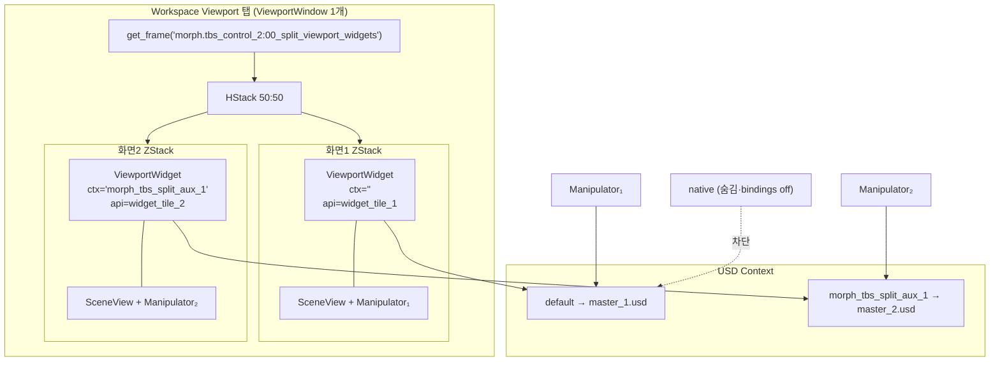

# TBS ViewportWidget 2분할 — 통합 가이드

> **작성일**: 2026-07-06  
> **대상**: Omniverse Kit / TBS Control 2 (`morph.tbs_control_2`)  
> **목적**: Workspace `Viewport` 탭 **1개** 안에서 화면1·화면2를 50:50으로 띄우고, **독립 USD Stage**에 **독립 Orbit**을 구현한 전 과정을 **이 문서 하나**에 정리한다.

---

## 목차

1. [요약 — 무엇을 달성했는가](#1-요약--무엇을-달성했는가)
2. [절대 요구사항](#2-절대-요구사항)
3. [독립 Orbit이 가능해진 이유](#3-독립-orbit이-가능해진-이유)
4. [이전에 왜 카메라가 연동됐는가](#4-이전에-왜-카메라가-연동됐는가)
5. [전체 아키텍처](#5-전체-아키텍처)
6. [처음부터 따라하기 — 8단계](#6-처음부터-따라하기--8단계)
7. [최소 통합 예시](#7-최소-통합-예시)
8. [TBS 실제 코드 — startup 순서·파일](#8-tbs-실제-코드--startup-순서파일)
9. [적용된 패치 (2026-07-06)](#9-적용된-패치-2026-07-06)
10. [조명·렌더 톤 (Orbit과 별개)](#10-조명렌더-톤-orbit과-별개)
11. [Kit 구조 조사 요약](#11-kit-구조-조사-요약)
12. [흔한 실수](#12-흔한-실수)
13. [검증 체크리스트](#13-검증-체크리스트)
14. [로그 태그](#14-로그-태그)
15. [공식 참고 URL](#15-공식-참고-url)

---

## 1. 요약 — 무엇을 달성했는가

| 항목 | 결과 |
|------|------|
| 단일 `Viewport` 탭 + HStack 50:50 | ✓ |
| 화면1 → `master_1.usd` (default context) | ✓ |
| 화면2 → `master_2.usd` (`morph_tbs_split_aux_1`) | ✓ |
| 별도 Workspace 창 (`TBS_SimSplit_*`) 없음 | ✓ |
| 타일별 독립 `ViewportAPI` + `RenderProduct` | ✓ |
| **화면1·화면2 독립 Orbit** | ✓ (2026-07-06 확인) |
| 화면1·2 렌더 톤/조명 동일 | 조명 동기화 패치 적용·검증 중 |

**핵심 성공 요인**: 타일마다 `ViewportCameraManipulator`를 붙이는 것만으로는 부족했다.  
Kit `ViewportWindow`의 **숨은 네이티브 camera 입력 경로**를 끊어야 했다.

---

## 2. 절대 요구사항

이 조건을 깨는 해결책은 채택하지 않는다.

1. **Workspace `Viewport` 탭 1개** — `get_frame` HStack 50:50
2. **`TBS_SimSplit_*` / Dock / `create_viewport_window` 금지** (Widget 모드)
3. 화면1·2 모두 **`omni.kit.widget.viewport.ViewportWidget`**
4. Widget 분할 실패 시 **Dock 자동 폴백 없음**
5. 설정 SSOT: `sim_control_defaults.py`

```python
START_WITH_DUAL_SCREEN: bool = True
USE_VIEWPORT_WIDGET_SPLIT: bool = True
VIEWPORT_DISABLE_NATIVE_CAMERA_BINDINGS: bool = True   # ★ 독립 Orbit
VIEWPORT_AUX_LIGHTING_SYNC_FROM_MAIN: bool = True      # 조명
```

---

## 3. 독립 Orbit이 가능해진 이유

### 한 줄

```python
import carb.settings
settings = carb.settings.get_settings()
settings.set("/exts/omni.kit.viewport.window/bindings/camera", {})
```

Kit은 `ViewportWindow`에 **전역 camera mouse bindings**가 걸려 있다.  
embedded `ViewportWidget`에 manipulator를 붙여도, 이 bindings가 살아 있으면 **native 경로**가 default Stage 카메라를 같이 움직인다.

### 함께 필요한 조치

| 조치 | 역할 |
|------|------|
| `bindings/camera` → `{}` | 네이티브 마우스 camera 제스처 차단 |
| native `viewport_widget` 숨김 | HStack 타일과 겹침·깜빡임 방지 |
| native manipulator navigation off | ViewportWindow 내장 manipulator 비활성 |
| 타일별 `ViewportCameraManipulator(api)` | 각 타일 API → 각 Stage Persp |
| `api.add_scene_view(scene_view)` | view/projection 동기화 |
| 활성 타일 1개만 navigation ON | 양쪽 manipulator 동시 수신 방지 |

### 독립 조작 5원칙

| # | 원칙 |
|---|------|
| 1 | 타일마다 독립 `ViewportWidget` — `usd_context_name` + 고유 `viewport_api` id |
| 2 | ZStack: **아래** Widget(렌더), **위** SceneView(마우스) |
| 3 | `ViewportCameraManipulator(그 타일 api)` |
| 4 | `add_scene_view` 사용 — **`scene_view.model = manip.model` 금지** |
| 5 | 네이티브 경로 차단 (bindings + presenter + native manipulator) |

---

## 4. 이전에 왜 카메라가 연동됐는가

Stage·RenderProduct·Hydra·ViewportAPI는 **이미 분리**되어 있었다.  
문제는 **마우스 입력이 두 갈래**로 갔기 때문이다.

```
마우스 드래그 (화면2 위)
    ├─ 경로 A (우리) ─ SceneView → Manipulator₂ → widget_tile_2 API → master_2 Persp
    └─ 경로 B (Kit)  ─ ViewportWindow native + carb bindings/camera (전역)
                       → get_active_viewport() = native API → master_1 Persp
```

`get_active_viewport()`는 embedded 타일 API가 아니라 **ViewportWindow 네이티브 API**를 반환한다.  
경로 B가 살아 있으면 화면2 Orbit 시 master_1도 같이 움직인다.

---

## 5. 전체 아키텍처



**UI 한 줄 구조**

```
ViewportWindow.get_frame(SPLIT_SLOT)
  └─ HStack 50:50
       ├─ ZStack [Rectangle | ViewportWidget₁ | SceneView₁+Manip₁]
       └─ ZStack [Rectangle | ViewportWidget₂ | SceneView₂+Manip₂]
```

---

## 6. 처음부터 따라하기 — 8단계

### Step 0. Kit 확장 의존성

```toml
"omni.kit.widget.viewport" = {}
"omni.kit.manipulator.camera" = {}
"omni.kit.viewport.window" = {}
"omni.ui.scene" = {}
```

### Step 1. ViewportWindow `get_frame` 슬롯

```python
import omni.ui as ui
import omni.kit.app as kit_app

SPLIT_SLOT = "my.ext:00_split_viewport_widgets"

async def wait_viewport_window():
    for _ in range(24):
        w = ui.Workspace.get_window("Viewport")
        if w is not None:
            return w
        await kit_app.get_app().next_update_async()
    return None
```

### Step 2. 타일 생성 — ViewportWidget + SceneView

공식 [Stage Preview Widget](https://docs.omniverse.nvidia.com/kit/docs/omni.kit.viewport.docs/latest/widget.html) 패턴을 **타일마다 1세트**.

```python
from omni.kit.widget.viewport import ViewportWidget
import omni.ui.scene as sc

def create_tile(usd_context_name, viewport_api_name, w, h,
                camera_path="/OmniverseKit_Persp"):
    with ui.ZStack():
        ui.Rectangle(style={"background_color": 0xFF101010})
        widget = ViewportWidget(
            usd_context_name=usd_context_name,
            camera_path=camera_path,
            resolution=(w, h),
            viewport_api=viewport_api_name,  # 타일마다 고유 id
        )
        scene_view = sc.SceneView(
            aspect_ratio_policy=sc.AspectRatioPolicy.STRETCH
        )
    api = widget.viewport_api
    api.resolution = (w, h)
    api.camera_path = camera_path
    return {
        "widget": widget, "api": api, "scene_view": scene_view,
        "context_name": usd_context_name,
        "camera_manipulator": None, "scene_view_registered": False,
    }
```

### Step 3. HStack 50:50 배치

```python
host = await wait_viewport_window()
half_w, h = 640, 480

with host.get_frame(SPLIT_SLOT):
    with ui.HStack(spacing=0):
        with ui.ZStack(width=ui.Fraction(0.5)):
            tile1 = create_tile("", "my.ext:widget_tile_1", half_w, h)
        with ui.ZStack(width=ui.Fraction(0.5)):
            # 화면2: USD 준비 전 placeholder, 이후 1회만 생성
            tile2_slot = ui.ZStack(width=ui.Fraction(0.5))
```

### Step 4. USD Context 분리

```python
import omni.usd as ou

def get_or_create_context(name):
    ctx = ou.get_context(name)
    return ctx if ctx else ou.create_context(name)

AUX_CTX = "morph_tbs_split_aux_1"   # TBS 실제 이름
aux_ctx = get_or_create_context(AUX_CTX)
```

| 화면 | Context | Stage |
|------|---------|-------|
| 화면1 | `""` (default) | `master_1.usd` |
| 화면2 | `morph_tbs_split_aux_1` | `master_2.usd` |

### Step 5. USD 로드 후 Stage 연결

```python
ou.get_context().open_stage(".../master_1.usd")
aux_ctx.open_stage(".../master_2.usd")

def connect_tile(rec, ctx_name):
    api = rec["api"]
    if ctx_name:
        api.usd_context_name = ctx_name
    api.camera_path = "/OmniverseKit_Persp"
```

**중요**: 화면2 `ViewportWidget`은 **master_2 로드 후 1회만** 생성한다.  
빈 context에서 미리 만들면 RenderProduct·Hydra 문제가 난다.

### Step 6. Manipulator 부착

순서: projection/RenderProduct 준비 → `add_scene_view` → `ViewportCameraManipulator(api)`

```python
from omni.kit.manipulator.camera import ViewportCameraManipulator

def attach_manipulator(rec):
    api, scene_view = rec["api"], rec["scene_view"]
    api.add_scene_view(scene_view)
    rec["scene_view_registered"] = True
    with scene_view.scene:
        manip = ViewportCameraManipulator(api)
    manip.model.set_ints("disable_undo", [1])
    rec["camera_manipulator"] = manip
    return manip
```

**금지**: `scene_view.model = manip.model` — projection 동기화 깨짐, 화면2 미렌더.

### Step 7. 네이티브 경로 차단 ★

```python
CAM_KEY = "/exts/omni.kit.viewport.window/bindings/camera"

def disable_native_camera_path(ext):
    settings = carb.settings.get_settings()
    ext._saved_bindings = settings.get(CAM_KEY)
    settings.set(CAM_KEY, {})

    vw = ui.Workspace.get_window("Viewport")
    for attr in ("viewport_widget", "_viewport_widget"):
        w = getattr(vw, attr, None)
        if w: w.visible = False

    from omni.kit.viewport.utility import get_viewport_from_window_name
    native = get_viewport_from_window_name("Viewport")
    if native:
        for a in ("enable_input", "inputs_enabled"):
            if hasattr(native, a): setattr(native, a, False)
```

TBS 함수: `_disable_viewport_window_camera_bindings`, `_suspend_native_viewport_widget_presenter`, `_disable_native_viewport_navigation_permanent`.

### Step 8. 활성 타일 전환

```python
def set_nav(model, on):
    f = 0 if on else 1
    for k in ("disable_tumble", "disable_pan", "disable_zoom", "disable_look"):
        model.set_ints(k, [f])

def activate_tile_only(tiles, active):
    for name, rec in tiles.items():
        m = getattr(rec.get("camera_manipulator"), "model", None)
        if m: set_nav(m, name == active)

def bind_activation(rec, name, activate_fn):
    def on_mouse(*_):
        activate_fn(name)
        return False
    rec["scene_view"].set_mouse_pressed_fn(on_mouse)
    rec["scene_view"].set_mouse_hovered_fn(on_mouse)
```

---

## 7. 최소 통합 예시

```python
async def setup_dual_viewport(ext):
    host = await wait_viewport_window()
    tiles = build_hstack_shell(host)       # 화면1 즉시, 화면2 슬롯

    disable_native_camera_path(ext)        # ★ 먼저

    ou.get_context().open_stage(MASTER_1)
    get_or_create_context(AUX_CTX).open_stage(MASTER_2)

    connect_tile(tiles["Viewport"], "")
    create_tile_in_slot(tiles["aux"], AUX_CTX, "my.ext:widget_tile_2", ...)
    connect_tile(tiles["aux"], AUX_CTX)

    for _ in range(8):
        await kit_app.get_app().next_update_async()

    for name, rec in tiles.items():
        attach_manipulator(rec)
        bind_activation(rec, name, lambda n: activate_tile_only(tiles, n))

    activate_tile_only(tiles, "Viewport")
```

---

## 8. TBS 실제 코드 — startup 순서·파일

### Startup 순서

| # | 함수 | 설명 |
|---|------|------|
| 1 | `apply_split_widget_layout` | HStack + 화면1 Widget, 화면2 placeholder |
| 2 | USD loader | `master_1` → default, `master_2` → aux ctx |
| 3 | `connect_widget_tile_main_stage` | 화면1 API ↔ default ctx |
| 4 | `_connect_widget_tile_aux_stage` | 화면2 Widget **최초 1회** 생성 + 연결 |
| 5 | `finalize_widget_split_startup` | manipulator, bindings off, READY |
| 6 | `assign_widget_split_cameras` | 타일별 `camera_path` 설정 |

### 소스 파일

| 파일 | 역할 |
|------|------|
| `sim_multi_view_widget.py` | HStack shell, 타일 생성, manipulator, native 차단, 조명 동기화 |
| `sim_multi_view.py` | Context 생성, startup orchestration |
| `sim_control_defaults.py` | 플래그 SSOT |
| `sim_viewport_coupling_diag.py` | Orbit·조명 진단 로그 |

### 타일 record 구조 (개념)

```python
rec = {
    "widget": ViewportWidget,
    "api": ViewportAPI,
    "scene_view": SceneView,
    "camera_manipulator": ViewportCameraManipulator | None,
    "scene_view_registered": bool,
    "context_name": str,          # "" or "morph_tbs_split_aux_1"
    "manip_pending": bool,
    "stage_connected": bool,
}
```

---

## 9. 적용된 패치 (2026-07-06)

### P0-A — 독립 Orbit (성공 확인)

| 패치 | 내용 |
|------|------|
| **camera bindings `{}`** | native manipulator 마우스 경로 차단 — **결정적** |
| native presenter 숨김 | 깜빡임·겹침 방지 |
| native manipulator nav off | ViewportWindow 내장 조작 비활성 |
| Orbit 계측 | `MANIP_ACTIVATE`, `ORBIT_CTX`, `USD_CHANGED` (Persp만) |

### P0-B — 조명·렌더

| 패치 | 내용 |
|------|------|
| `_sync_aux_stage_lighting_from_main` | 화면1 UsdLux → aux session layer `CopySpec` |
| fallback DomeLight | 복제 0건 + 조명 없을 때만 |
| `stage-lux` 로그 | main vs aux UsdLux 경로 비교 |
| aux fps bootstrap | READY 후 fps&lt;0.5 이면 렌더 pump 16프레임 |

### 재시도하지 않은 것 (효과 없었음)

`enable_input` 반복, `focus()`, polling, hold loop, `viewport_changed`, render profile 대량 복사, `camera_path` 임의 변경, `request_render`/`wake_up` 반복, SceneView 재생성.

---

## 10. 조명·렌더 톤 (Orbit과 별개)

| 레이어 | Orbit | 톤/조명 |
|--------|-------|---------|
| ViewportAPI attr | 관련 | DIFF 없어도 시각 다를 수 있음 |
| Stage UsdLux | 무관 | **핵심** — 화면1 복제 필요 |
| Hydra / Presenter | 무관 | 타일별 인스턴스 |

객체가 **검게** 보이면 ViewportAPI가 아니라 **Stage 조명 부재**.  
DomeLight 무조건 제거는 회귀 원인이었음 → 화면1과 **동일 UsdLux** 복제가 목표.

---

## 11. Kit 구조 조사 요약

| 질문 | 답 |
|------|-----|
| `get_frame`+HStack+ViewportWidget×2 공식 지원? | **공식 샘플 없음** |
| Coupling 원인 | 앱 버그 아님 — **native bindings + active viewport** |
| `ViewportCameraManipulator` 내부 | API 계약상 `viewport_api` 인자; 소스는 Kit 패키지 내 |
| 공식 다중 뷰 패턴 | `create_viewport_window()` — 별도 Window (TBS 제약과 충돌) |

---

## 12. 흔한 실수

| 실수 | 증상 | 해결 |
|------|------|------|
| `scene_view.model = manip.model` | 화면2 미렌더 | `add_scene_view` 만 |
| 화면2 Widget을 USD 전 생성 | RP 없음 | master_2 후 deferred 1회 |
| `create_viewport_window` | 별도 탭 | `get_frame` HStack only |
| bindings 그대로 | 양쪽 카메라 이동 | `bindings/camera` → `{}` |
| manipulator 양쪽 nav ON | 동시 수신 | 활성 타일 1개만 |
| `get_active_viewport()` 사용 | native 조작 | 타일 `rec["api"]` |

---

## 13. 검증 체크리스트

- [ ] `ViewportWidget.get_instances()` — embedded API ≠ native API id
- [ ] 화면2 Orbit → `master_2` Persp만 변경
- [ ] 화면1 Orbit → `master_1` Persp만 변경
- [ ] 로그: `ViewportWindow camera bindings disabled`
- [ ] 로그: `manipulator attached` 양쪽
- [ ] (조명) `stage-lux` main/aux 경로 유사

---

## 14. 로그 태그

| 태그 | 용도 |
|------|------|
| `[TBS/multi-sim]` | startup·조명·bindings |
| `[TBS/coupling-report]` | READY manipulator·stage-lux |
| `[TBS/coupling-trace]` | Orbit USD_CHANGED·MANIP_ACTIVATE·ORBIT_CTX |
| `[TBS/widget-life]` | Widget/API 수명 |
| `[TBS/hydra-diag]` | RenderProduct·Hydra |

---

## 15. 공식 참고 URL

- [Stage Preview Widget](https://docs.omniverse.nvidia.com/kit/docs/omni.kit.viewport.docs/latest/widget.html)
- [Viewport API](https://docs.omniverse.nvidia.com/kit/docs/omni.kit.viewport.docs/latest/viewport_api.html)
- [Camera Manipulation](https://docs.omniverse.nvidia.com/kit/docs/omni.kit.viewport.docs/latest/camera_manipulator.html)
- [ViewportWindow](https://docs.omniverse.nvidia.com/kit/docs/omni.kit.viewport.window/latest/omni.kit.viewport.window/omni.kit.viewport.window.ViewportWindow.html)
- [ViewportWidget Overview](https://docs.omniverse.nvidia.com/kit/docs/omni.kit.widget.viewport/latest/Overview.html)
