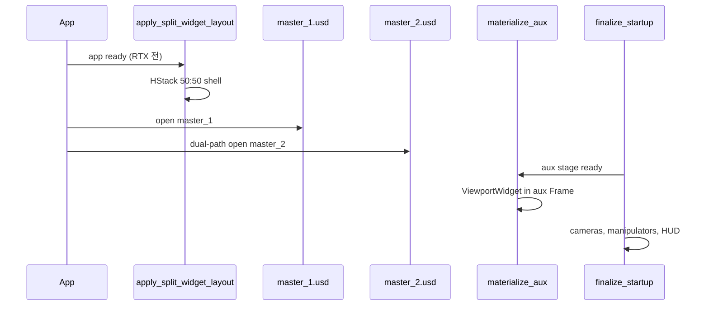

# TBS Control 2 — ViewportWidget 2분할 구현 현황 및 미해결 현상

> **작성 목적**: 코드 추가 수정 없이, 현재 구현 방식·로그·증상을 외부(예: ChatGPT, NVIDIA 포럼)에 공유해 해결책을 찾기 위한 기술 문서  
> **작성일**: 2026-07-05  
> **최종 갱신**: 2026-07-06 22:00 (§12 패치 적용)  
> **대상 확장**: `morph.tbs_control_2`  
> **플랫폼**: NVIDIA Omniverse Kit (RTX - Real-Time 2.0)  
> **상세·ChatGPT용 최신 문서**: [`docs/tbs_control_2_viewport_widget_split_chatgpt_briefing_ko.md`](tbs_control_2_viewport_widget_split_chatgpt_briefing_ko.md) ← **우선 참조**

---

## 1. 요약 (Executive Summary) — 2026-07-06 22:00

앱 시작 시 **Workspace `Viewport` 탭 1개** 안에서 **좌우 50:50**으로 화면1·화면2를 동시에 보여야 한다.  
각 화면은 **독립 USD 컨텍스트·스테이지**(`master_1.usd` / `master_2.usd`)를 사용하며, **별도 Workspace 창(`TBS_SimSplit_1`)은 절대 만들면 안 된다.**

| 항목 | 상태 |
|------|------|
| 단일 Viewport 탭 + HStack 50:50 | **성공** |
| `TBS_SimSplit_1` 별도 창/탭 | **성공** |
| 화면1 렌더 (머티리얼·조명) | **성공** |
| 화면2 RenderProduct (`ViewportTexture_2`) | **성공** |
| 화면2 **객체 셰이딩** | **§12 패치 후 재검증 필요** — 화면1 UsdLux session 복제 |
| 깜빡임 / RP 파괴 | **해소** |
| **Manipulator 양쪽 부착** | **성공** |
| **화면2 orbit → 화면1 카메라 연동** | **§12 패치 후 재검증** — native camera bindings 차단 |
| **화면1·2 렌더 톤/조명 동일** | **§12 패치 후 재검증** — UsdLux 복제 + `stage-lux` 로그 |
| Dock / `create_viewport_window` 폴백 | **의도적으로 금지** |

> **통합 가이드 (단일 문서)**: [`tbs_control_2_viewport_widget_split_complete_ko.md`](tbs_control_2_viewport_widget_split_complete_ko.md) ← **독립 Orbit·구현 전 과정**

---

## 2. 절대 요구사항 (Hard Constraints)

사용자가 반복해서 강조한 제약. **이 조건을 깨는 해결책은 채택 불가.**

1. **Workspace `Viewport` 탭은 1개만** — 내부 `get_frame` HStack 50:50으로 분할
2. **`TBS_SimSplit_*` Workspace 창 / Dock / `create_viewport_window` 사용 금지** (Widget 모드)
3. 화면1·화면2 모두 **`omni.kit.widget.viewport.ViewportWidget`** 기반
4. Widget 분할 실패 시 **Dock으로 자동 폴백하지 않음** (두 번째 창 재발 방지)
5. `USE_VIEWPORT_WIDGET_SPLIT=False` 경로(Dock + `create_viewport_window`)는 **기존 코드 유지**, Widget 경로만 작업

설정 SSOT: `sim_control_defaults.py`

```python
START_WITH_DUAL_SCREEN: bool = True
USE_VIEWPORT_WIDGET_SPLIT: bool = True
MAX_VIEWPORT_SPLIT_COUNT: int = 2
```

환경변수: `TBS_SIM_VIEWPORT_WIDGET_SPLIT=0` → Widget 모드 off

---

## 3. 목표 아키텍처

```
Workspace "Viewport" 탭 (1개)
└─ ViewportWindow.get_frame("morph.tbs_control_2:00_split_viewport_widgets")
    └─ ui.HStack (50% : 50%)
        ├─ [화면1] ui.ZStack
        │     ├─ ViewportWidget (usd_context = 기본 omni.usd, master_1.usd)
        │     └─ omni.ui.scene.SceneView + ViewportCameraManipulator
        └─ [화면2] ui.Frame → (aux USD 준비 후 materialize)
              ├─ ViewportWidget (usd_context = morph_tbs_split_aux_1, master_2.usd)
              └─ SceneView + ViewportCameraManipulator
```

**논리 타일 이름** (Workspace 창 이름과 별개, 코드 내부 식별자):

| 타일 | 논리 win_name | USD 컨텍스트 | 스테이지 |
|------|---------------|--------------|----------|
| 화면1 | `Viewport` | `""` (기본 `omni.usd`) | `master_1.usd` |
| 화면2 | `TBS_SimSplit_1` | `morph_tbs_split_aux_1` | `master_2.usd` |

> `TBS_SimSplit_1`은 **타일 레코드 키**일 뿐, 실제 Workspace 창을 만들지 않는다.

---

## 4. 핵심 소스 파일

| 파일 | 역할 |
|------|------|
| `sim_control_defaults.py` | `USE_VIEWPORT_WIDGET_SPLIT`, `START_WITH_DUAL_SCREEN` |
| `sim_multi_view_widget.py` | ViewportWidget shell·deferred aux·카메라 manipulator·렌더 프로필 동기화 |
| `sim_viewport_coupling_diag.py` | P0 coupling 조사 로그 (`[TBS/coupling-report]`, `[TBS/coupling-trace]`) |
| `sim_viewport_rp_diag.py` | RenderProduct 체인 관측 (`[TBS/rp-invest]`) |
| `sim_multi_view.py` | 분할 오케스트레이션, Dock 경로(Widget off), entry 관리 |
| `tbs_split_composed_loader.py` | dual-path USD 로드, 화면2 Discover/Extract |
| `kit_chrome_visibility.py` | Viewport·TBS_SimSplit 보호 |

### 4.1 `sim_multi_view_widget.py` 주요 함수 (2026-07-06 갱신)

| 함수 | 설명 |
|------|------|
| `apply_split_widget_layout()` | shell 생성 (화면1 Widget + 화면2 Rectangle 슬롯) |
| `_build_split_widget_shell()` | `get_frame` HStack 50:50 |
| `_create_viewport_tile()` | `ZStack(ViewportWidget + SceneView)` 1타일 |
| `_create_deferred_aux_viewport_widget()` | master_2 후 화면2 Widget **1회** 생성 |
| `finalize_widget_split_startup()` | Stage 연결·visual sync·manipulator·HUD |
| `_bind_widget_split_cameras_once()` | 타일별 `camera_path` 1회 설정 |
| `_activate_tile_manipulator_only()` | 타일 manipulator navigation 토글 (focus 없음) |
| `_disable_native_viewport_navigation_permanent()` | 네이티브 manipulator·입력 영구 OFF |
| `_ensure_tile_manipulator()` | SceneView + `ViewportCameraManipulator` 부착 |
| `_copy_visual_render_profile_only()` | Hydra 공유 없이 ViewportAPI 시각 attr 복사 |
| `_sync_aux_tile_render_from_main()` | aux ← main visual profile |
| `_ensure_aux_stage_default_lighting()` | **함수는 존재하나 호출 제거됨** (12:38 회귀 원인) |

**제거·축소됨**: `_start_native_viewport_input_guard`, nav hold polling, `assign_widget_split_cameras` 12회 폴링, finalize bootstrap 루프.

### 4.2 Extension 상태 플래그 (`ext` 속성)

| 속성 | 의미 |
|------|------|
| `_tbs_split_used_widget_layout` | Widget 분할 활성 |
| `_tbs_split_widget_tiles` | `{"Viewport": rec, "TBS_SimSplit_1": rec}` 타일 레코드 |
| `_tbs_aux_cell_frame` | 화면2 placeholder → materialize 대상 Frame |
| `_tbs_aux_vw_materialized` | 화면2 ViewportWidget 주입 완료 |
| `_tbs_active_widget_tile` | 현재 입력 포커스 타일 |
| `_tbs_widget_split_ready` | `finalize_widget_split_startup` 완료 |
| `_sim_multi_context_names` | `["morph_tbs_split_aux_1", ...]` 보조 컨텍스트 목록 |

---

## 5. Startup 시퀀스 (layout-first) — 2026-07-06 갱신

```
[app ready]
  → apply_split_widget_layout()
       ├─ 화면1: ViewportWidget #1 즉시 생성
       ├─ 화면2: Rectangle 슬롯만 (deferred)
       └─ _disable_native_viewport_navigation_permanent()
  → manipulator attached tile='Viewport' (shell 직후)

[RTX ready]
  → master_1.usd open

[화면2 dual-path]
  → master_2.usd → morph_tbs_split_aux_1
  → deferred aux ViewportWidget #2 생성
  → manipulator attached tile='TBS_SimSplit_1'

[finalize_widget_split_startup]
  → _copy_visual_render_profile_only (aux ← main)
  → _bind_widget_split_cameras_once
  → [TBS/coupling-report] READY
  → "ViewportWidget 분할 startup READY (create_total=2)"
```

**12:38 로그에서 확인된 finalize 상태**

- `HAS_RP=True` 양쪽 (`ViewportTexture_1` / `_2`)
- manipulator 양쪽 `SceneCameraModel` + `ViewportCameraManipulator`
- `render-profile-diff`: DIFF 없음
- aux `fps=0`, main `fps≈0.33`
- **`_ensure_aux_stage_default_lighting` 미호출** → 화면2 객체 검은 실루엣 (사용자 스크린샷)

Mermaid:



---

## 6. ViewportWidget 타일 생성 상세

### 6.1 `_create_viewport_tile()` 구조

```python
with ui.ZStack():
    vw_tile = ViewportWidget(
        camera_path="/OmniverseKit_Persp",
        resolution=(tile_w, tile_h),
        usd_context_name=ctx_name,   # 화면1: 키 생략(기본 ctx), 화면2: morph_tbs_split_aux_1
        hd_engine=hd_engine,         # 네이티브 Viewport에서 복사한 rtx 엔진
    )
    vw_tile.fill_frame = False
    scene_view = sc.SceneView(aspect_ratio_policy=STRETCH)
```

- `api = vw_tile.viewport_api` 로 Viewport API 획득
- manipulator는 **즉시** 붙이지 않고 `_schedule_tile_manipulators_when_ready()`로 projection 준비 후 `api.add_scene_view(scene_view)` → `ViewportCameraManipulator(api)`

### 6.2 카메라

- 양 타일 모두 **`/OmniverseKit_Persp`** (스테이지별 독립 prim — 컨텍스트가 다르므로 물리적으로 다른 카메라)
- 커스텀 `/OmniverseKit_Persp_SplitAux` 복제는 **GfQuatf/GfQuatd 오류**로 포기

### 6.3 네이티브 Viewport 처리

Widget shell 적용 후:

- `_set_native_viewport_input_blocked(ext, True)` → 네이티브 `Viewport` API의 `enable_input`, `inputs_enabled`, **`updates_enabled`, `enabled` 모두 False**
- 매 프레임 `_start_native_viewport_input_guard` tick에서 재적용
- 목적: Widget 타일 뒤에 네이티브 Viewport가 겹쳐 그려지거나 입력을 가로채지 않게 함

### 6.4 보조 스테이지 조명

- `_ensure_aux_stage_default_lighting(aux_ctx)` — DomeLight 없으면 추가

---

## 7. Dock 경로 vs Widget 경로 (비교)

| | Widget 경로 (`USE_VIEWPORT_WIDGET_SPLIT=True`) | Dock 경로 (`False`) |
|--|--|--|
| UI | Viewport 탭 1개, get_frame HStack | Viewport + TBS_SimSplit_1 Dock |
| 뷰포트 생성 | `ViewportWidget` × 2 | `create_viewport_window` |
| RTX 렌더 루프 | Widget 자체 Hydra texture | Kit ViewportWindow 백엔드 |
| 현재 상태 | **개발 중, 렌더 이슈** | 기존 동작 (변경 금지) |

---

## 8. 현재 관측 현상 (2026-07-05 로그 기준)

### 8.1 화면 레이아웃

- **Viewport 탭 1개** — 요구사항 충족
- **좌측**: 화면1 — 3D 장면 + EBS HUD 오버레이 일부 표시
- **우측**: 화면2 — **완전 검정**, FPS 오버레이 **0.00**

### 8.2 핵심 로그 (성공·실패 혼재)

```
[TBS multi-sim] Widget 타일 api tile='Viewport' expect_ctx='' api_ctx=''
[TBS multi-sim] ViewportWidget shell 적용 — aux USD·HUD·navigation 은 startup READY 에서 1회
[TBS multi-sim] 분할 레이아웃: ViewportWidget shell (Dock 미사용)
...
[TBS multi-sim] 보조 스테이지 기본 DomeLight 추가 ctx='morph_tbs_split_aux_1'
[TBS multi-sim] 화면2 ViewportWidget materialize tile='TBS_SimSplit_1' ctx='morph_tbs_split_aux_1'
[TBS multi-sim] Widget 타일 api tile='TBS_SimSplit_1' expect_ctx='morph_tbs_split_aux_1' api_ctx='morph_tbs_split_aux_1'
[TBS multi-sim] aux ViewportWidget hydra='rtx' mode='RealTimePathTracing'
[TBS multi-sim] tile render diag tile='TBS_SimSplit_1' res=(574,612) fps=0 fill_frame=False cam=/OmniverseKit_Persp
[TBS multi-sim] 화면2 ViewportWidget materialize 완료 (단일 Viewport 탭·HStack 50:50)
[TBS multi-sim] tile render diag tile='Viewport' res=(574,612) fps=0.39 fill_frame=False cam=/OmniverseKit_Persp
[TBS multi-sim] tile render diag tile='TBS_SimSplit_1' res=None fps=0 fill_frame=False cam=None   ← READY 직후 api 붕괴?
[TBS multi-sim] ViewportWidget 분할 startup READY
```

**해석:**

1. materialize 직후 화면2: `res=(574,612)`, `cam=/OmniverseKit_Persp`, **`fps=0`**
2. finalize 마지막 diag에서 화면2: **`res=None`, `cam=None`, `fps=0`** — API 객체가 무효화되었거나 Widget이 파괴된 가능성
3. 화면1: `fps≈0.39` — 렌더 루프는 돌지만 매우 느림 (정상 Viewport 대비 ~240fps)

### 8.3 GPU 경고

```
[Error] [gpu.foundation.plugin] make sure to wait for cmdlist completion ...
```

materialize 타이밍에 GPU command list 동기화 문제 가능성.

### 8.4 카메라 coupling (화면2 조작 → 화면1 이동)

**증상**: 우측(검정) 영역에서 마우스 드래그/휠 시 좌측 화면1 카메라가 움직임.

**가능 원인 (코드 분석 기반):**

1. **화면2 manipulator 미부착** — `fps=0`, `res=None`이면 `_api_ready_for_manipulator` / `_api_projection_ready` 실패 → `ViewportCameraManipulator`가 화면2에 없음
2. **입력이 네이티브 Viewport 또는 화면1 manipulator로 전달** — `_suspend_native_viewport_manipulators()`가 `TBS_SimSplit_1` **Workspace 창** manipulator를 끄려 하지만, Widget 모드에서는 해당 창이 없어 효과 없음
3. **활성 타일 전환 실패** — `_wire_frame_focus_input` / `_wire_tile_input`이 placeholder·검정 영역 클릭 시 `_tbs_active_widget_tile = TBS_SimSplit_1`로 설정하지만, manipulator가 없으면 실제 카메라 조작은 다른 경로(화면1 또는 Kit 기본)로 감
4. **동일 camera_path** — 양쪽 `/OmniverseKit_Persp`이지만 컨텍스트가 다르면 독립이어야 함. coupling이 화면1으로만 간다면 **조작 대상 API가 화면1 쪽**임을 시사

### 8.5 USD / 시뮬 (부수적)

- Extract `NEED-BAKE-OR-EMPTY` (OmniGraph 자산) — 양 화면 공통, 렌더 실패의 직접 원인은 아닐 수 있음 (정적 mesh는 보임)
- `Stage opening or closing already in progress` — 화면2 open 타이밍 경합

---

## 9. 시도했던 접근과 결과 (역사)

| # | 접근 | 결과 | 채택 |
|---|------|------|------|
| 1 | Dock + `create_viewport_window` (기존) | 화면2 렌더 OK | Widget 모드에서 **사용 금지** |
| 2 | 커스텀 aux 카메라 `SplitAux` prim 수동 생성 | GfQuatf/GfQuatd manipulator 오류 | **포기** |
| 3 | Sdf.CopySpec으로 Persp 복제 | 부분 성공, 여전히 이슈 | **포기** |
| 4 | 화면2 hidden `create_viewport_window` + `viewport_api` 브리지 | fps>0 but **`TBS_SimSplit_1` 창 노출** | **사용자 거부, 제거** |
| 5 | 화면1 `viewport_api=native_api` 브리지 | `weakref.ProxyType` 오류로 **shell 전체 실패** | **제거** |
| 6 | 순수 ViewportWidget (현재) | 단일 탭 OK, 화면2 검정·fps=0, 카메라 coupling | **현재 상태** |
| 7 | Dock 폴백 (Widget 실패 시) | 두 번째 창 재발 | **금지** |
| 8 | `_workspace_show_named_window`에서 TBS_SimSplit show 차단 | 별도 창 방지 성공 | **유지** |

---

## 10. 미해결 이슈 정리 (질문용)

### Q1. 보조 USD 컨텍스트 + ViewportWidget만으로 RTX 렌더 루프를 어떻게 돌리나?

- `create_viewport_window` 없이 `ViewportWidget(usd_context_name="morph_tbs_split_aux_1")`만으로 Hydra texture가 갱신되어야 함
- 현재 `hydra='rtx'`, `mode='RealTimePathTracing'` 설정은 되지만 **`fps=0`**
- Kit에서 두 번째 `UsdContext`용 `ViewportWidget`에 필요한 추가 설정이 있는지? (`RenderProduct`, `request_render` 주기, extension dependency 등)

### Q2. `get_frame` 슬롯 안 ViewportWidget의 알려진 제한은?

- shell이 **RTX ready 전** (~6s) 적용됨 — 타이밍 이슈인가?
- `fill_frame=False` + 명시적 `resolution` 사용 중
- 두 Widget이 같은 `ViewportWindow.get_frame` 슬롯에 있을 때 두 번째만 실패하는 사례?

### Q3. finalize 후 `res=None, cam=None` — API가 왜 무효화되나?

- materialize 직후에는 `res=(574,612)` 유효
- `finalize_widget_split_startup` 마지막 diag에서 무효
- `_destroy_all_aux_workspace_windows`, `sync_split_widget_fill_frame`, manipulator 등록 중 Widget/api 파괴 가능성

### Q4. Widget 타일별 독립 카메라 manipulator 패턴

- `api.add_scene_view(scene_view)` + `ViewportCameraManipulator(api)` 패턴이 맞는지
- 화면2에서 `scene_view_registered` / `manip_pending` 상태를 어떻게 확인해야 하는지
- 검정 화면에서 입력이 화면1으로 가는 Kit 기본 동작을 막는 공식 방법

### Q5. `viewport_api` 브리지 없이 화면1 렌더 성능

- 화면1 `fps≈0.39` — 네이티브 Viewport 대비 극히 낮음
- 네이티브 `updates_enabled=False` 후 Widget만 렌더하는 구조에서 성능 저하가 정상인지

---

## 11. 재현 절차

1. `sim_control_defaults.py`: `START_WITH_DUAL_SCREEN=True`, `USE_VIEWPORT_WIDGET_SPLIT=True`
2. 앱 실행 (`morph.editor` 등)
3. 자동으로 `master_1.usd`, `master_2.usd` 로드 (dual-path)
4. Viewport 탭에서 좌우 분할 확인
5. 우측 검정 + 우측 드래그 시 좌측 카메라 이동 확인
6. 콘솔에서 `tile render diag` 줄 확인

---

## 12. ChatGPT / 외부 검색에 넣을 키워드

```
Omniverse Kit ViewportWidget multiple usd context split view
omni.kit.widget.viewport ViewportWidget secondary UsdContext fps 0
ViewportWindow get_frame multiple ViewportWidget HStack
ViewportCameraManipulator add_scene_view secondary viewport
create_viewport_window vs ViewportWidget hydra render loop
Kit viewport_api weakref ProxyType ViewportWidget
```

---

## 13. 코드 수정 시 주의 (다음 작업자용)

1. **`create_viewport_window`를 Widget 경로에 다시 넣지 말 것** — `TBS_SimSplit_1` 창 재발
2. **`viewport_api=native_api` 브리지 금지** — `weakref.ProxyType` 크래시
3. Widget 실패 시 **Dock 폴백 금지** (`sim_multi_view.py` `widget_only` 분기)
4. manipulator 부착 시 **`scene_view.model = manip.model` 덮어쓰기 금지** (주석에 명시됨)
5. 화면2 materialize는 **`_tbs_aux_cell_frame`에만** 주입 — 별도 Workspace 창 X

---

## 14. 관련 문서

- **`docs/tbs_control_2_viewport_widget_split_chatgpt_briefing_ko.md`** — **(2026-07-06 01:10 최신)** RP 파괴 수정·미해결 P0(coupling·렌더 동일)·증상 완화 패치 실패·ChatGPT 질문 §20
- `docs/tbs_control_2_multi_split_requirements_ko.md` — 멀티 분할 기능 요구사항 (시뮬·JSON 측)
- `docs/tbs_control_2_playback_structural_redesign_ko.md` — 2화면 시뮬 구조

> **주의**: 본 status 문서 §8~15 일부는 07-05 시점(화면2 검정) 기술. 최신 증상은 briefing §1·§19 우선.

---

## 15. 부록: 최신 로그 타임라인 (요약)

| 시각(상대) | 이벤트 |
|------------|--------|
| 6.06s | app ready, shell 적용 시작 |
| 6.x s | ViewportWidget shell OK (RTX **전**) |
| 9.97s | RTX ready |
| 10.6s | master_1.usd open |
| 13.6s | master_2.usd open (stage busy 경고) |
| 17.7s | 화면2 materialize, fps=0 |
| 17.7s+ | finalize READY, 화면2 api res=None |

---

*이 문서는 현상 기록용. 2026-07-06 01:10 이후 상세·ChatGPT 질문은 briefing 문서를 사용하세요.*
