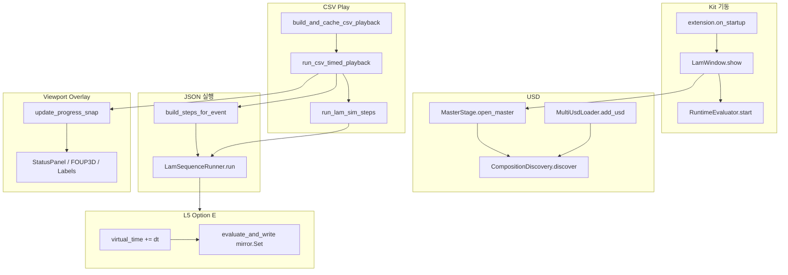

# LAM Control — 실무 담당자 기술 가이드

> **대상 독자**: Omniverse Kit / USD를 어느 정도 아는 엔지니어  
> **목적**: `morph.lam_control` 확장의 주요 기능을 **파일·코드·데이터 흐름**으로 따라갈 수 있게 설명  
> **패키지명**: `morph.lam_control` / Python 모듈: `morph/lam_control/`  
> **형식**: `TBS_Control_2_Operator_Technical_Guide.md`와 동일 — **① 호출부 / ② 원초 구현**  
> **용어가 낯설면** → **§0.1 용어 설명**을 먼저 읽으세요.

---

## 0. 확장 구조 한눈에

Kit 앱이 로드하면 `extension.py`가 진입점입니다. LAM은 **여러 USD를 하나의 Master stage에 합성**하고, **인스턴스마다 독립 virtual_time(Option E)** 으로 재생합니다.

```
source/extensions/morph.lam_control/
├── morph/lam_control/              ← Python 코드 (핵심)
│   ├── extension.py                ← on_startup / on_shutdown
│   ├── lam_window.py               ← 메인 창 + 오버레이 조립
│   ├── simulation_play.py          ← CSV dwell 재생 + Play UI
│   ├── lam_sequence_engine.py      ← JSON step 실행 (LamSequenceRunner)
│   ├── lam_sequence_editor.py      ← 시퀀스 편집기 UI
│   ├── lam_event_sequences.py      ← 이벤트 JSON → step 조립
│   ├── lam_sim_actions.py          ← 46개 pick/place 매크로
│   ├── lam_master_stage.py         ← Master USD (L1)
│   ├── lam_multi_usd_loader.py     ← 다중 USD 등록 (L1b)
│   ├── lam_instance_registry.py    ← 인스턴스 SSOT (L3)
│   ├── lam_playback_scheduler.py     ← 재생 API (L4)
│   ├── lam_runtime_evaluator.py    ← Option E reauthor (L5)
│   ├── lam_viewport_overlay_config.py  ← 오버레이 SSOT
│   ├── lam_viewport_overlay_state.py   ← 오버레이 런타임 상태
│   ├── lam_viewport_status_panel.py    ← 2D STATUS HUD
│   ├── lam_viewport_foup_status_3d.py  ← FOUP 3D 패널
│   ├── lam_viewport_device_labels_3d.py
│   ├── lam_wafer_viewport_labels.py    ← 웨이퍼 번호 3D
│   ├── lam_viewport_pick_whitelist.py
│   ├── lam_csv_viewport_hud.py         ← Viewport 우측 CSV 미니 패널
│   ├── lam_play_prim_hide.py           ← Play 시 prim 숨김/fade
│   └── lam_play_camera_fly.py          ← Play 시 카메라 fly
└── data/
    ├── csv/                        ← dwell CSV (EAP 시뮬)
    ├── lam_event_sequences/          ← 이벤트 JSON (pick/place)
    ├── usd/                        ← Master/합성 USD
    └── lam_external_results/         ← 외부 시뮬 결과 샘플
```

**TBS(`morph.tbs_control_2`)와의 핵심 차이**

| 항목 | LAM | TBS Control 2 |
|------|-----|---------------|
| import | `morph.tbs_control_1.*` **절대 import 안 함** | TBS 전용 모듈 |
| 시뮬 | **CSV dwell → JSON step** | **SimPy** 공정 시뮬 |
| USD | default context `""`, **합성 stage 유지** | TBS USD Load가 default stage 교체 |
| 재생 | L3 Registry + L5 **Option E** (per-instance virtual_time) | TBS_OFFSET + 단일 stage |
| HTTP | `morph.lam_web_bridge` + `remote_api.py` | `kit_remote_http_bridge` |

**읽는 순서 추천**

0. 이 문서 **§0.1 용어 설명** — 처음 보는 단어 정리  
1. `extension.py` — 싱글턴 생성·창 표시  
2. `lam_window.py` — Master open·오버레이 조립  
3. `simulation_play.py` 상단 구조 주석 — CSV Play 파이프라인  
4. `lam_sequence_engine.py` docstring — main-thread dispatch  
5. `lam_viewport_overlay_config.py` — 운영자 SSOT

| 궁금한 것 | 문서 섹션 |
|-----------|-----------|
| **처음 보는 용어 전체** | **§0.1 용어 설명** |
| JSON Save/Load · 편집기 Run | §1.2 · §1.3 |
| MOVE/ROTATE **TranslateOp/RotateXYZOp.Set** | §1.5.1 · §1.5.2 |
| TIMESAMPLES **attr.Get + mirror.Set** | §1.5.4 |
| Master USD open **ctx.open_stage()** | §2.3 |
| 다중 USD 추가 **AddReference** | §2.4 |
| CSV Play **dwell → JSON** | §3.2 · §3.3 |
| 이벤트 JSON **build_steps_for_event** | §4.2 |
| 2D STATUS HUD | §5.1 |
| FOUP 3D 패널 | §5.2 |
| 기기 3D 라벨 | §5.3 |
| 웨이퍼 번호 3D | §5.4 |
| Pick whitelist | §5.5 |
| Play prim 숨김 / 카메라 fly | §5.6 · §5.7 |
| L3~L5 Option E | §6 |

**문서 작성 규칙 (전 섹션 공통)**

| 표기 | 의미 |
|------|------|
| **① 호출부** | UI·엔진·CSV가 **어떤 함수/모듈을 호출**하는지 |
| **② 원초 구현** | 그 호출 **안에서** USD/Kit/SimPy/UI API로 **실제 상태가 바뀌는** 코드 |

---

### 0.1 용어 설명 (Glossary)

본문에 나오는 전문 용어를 **처음 읽는 사람 기준**으로 풀어 씁니다.  
TBS 가이드(`TBS_Control_2_Operator_Technical_Guide.md`) **§0.1**에 SimPy·프리런·EP 막대 등 TBS 전용 설명이 있습니다.

#### A. 이 문서만의 읽기 방식

| 용어 | 쉬운 설명 |
|------|-----------|
| **① 호출부** | “누가 누구를 부르나” — CSV Play·버튼·엔진이 호출하는 **함수 이름**과 흐름. |
| **② 원초 구현** | “실제로 무엇이 바뀌나” — `op.Set()`, `MakeInvisible()`, `ui.Rectangle` 등 **상태가 변하는 마지막 코드**. |
| **SSOT** | *Single Source of Truth* — 설정을 **한 파일**만 수정하면 되게 둔 기준 파일. 예: `lam_viewport_overlay_config.py`. |

#### B. Kit · USD · 그래픽 기본

| 용어 | 쉬운 설명 |
|------|-----------|
| **Kit / Omniverse Kit** | NVIDIA 3D 앱 런타임. `morph.lam_control`은 여기서 로드되는 **extension(플러그인)**. |
| **extension** | `extension.py`의 `on_startup()`으로 창·Registry·Evaluator를 띄우는 **확장 단위**. |
| **USD / stage / prim** | 3D 씬 파일(USD)과 그 안의 **객체 하나**(prim). 경로 예: `/World/ATM/HeightStage`. |
| **xform / TranslateOp / RotateXYZOp** | prim의 **이동·회전**을 저장하는 USD 연산. `op.Set()`으로 값 변경. |
| **timeSamples** | attribute에 **프레임별 값**이 들어 있는 USD 애니메이션 형식 (FBX import 후 흔함). |
| **reference / AddReference** | 다른 `.usd` 파일을 `/World/인스턴스ID` 아래 **붙여 넣기**. 원본 파일은 그대로. |
| **Master USD / 합성 stage** | 여러 자산 USD를 **한 stage에 모아** 보는 루트 파일. LAM은 default viewport가 이 stage를 표시. |
| **main thread / _dispatch_main** | USD 쓰기는 Kit **메인 스레드**에서만 안전. 시퀀스 Run은 백그라운드에서 돌되 write는 main으로 위임. |

#### C. 애니메이션 · JSON (LAM)

| 용어 | 쉬운 설명 |
|------|-----------|
| **시퀀스 JSON / step** | prim 움직임을 `[{type:MOVE,...}, ...]` 배열로 적은 파일. 원소 하나 = step. |
| **이벤트 JSON** | `data/lam_event_sequences/atm_foup1_pick.json` 등 — **pick/place 한 동작**에 대한 step 묶음. |
| **MOVE / ROTATE / DELAY / PRIM_VISIBILITY** | 이동 / 회전 / 대기 / 보이기·숨기기 step 타입. |
| **TIMESAMPLES_REPLAY** | timeSamples를 읽어 재생하는 step. LAM **실무 기본** (팔·장비 FBX 애니). |
| **USD_TIMELINE** | Kit **전역 타임라인** 하나로 재생. 멀티 인스턴스 동시 재생에는 부적합 → TIMESAMPLES 권장. |
| **TBS_OFFSET** | 자산 원본 xform은 유지하고, 이름 `TBS_OFFSET`인 translate/rotate op **만** 움직이는 규약. |
| **LamSequenceRunner** | step 배열을 순서·그룹·배속 규칙으로 실행하는 **LAM 시퀀스 엔진**. |
| **build_steps_for_event** | 이벤트명 + slot 번호 → JSON 로드 → 토큰 치환 → (필요 시) Z MOVE 삽입 → step list 반환. |
| **run_lam_sim_steps** | 조립된 step list를 `LamSequenceRunner.run()`으로 넘기는 **단일 재생 진입점**. |

#### D. CSV 시뮬 · dwell (LAM 핵심)

| 용어 | 쉬운 설명 |
|------|-----------|
| **CSV (dwell CSV)** | `data/csv/` 아래 **EAP/장비 이력 CSV**. 행마다 “어느 시각에 어느 모듈에 있었는지” 기록. |
| **dwell** | 웨이퍼(LOT)가 **한 모듈(장비 위치)에 머문 구간**. CSV에서 연속된 같은 `module_nm` 또는 시각 차이로 구간이 잡힘. |
| **dwell 파싱** | CSV 파일을 읽어 `DwellRecord`·`CsvPlaybackBlock` 리스트로 바꾸는 것 (`csv.DictReader` → `build_and_cache_csv_playback`). |
| **eqp_start_tm** | CSV 컬럼 — 해당 행 이벤트의 **장비 시작 시각**(타임스탬프). Play 시 “이 시각까지 기다렸다가 JSON 실행”의 기준. |
| **module_nm** | CSV 컬럼 — **모듈 이름** 문자열. `MODULE_NM_TO_SLOT_KEY`로 `foup1_3`, `vtm_chamber2` 같은 **slot_key**로 변환. |
| **slot_key** | LAM 내부 **논리 슬롯 ID**. wafer prim 경로·Z 높이·이벤트 JSON 선택에 사용. |
| **dwell 간 이송** | 이전 dwell 모듈 → 다음 dwell 모듈로 바뀔 때 실행하는 **이벤트 JSON** (예: buffer→FOUP pick). `build_steps_for_dwell_transfer()`. |
| **CSV Play / run_simulation_from_csv** | dwell 타임라인을 **CSV 시각에 맞춰** JSON 애니를 재생하는 **전체 Play 기능**. |
| **run_csv_timed_playback** | 블록마다 “CSV 시각까지 sleep → `run_lam_sim_steps`”를 도는 **시간 동기 재생 루프**. |
| **process_only (공정만보기)** | dwell **대기 시간은 건너뛰고** pick/place JSON만 **연속·1배속**으로 재생하는 모드. |
| **배속 (speed_scale)** | CSV 시각 대기·애니 duration에 곱해지는 **재생 빠르기**. 2.0 = 2배속. |
| **레인 (lane)** | ATM / VTM 등 **서로 다른 반송 축**은 병렬, **같은 레인 안**은 직렬 재생 (`_CsvPlaybackLaneCoordinator`). |
| **CachedCsvPlayback** | CSV 파싱·블록 빌드 결과 **캐시**. Play마다 다시 파싱하지 않음. |

#### E. 장비 · 공정 도메인 (LAM)

| 용어 | 쉬운 설명 |
|------|-----------|
| **ATM** | *Atmospheric* 쪽 모듈 — FOUP, buffer, aligner, coolstation 등 **대기압 구간**. |
| **VTM** | *Vacuum Transfer Module* — 챔버·airlock 사이 **진공 반송** (EE left/right 팔). |
| **FOUP** | 웨이퍼 카세트 **용기**. `atm_foup{n}_pick|place` 이벤트로 슬롯에서 집거나 놓음. |
| **pick / place** | 웨이퍼를 **집어 올리기 / 내려놓기** 동작. JSON·매크로 이름에 `_pick`, `_place` 접미사. |
| **aligner / coolstation / airlock / chamber** | 얼라이너·쿨스테이션·에어록·챔버 등 **공정 모듈** 이름. `module_nm`·이벤트 JSON과 대응. |
| **Z MOVE / HeightStage** | ATM·VTM **높이축** prim을 slot Z 테이블(`lam_slot_z_config.py`)에 맞게 **먼저** 올렸다 내리는 MOVE step. |
| **lam_sim_actions** | `atm_foup1_pick(7)` 같은 **46개 Python 매크로** — 내부에서 `build_steps_for_event` 호출. |
| **{SLOT_WAFER} / {ARM_WAFER}** | 이벤트 JSON 안 **플레이스홀더**. 로드 시 `lam_wafer_prim_paths`의 실제 prim 경로로 치환. |

#### F. Viewport 오버레이 (LAM)

| 용어 | 쉬운 설명 |
|------|-----------|
| **오버레이 (overlay)** | 3D 씬과 별도로 뷰포트 위·안에 그리는 **2D/3D UI** (STATUS, FOUP 카운트 등). USD prim이 아님. |
| **HUD** | *Head-Up Display* — 화면에 겹쳐 보이는 **정보 패널**. LAM은 좌상단 STATUS·우측 CSV 미니 패널. |
| **STATUS 패널** | EQ Model, **실경과 시간**, Current State(웨이퍼·lot·이벤트명) **2D 표**. |
| **progress snap** | CSV Play 진행 중 `update_progress_snap()`이 쌓는 **스냅샷 dict** — 패널이 읽기만 함. |
| **FOUP 3D 패널** | FOUP 1~3별 **pick/place 횟수**만 앵커 prim 옆 **3D 텍스트**로 표시 (`omni.ui.scene`). |
| **기기정보 3D 라벨** | CoolStation 등 **장비 prim 옆 이름 라벨** (`DEVICE_LABEL_SPECS`). |
| **웨이퍼 번호 3D** | wafer prim 위 **카세트 번호** 라벨. PRIM_VISIBILITY와 연동. |
| **Pick whitelist (선택제한)** | 뷰포트 클릭 선택을 **허용 루트 prim 아래로만** 제한. Stage 트리 선택은 그대로. |
| **prim 숨김 (play prim hide)** | CSV Play 시작 시 CAD mesh 등 **지정 prim을 숨김/fade** — 연출용 (`PLAY_HIDE_PRIM_SPECS`). |
| **카메라 fly** | Play 시작 시 카메라를 **preset 시점·타겟**으로 부드럽게 이동 (`PLAY_CAMERA_PRESET`). |
| **sync_layers** | 오버레이 모듈이 viewport frame 슬롯에 UI를 **마운트/갱신**하는 공통 패턴. |

#### G. L3~L5 · Option E (LAM 재생 스택)

| 용어 | 쉬운 설명 |
|------|-----------|
| **인스턴스 (instance)** | 합성 stage에 등록된 **자산 USD 하나** (`/World/CharA` 등). Registry에 메타 보관. |
| **L3 Registry** | 모든 인스턴스의 `prim_path`, `virtual_time`, `state` 등 **목록 SSOT**. |
| **L4 Scheduler** | `start()` / `stop()` — 인스턴스 **재생 상태·속도**만 바꿈. 실제 pose write는 L5. |
| **L5 Evaluator** | Kit **매 프레임** update에서 playing 인스턴스의 timeSamples를 평가. |
| **Option E** | L5 구현 방식 이름 — offscreen 평가 + master **mirror**에 reauthor. **전역 timeline 미사용**. |
| **virtual_time** | 인스턴스 **자체 시계**(초). 인스턴스마다 독립 — A는 2초, B는 5초 동시 가능. |
| **reauthor / mirror prim** | 평가한 attribute 값을 master layer의 **mirror 경로**에 `Set()` — 화면에 그 pose 표시. |
| **CompositionDiscovery** | Master open 후 stage를 훑어 **이미 있는 prim**을 Registry에 자동 등록. |

#### H. TBS와 구분되는 말

| 용어 | 쉬운 설명 |
|------|-----------|
| **SimPy** | TBS 전용 **공정 시뮬 엔진**. LAM은 **CSV dwell + JSON**만 사용 (SimPy 없음). |
| **프리런** | TBS가 시뮬을 미리 끝까지 계산해 **타임라인 기록 후 재생**하는 기능. LAM CSV Play는 **한 번에 실시간 재생** 구조. |
| **morph.tbs_control_1 import 금지** | LAM 코드가 TBS 패키지를 import 하지 않음 (REQ-002). 이름만 `TBS_OFFSET` 규약 공유. |

#### I. 약어 · UI

| 용어 | 쉬운 설명 |
|------|-----------|
| **EAP** | *Equipment Automation Program* — 상위/장비 쪽에서 내려오는 **이력·CSV** 맥락. |
| **eqp_id / lot_id / cassette_slot** | CSV 컬럼 — 장비 ID, LOT ID, 카세트 슬롯 번호. STATUS 패널·로그에 표시. |
| **omni.ui / omni.ui.scene** | Kit **2D UI** / **3D 뷰포트 안 UI** API. Rectangle, Label, scene Label 등. |
| **fade / opacity_constant** | prim 숨김 시 **즉시 hide** 대신 MDL 셰이더 투명도를 프레임마다 줄이는 **페이드**. |

---

## 1. 애니메이션 JSON · 편집기 · step 실행

### 1.1 JSON이란?

시퀀스 JSON은 prim을 어떻게 움직일지를 step 배열로 적은 파일입니다. 최상위는 **JSON 배열(`[]`)** 입니다.

**지원 step 타입** (`lam_sequence_editor.py` — `STEP_TYPES`):

| type | 의미 |
|------|------|
| `USD_TIMELINE` | Master `omni.timeline` 재생 (멀티 인스턴스 한계) |
| `TIMESAMPLES_REPLAY` | timeSamples 기반 재생 (**LAM 실무 기본**) |
| `MOVE` | `TBS_OFFSET` translate 델타/절대 이동 |
| `ROTATE` | `TBS_OFFSET` rotateXYZ 델타 회전 |
| `DELAY` | 대기(초) |
| `PRIM_VISIBILITY` | prim 숨김/표시 (+ 웨이퍼 라벨 연동) |

**① 호출부**: 편집기 Run·CSV Play·매크로가 `json.load` → step list → `LamSequenceRunner.run()` (§1.3·§3.2).

**② 원초 구현**: JSON 파일 자체는 데이터 — prim 변경은 §1.5 step 실행에서만 발생.

---

### 1.2 편집기에서 JSON 만드는 방법

1. Kit 실행 → **LAM Sequence Editor** 자동 표시 (`extension.py` → `LamWindow._open_editor()`)
2. Step 추가 → prim·duration·델타 입력
3. **Run** — 뷰포트 즉시 테스트
4. **Save…** — `data/lam_event_sequences/` 또는 사용자 경로

| 역할 | 파일 |
|------|------|
| 편집기 UI | `lam_sequence_editor.py` |
| 실행 엔진 | `lam_sequence_engine.py` — `LamSequenceRunner` |
| 경로 해석 | `lam_data_paths.py` — `resolve_local_data_path()` |

**① 호출부 — Save**:

```python
# lam_sequence_editor.py — _do_save_json(path)
with open(path, "w", encoding="utf-8") as f:
    json.dump(self._steps, f, ensure_ascii=False, indent=2)
```

**② 원초 구현**: `json.dump` — 디스크 직렬화만, USD write 없음.

**① 호출부 — Load**:

```python
data = json.load(f)
self._steps = [_coerce_loaded_step(s) for s in data]
```

**② 원초 구현**: `_coerce_loaded_step()` — `type` 대문자·필드 타입 정규화.

---

### 1.3 편집기 Run — JSON 실행 경로

**① 호출부**:

```python
# lam_sequence_editor.py — [Run]
threading.Thread(
    target=LamSequenceRunner(registry, scheduler).run,
    kwargs={"steps": self._steps, "reset_each_start": reset},
    daemon=True,
).start()
```

**② 원초 구현**: `LamSequenceRunner.run()` — background thread에서 step 그룹 순회.  
USD write는 **반드시** `_dispatch_main()` / `_dispatch_main_wait()`으로 main thread 위임 (deadlock 방지).

**LAM vs TBS 차이**: LAM은 baseline에서 `TBS_OFFSET` op를 미리 author하지 않을 수 있음 → 첫 MOVE/ROTATE에서 `AddTranslateOp`/`AddRotateXYZOp`가 main thread에서 생성됨.

---

### 1.4 CSV·매크로에서 JSON 실행

CSV dwell 이송·`lam_sim_actions` 매크로도 동일 엔진을 탑니다.

**① 호출부** (`simulation_play.py`):

```python
def run_lam_sim_steps(registry, scheduler, steps, *, speed_scale=1.0, ...):
    LamSequenceRunner(registry, scheduler).run(list(steps), reset_each_start=False, speed_scale=sp)
```

**② 원초 구현**: §1.5와 동일 step dispatch.

---

### 1.5 JSON step 실행 원리 — 타입별 코드

JSON step은 `LamSequenceRunner._start_step()` (`lam_sequence_engine.py`)에서 `type` 문자열로 분기합니다.

```python
t = str(step.get("type") or "").upper()
if step_kind_is_instance_playback(t):
    duration = self._start_usd_timeline(idx, step, speed_scale, reset_each_start)
elif t == "MOVE":
    duration = self._start_move(idx, step, speed_scale)
elif t == "ROTATE":
    duration = self._start_rotate(idx, step, speed_scale)
elif t == "DELAY":
    duration = float(step.get("duration", 1.0)) / speed_scale
elif step_kind_is_prim_visibility(t):
    duration = self._start_set_prim_visibility(idx, step, speed_scale)
```

---

#### 1.5.1 MOVE — TBS_OFFSET translate 보간

```json
{ "type": "MOVE", "prim": "/World/ATM/HeightStage", "duration": 0.5, "dx": 0, "dy": 0, "dz": 120.0 }
```

**① 호출부**:

```python
def _do_in_main() -> None:
    lam_translate_animation.run_prim_translate_animation(
        p, [{"duration": duration, "delta": (dx, dy, dz)}], speed_ref=sp)
_dispatch_main(_do_in_main)
```

**② 원초 구현** (`lam_translate_animation.py`):

```python
_OFFSET_SUFFIX = "TBS_OFFSET"

def _get_or_create_offset_translate_op(prim):
    x = UsdGeom.Xformable(prim)
    for op in x.GetOrderedXformOps():
        if op.GetOpType() == UsdGeom.XformOp.TypeTranslate and _OFFSET_SUFFIX in op.GetName():
            return op
    return x.AddTranslateOp(opSuffix=_OFFSET_SUFFIX)

def _set_prim_translate(prim, position):
    op = _get_or_create_offset_translate_op(prim)
    op.Set(Gf.Vec3f(float(position[0]), float(position[1]), float(position[2])))
```

**② 원초 구현** — 매 프레임 (`_on_update`):

```python
stream = omni.kit.app.get_app().get_update_event_stream()
_update_sub = stream.create_subscription_to_pop(_on_update, ...)
# _on_update: t = elapsed/duration → op.Set(start + delta*t)
```

`move_from_initial=True`: `(dx,dy,dz)` = TBS_OFFSET **절대 목표** 좌표.

---

#### 1.5.2 ROTATE — TBS_OFFSET rotateXYZ 보간

**① 호출부**: `_start_rotate()` → `lam_rotate_animation.run_prim_rotate_animation()`

**② 원초 구현** (`lam_rotate_animation.py`):

```python
op = x.AddRotateXYZOp(opSuffix="TBS_OFFSET")
op.Set(Gf.Vec3f(rx, ry, rz))   # 매 tick Euler XYZ degree 보간
```

LAM은 **simple 모드만** (월드 피봇 회전 제거, 2026-05-12).

---

#### 1.5.3 USD_TIMELINE — omni.timeline (제한적)

멀티 인스턴스 동시 재생에는 **TIMESAMPLES_REPLAY 권장**. USD_TIMELINE은 Master 전역 timeline 1개만 사용.

**① 호출부**: `_start_usd_timeline()` → `begin_master_timeline_mode()` → `lam_master_timeline_play.begin_play_frame_range()`

**② 원초 구현** (`lam_master_timeline_play.py`):

```python
tl = omni.timeline.get_timeline_interface()
tl.set_current_time(start_time)
tl.set_time_scale(speed_scale)
tl.play()    # Master stage timeSamples 평가
```

---

#### 1.5.4 TIMESAMPLES_REPLAY — Option E (LAM 기본)

**① 호출부**:

```python
resolve_step_ref(registry.all_instances(), step["ref"])
self._scheduler.begin_replay_mode(replay_prim)
self._scheduler.start(replay_prim, reset=..., speed=..., loop=..., range_mode=...)
self._sleep(est, allow_stop=True)
```

**② 원초 구현** (`lam_instance_runtime.py` — `evaluate_and_write`):

```python
timecode = round(virtual_time * 30.0)   # LAM_FIXED_FPS=30
self._offscreen_stage.SetCurrentTimeCode(float(timecode))
val = entry.attr.Get(timecode)          # reference timeSamples 평가
entry.mirror_attr.Set(val)              # master mirror prim default author
```

**② 원초 구현** — virtual_time 진행 (`lam_runtime_evaluator.py`):

```python
# 매 Kit update tick
inst.virtual_time += dt * inst.speed
runtime.evaluate_and_write(inst.virtual_time)
```

의도적으로 일반 경로에서 `omni.timeline.set_current_time()` **미호출** — 인스턴스별 독립 재생.

---

#### 1.5.5 DELAY · PRIM_VISIBILITY

**DELAY ① 호출부**: `_start_step`이 `duration/speed_scale` 반환 → 러너 `_sleep()`.

**DELAY ② 원초 구현**:

```python
time.sleep(duration_sec)   # background thread, USD write 없음
```

**PRIM_VISIBILITY ① 호출부**: `_start_set_prim_visibility()` → `_dispatch_main_wait(_do_in_main)`

**PRIM_VISIBILITY ② 원초 구현**:

```python
img = UsdGeom.Imageable(prim)
if visible: img.MakeVisible()
else:       img.MakeInvisible()
# 웨이퍼 라벨: lam_wafer_viewport_labels.WaferNumberLabelTracker.on_visibility(...)
```

`hide_enabled` step: `LamHideController.hide_for_step()` → `MakeInvisible()` (`lam_hide_helper.py`).

---

#### 1.5.6 그룹 실행 · run_with_previous

**① 호출부** (`_execute_group()`):

```python
leader_dur = self._start_step(leader_idx, ...)   # 즉시
for i in range(a+1, b+1):
    threading.Thread(target=_runner_for).start()   # step_delay_ms 후
self._wait_for_motion_complete(...)
```

**② 원초 구현**: follower thread마다 §1.5 step USD write **병렬** 진행.

---

## 2. USD Load — Master · 다중 USD · Viewport

### 2.1 설계 원칙

| 설정 | 파일 | 기본값 |
|------|------|--------|
| 자동 로드 | `lam_window.py` — `load_automatically` | `True` |
| Master 경로 | `default_load_usd_path` | `"usd/master_1.usd"` |
| USD 컨텍스트 | `LAM_MASTER_CONTEXT_NAME` | `""` (default viewport) |

**① 호출부**: 모든 USD·오버레이·CSV Play가 `LamWindow` / `MasterStage` 경유.

**② 원초 구현**: 설정은 `lam_window.py` 상단 변수 — 런타임 write 없음.

**TBS 공존 주의**: TBS [USD Load]로 default stage를 교체하면 LAM author가 사라질 수 있음 (`lam_window.py` 경고).

---

### 2.2 확장 시작

**① 호출부** (`extension.py`):

```python
self._registry = AnimationInstanceRegistry()
self._evaluator = RuntimeEvaluator(registry=self._registry)
self._scheduler = PlaybackScheduler(registry=self._registry, evaluator=self._evaluator)
self._window = LamWindow(registry, scheduler, evaluator, ext_id)
self._window.show()
self._evaluator.start()
set_session(LamKitSession(registry, scheduler, open_master_at_path=...))
```

**② 원초 구현**:

```python
# lam_runtime_evaluator.py — start()
stream = omni.kit.app.get_app().get_update_event_stream()
_sub = stream.create_subscription_to_pop(self._on_update, name="lam.runtime_evaluator")
```

---

### 2.3 Master USD Open

**① 호출부** (`lam_window.py`):

```python
def _open_master_at_path(self, path):
    ok = self._master.open_master(path)
    if ok:
        self._master.set_root_layer_edit_target()
        self._discovery.discover()
        self._auto_extract_after_master_open()
```

**② 원초 구현** (`lam_master_stage.py`):

```python
ctx = omni.usd.get_context(self._context_name)   # ""
ok = ctx.open_stage(path)                          # USD → viewport stage
self.force_fixed_fps_30()
```

---

### 2.4 다중 USD 추가 (L1b)

**① 호출부**: `LamWindow._on_add_usd()` → `MultiUsdLoader.add_usd(asset_path, instance_id)`

**② 원초 구현** (`lam_multi_usd_loader.py`):

```python
prim = stage.DefinePrim(f"/World/{usd_id}", "Xform")
prim.GetReferences().AddReference(asset_path)
prim.SetCustomDataByKey("lam:guid", guid)
prim.SetCustomDataByKey("lam:instance_id", instance_id)
prim.SetCustomDataByKey("lam:source_asset", asset_path)
# read_asset_time_range() → asset_start_time, asset_end_time (FPS 30 고정)
registry.register(AnimationInstance(prim_path=..., ...))
```

---

### 2.5 Viewport 정책

**① 호출부**: `LamWindow.show()` → `self._viewport.show()`

**② 원초 구현** (`lam_viewport.py`):

- `LAM_MASTER_CONTEXT_NAME = ""` → 별도 mount 불필요, default viewport가 Master stage 표시
- 폴백: `ViewportWindow("LAM Viewport", usd_context_name=...)`

---

## 3. CSV 시뮬레이션 재생

### 3.1 CSV가 모델링하는 것

EAP CSV(`module_nm`, `eqp_start_tm`, `eqp_id`, `lot_id`, …)를 **dwell 타임라인**으로 파싱하고, **dwell 간 모듈 이송**마다 이벤트 JSON을 실행합니다.

| 파일 | 역할 |
|------|------|
| `simulation_play.py` | 파싱·스케줄·재생·UI 전체 |
| `data/csv/` | dwell CSV SSOT |
| `lam_slot_z_config.py` | Z mm 테이블·MOVE prim |
| `lam_wafer_prim_paths.py` | slot_key → wafer prim |

**TBS와 차이**: SimPy 공정 시뮬 없음 — **CSV 시각 + JSON 애니**가 전부.

---

### 3.2 CSV 파싱 · dwell 빌드

> **dwell** = 웨이퍼가 한 모듈에 머문 구간. **dwell 파싱** = CSV를 읽어 그 구간·시각·다음 이송 JSON 목록으로 바꾸는 것. → §0.1 D절.

**① 호출부**:

```python
cached = build_and_cache_csv_playback(csv_path)
blocks = cached.blocks   # CsvPlaybackBlock 리스트 (시각, steps, title_ko, ...)
```

**② 원초 구현**:

```python
# csv.DictReader → ParsedCsvRow → DwellRecord
slot_key = parse_module_nm_to_slot_key(row["module_nm"])   # MODULE_NM_TO_SLOT_KEY
# dwell 간 이송:
steps = build_steps_for_dwell_transfer(prev_slot, curr_slot)  # §4.2
```

---

### 3.3 CSV 시간 동기 재생

**① 호출부** (`run_simulation_from_csv`):

```python
# background thread
apply_play_prim_hide_phase("play_start")          # §5.6 (선택)
run_csv_timed_playback(blocks, speed_scale=sp, process_only=..., ...)
```

**② 원초 구현** (`run_csv_timed_playback`):

```python
# 블록별 worker thread
sleep_until_csv_time(block.t_csv, speed_scale)    # wall-clock × 배속
run_lam_sim_steps(registry, scheduler, block.steps, speed_scale=sp)
record_foup_event_from_schedule_entry(sched)      # §5.2 FOUP 집계
update_progress_snap({...})                       # §5.1 STATUS 갱신
```

**레인 정책**: ATM/VTM 레인 **병렬**, 동일 레인 내 **직렬** (`_CsvPlaybackLaneCoordinator`).

**process_only=True**: dwell 생략·배속 1x·공정 JSON만 압축 재생.

---

### 3.4 CSV Play UI · Viewport HUD

| UI | 클래스 | 파일 |
|----|--------|------|
| 본창 (선택) | `LamSimulationCsvPlayWindow` | `simulation_play.py` |
| Viewport 미니 패널 | `LamCsvViewportControlsHud` | `lam_csv_viewport_hud.py` |

**① 호출부** (`lam_window._sync_csv_viewport_hud`):

```python
self._csv_sim_window = LamSimulationCsvPlayWindow(registry, scheduler)
self._csv_viewport_hud = LamCsvViewportControlsHud(csv_sim_window, viewport=...)
self._status_panel = LamViewportStatusPanel(csv_sim_window, viewport=...)
self._foup_status_3d = LamFoupStatus3dPanel(...)
self._device_labels_3d = LamViewportDeviceLabels3d(...)
# 각 sync_layers()
```

**② 원초 구현**: `omni.ui` / `omni.ui.scene`를 viewport `frame` 슬롯에 마운트 — §5 참고.

`LAM_CSV_VIEWPORT_CONTROLS_ENABLED = True` (`lam_csv_viewport_hud.py`)이면 별도 `ui.Window` 대신 viewport에 CSV 콤보·Play·체크박스 표시.

---

### 3.5 Play 시작 · 정지 · 초기화

**① 호출부 — Play**:

```python
threading.Thread(target=run_simulation_from_csv, kwargs={...}).start()
```

**① 호출부 — 정지/초기화**:

```python
request_stop_csv_playback()
reset_lam_sim_to_initial_state()    # TBS_OFFSET 0, wafer visibility
apply_play_prim_hide_phase("play_stop_reset")
reset_foup_play_session()
```

**② 원초 구현** (초기화):

```python
lam_translate_animation.zero_tbs_offset_translate_at_path(p)
lam_rotate_animation.zero_tbs_offset_rotate_at_path(p)
# registry 인스턴스 virtual_time → range_start, state → stopped
```

---

## 4. 이벤트 JSON · Z · wafer SSOT

### 4.1 이벤트 이름 · JSON 파일

`data/lam_event_sequences/<event_name>.json` — 예: `atm_foup1_pick.json`, `vtm_chamber3_right_place.json`

**① 호출부** (`lam_sim_actions.py`):

```python
def atm_foup1_pick(slot_number: int):
    steps = build_steps_for_event("atm_foup1_pick", slot_number=slot_number)
    run_lam_sim_steps(registry, scheduler, steps)
```

**② 원초 구현**: 46개 함수가 동일 패턴 — `build_steps_for_event` → `run_lam_sim_steps`.

---

### 4.2 build_steps_for_event — step 조립

**① 호출부** (`lam_event_sequences.py`):

```python
def build_steps_for_event(event_name, *, slot_number=None, ...):
    raw = json.load(open(f"data/lam_event_sequences/{event_name}.json"))
    steps = _substitute_tokens(raw, slot_key)   # {SLOT_WAFER}, {ARM_WAFER}
    steps = _prepend_z_move_if_needed(steps, slot_key)   # ATM/VTM Z MOVE 선행
    return steps
```

**② 원초 구현 — 토큰 치환**:

```python
# lam_wafer_prim_paths.load_wafer_prim_by_slot_key(slot_key)
step["prim"] = step["prim"].replace("{SLOT_WAFER}", wafer_prim_path)
```

**② 원초 구현 — 자동 Z MOVE** (`lam_slot_z_config.py`):

```json
{
  "type": "MOVE",
  "prim": "/World/ATM/HeightStage",
  "duration": 0.5,
  "dx": 0, "dy": 0, "dz": 120.0,
  "move_from_initial": true
}
```

Z mm 테이블: `lam_slot_z_config.py` — `ATM_Z_MOVE_PRIM_PATH`, `VTM_Z_MOVE_PRIM_PATH`.

---

### 4.3 wafer prim · slot_key SSOT

| 파일 | 내용 |
|------|------|
| `lam_wafer_prim_paths.py` | `WAFER_PRIM_BY_SLOT_KEY` — 145+3 슬롯 |
| `lam_slot_z_config.py` | 높이 mm·MOVE prim |
| `simulation_play.py` | `MODULE_NM_TO_SLOT_KEY` — CSV `module_nm` 매핑 |

**② 원초 구현**: Python dict lookup — USD write는 이후 MOVE/PRIM_VISIBILITY step에서.

---

## 5. Viewport 오버레이 (2D / 3D / HUD)

**설계 원칙**: 재생 로직(`simulation_play`)을 수정하지 않고 **스냅샷·콜백을 관측** (`lam_viewport_overlay_state.py`).

### 5.0 공통 SSOT · 상태

| 파일 | 역할 |
|------|------|
| `lam_viewport_overlay_config.py` | 경로·색·행·체크박스 기본값·FOUP 앵커 |
| `lam_viewport_overlay_state.py` | 토글·progress snap·FOUP 집계·UI 동기화 |

**startup 체크 기본값** (`lam_viewport_overlay_config.py`):

```python
STARTUP_CHECK_FOUP_STATUS = True      # FOUP상태보기
STARTUP_CHECK_DEVICE_LABELS = True      # 기기정보보기
STARTUP_CHECK_PLAY_PRIM_HIDE = True     # prim숨김
STARTUP_CHECK_PLAY_CAMERA_FLY = True    # 카메라 fly
STARTUP_CHECK_WAFER_LABELS = False      # 웨이퍼번호보기
STARTUP_CHECK_PICK_WHITELIST = False    # 선택제한
```

---

### 5.1 2D 상태 패널 (STATUS HUD)

좌상단 — EQ Model, 실경과, Current State.

**① 호출부**:

```python
# simulation_play — progress ticker
update_progress_snap({"wall_elapsed_sec": ..., "csv_t_sec": ..., "schedule_key": ...})
# LamViewportStatusPanel — update 콜백
_format_status_time_line(snap)
_format_current_state_line(schedule_entry)
```

**② 원초 구현** (`lam_viewport_status_panel.py`):

```python
# viewport frame 슬롯 "morph.lam_control:status_hud"
with viewport.frame.build_child(_FRAME_SLOT):
    ui.Rectangle(style={"background_color": STATUS_PANEL_BG_COLOR_HEX})
    ui.Label(text=row_text)   # omni.ui 2D overlay — USD write 없음
```

`STATUS_PANEL_ROWS` 템플릿: `{eqp_id}`, `{time}`, `{state}` (`lam_viewport_overlay_config.py`).

---

### 5.2 FOUP 3D 진행 패널

FOUP 1~3 pick/place **카운트만** 3D 텍스트로 표시.

**① 호출부**:

```python
# JSON 블록 시작 시 (simulation_play)
record_foup_event_from_schedule_entry(sched)   # atm_foup{n}_pick|place 정규식

# 패널 갱신
get_foup_counts(foup_index) → LamFoupStatus3dPanel._update_ui()
```

**② 원초 구현** — 집계 (`lam_viewport_overlay_state.py`):

```python
m = re.match(r"atm_foup(\d+)_(pick|place)", event_name)
_foup_counts[foup_n] = FoupCounts(picked_count=..., placed_back_count=...)
```

**② 원초 구현** — 3D 그리기 (`lam_viewport_foup_status_3d.py`):

```python
anchor = stage.GetPrimAtPath(FOUP_ANCHOR_PRIM_BY_INDEX[foup_i])
center = UsdGeom.BBoxCache(...).ComputeWorldBound(anchor).GetBox().GetMidpoint()
sv = viewport_api.add_scene_view()
sc.Label(text=f"Pick: {counts.picked_count}", ...)
sc.Rectangle(...)   # 배경 — omni.ui.scene, USD write 없음
```

토글 OFF: `force_remove_all_foup_sceneviews()` → `viewport_api.remove_scene_view(sv)`.

---

### 5.3 기기정보 3D 라벨

**① 호출부**: `get_toggle_device_labels()` → `LamViewportDeviceLabels3d.sync_layers()`

**② 원초 구현** (`lam_viewport_device_labels_3d.py`):

```python
# DEVICE_LABEL_SPECS — lam_viewport_overlay_config.py
spec = DeviceLabelSpec(prim_path="/World/...", label_text="CoolStation", offset_xyz_m=(0,0,0.5))
center = _prim_world_center(stage, spec.prim_path)
sc.Label(text=spec.label_text, transform=Matrix44.Translate(center + offset))
```

---

### 5.4 웨이퍼 번호 3D 라벨

**① 호출부**:

```python
# PRIM_VISIBILITY step 후
WaferNumberLabelTracker.on_visibility(prim_path, visible, label_ctx)
# UI 체크
set_wafer_labels_ui_enabled(enabled)
```

**② 원초 구현** (`lam_wafer_viewport_labels.py`):

```python
# pick: SLOT hide → ARM show 시 카세트 번호 이식
sc.Label(text=wafer_number, parent=wafer_prim_bbox_center)
# post_update 로 prim 추적
```

`WAFER_LABEL_SHOW_FOUP_SLOT_NUMBERS = False` — FOUP 75슬롯 번호 기본 숨김.

---

### 5.5 Viewport Pick Whitelist

**① 호출부**:

```python
set_toggle_pick_whitelist(True) → enable_pick_whitelist()
apply_startup_checkbox_side_effects()
```

**② 원초 구현** (`lam_viewport_pick_whitelist.py`):

```python
# viewport frame mouse_pressed_fn → 클릭 시각 기록
frame.set_mouse_pressed_fn(_note_viewport_click)

# selection change 구독
paths = sel.get_selected_prim_paths()
root = _find_root_for_path(VIEWPORT_PICK_WHITELIST_ROOTS, paths[0])
if root:
    sel.set_selected_prim_paths([root], True)   # 하위 클릭 → 루트로 치환
else:
    sel.clear_selected_prim_paths()             # whitelist 밖 → 선택 해제
```

`VIEWPORT_PICK_WHITELIST_ROOTS` — `lam_viewport_overlay_config.py`.

---

### 5.6 Play prim 숨김 / fade

**① 호출부**:

```python
apply_play_prim_hide_phase("play_start")      # Play 시작
apply_play_prim_hide_phase("play_stop_reset") # 정지·초기화
apply_play_prim_hide_phase("ui_hide")         # 체크박스 OFF
```

**② 원초 구현** (`lam_play_prim_hide.py`):

```python
# 즉시
img = UsdGeom.Imageable(prim)
img.MakeInvisible() / img.MakeVisible()

# fade (PLAY_HIDE_FADE_ENABLED)
shader.GetInput("opacity_constant").Set(opacity)   # MDL RTX 투명
# 또는 Gprim 순차 hide (CAD mesh fallback)
```

경로·fade: `PLAY_HIDE_PRIM_SPECS` — `lam_viewport_overlay_config.py`.

---

### 5.7 Play 카메라 fly

**① 호출부** (`run_simulation_from_csv` 전):

```python
from lam_play_camera_fly import fly_to_play_camera_preset_if_enabled
fly_to_play_camera_preset_if_enabled()
```

**② 원초 구현** (`lam_play_camera_fly.py`):

```python
# active camera UsdGeom.Camera / Xformable
eye = lerp(start_eye, PLAY_CAMERA_PRESET.eye_xyz, t)
target = lerp(start_target, PLAY_CAMERA_PRESET.target_xyz, t)
xform_op.Set(Gf.Vec3d(eye))
camera.GetPrim().GetAttribute("omni:kit:centerOfInterest").Set(target)
```

`PLAY_CAMERA_PRESET` — `lam_viewport_overlay_config.py` (「뷰 저장」콘솔 출력 붙여넣기).

---

## 6. L3~L5 멀티 USD 재생 스택

편집기 Run · CSV Play · JSON 테스트 · 외부 러너가 공통으로 사용합니다.

### 6.1 L3 — Instance Registry

**① 호출부**: `CompositionDiscovery.discover()` / `MultiUsdLoader.add_usd()` → `registry.register()`

**② 원초 구현** (`lam_instance_registry.py`):

```python
@dataclass
class AnimationInstance:
    prim_path: str
    state: str = "stopped"      # playing | paused | stopped
    virtual_time: float = 0.0
    speed: float = 1.0
    asset_start_time: float = 0.0
    asset_end_time: float = 0.0
```

---

### 6.2 L4 — Playback Scheduler

**① 호출부**: `PlaybackScheduler.start(prim_path, reset=..., speed=..., loop=...)`

**② 원초 구현**:

```python
inst.state = "playing"
inst.speed = float(speed)
# USD write 없음 — L5가 담당
```

---

### 6.3 L5 — Runtime Evaluator (Option E)

**① 호출부**: `extension.on_startup` → `evaluator.start()`

**② 원초 구현** (`lam_runtime_evaluator.py` — `_on_update`):

```python
for inst in registry.all_instances():
    if inst.state == "playing":
        _advance_virtual_time(inst, dt)
        runtime.evaluate_and_write(inst.virtual_time)   # §1.5.4
# reference LayerOffset(0, 1e-9) freeze — master timeline과 분리
# OmniGraph prim active=false (평가 artifact 방지)
```

**보조 창**:
- `lam_json_test_window.py` — JSON 단건 테스트
- `lam_external_event_runner.py` — `lam_external_results/*.json` 타임라인

---

## 7. 설정 · 데이터 경로

### 7.1 경로 해석 (`lam_data_paths.py`)

| 상대 경로 | 용도 |
|-----------|------|
| `data/csv/` | dwell CSV |
| `data/lam_event_sequences/` | 이벤트 JSON |
| `data/usd/` | Master USD |
| `data/lam_external_results/` | 외부 시뮬 결과 |

`omniverse://` URL은 그대로 통과. 절대 경로 존재 시 그대로 사용.

---

### 7.2 운영자가 자주 수정하는 SSOT

| 바꾸는 것 | 파일 |
|-----------|------|
| 오버레이 전체 | `lam_viewport_overlay_config.py` |
| 웨이퍼 prim 145+3 | `lam_wafer_prim_paths.py` |
| Z mm · MOVE prim | `lam_slot_z_config.py` |
| 이벤트 애니 JSON | `data/lam_event_sequences/<name>.json` |
| CSV module_nm 매핑 | `simulation_play.py` — `MODULE_NM_TO_SLOT_KEY` |
| Master 자동 로드 | `lam_window.py` — `default_load_usd_path` |
| Viewport HUD on/off | `lam_csv_viewport_hud.py` — `LAM_CSV_VIEWPORT_CONTROLS_ENABLED` |
| Pick whitelist 루트 | `lam_viewport_overlay_config.py` — `VIEWPORT_PICK_WHITELIST_ROOTS` |

---

## 8. 전체 End-to-End (한 장 요약)

다이어그램의 각 박스는 **① 호출부** 체인입니다. prim/USD 변경은 **② 원초 구현** (§1.5, §5, §6)을 따르세요.



---

## 9. 실무 체크리스트

각 항목의 **①·②** 상세는 위 섹션을 참고하세요.

### CSV Play

- [ ] `data/csv/`에 CSV 존재 · `module_nm` 매핑 확인  
- [ ] Play → `[LAM]` 로그 · STATUS HUD 시간 갱신  
- [ ] 이벤트 JSON 실행 · FOUP 3D 카운트 증가  
- [ ] 정지 → TBS_OFFSET 0 · prim 숨김 복원(설정에 따라)

### 이벤트 JSON

- [ ] `lam_event_sequences/<name>.json` 존재  
- [ ] `{SLOT_WAFER}` 치환 · Z MOVE 선행 확인  
- [ ] 편집기 Run으로 단독 테스트

### 오버레이

- [ ] `lam_viewport_overlay_config.py` 경로·앵커 수정  
- [ ] FOUP/기기/웨이퍼 토글 ON/OFF 즉시 반영  
- [ ] Pick whitelist 루트 설정

### TBS 공존

- [ ] LAM 작업 중 TBS USD Load로 stage 교체하지 않기  
- [ ] `morph.tbs_control_1` import 없음 확인 (REQ-002)

---

## 10. 관련 문서

| 문서 | 내용 |
|------|------|
| `docs/LAM_Control_Maintenance_Guide.md` | SSOT 표·실행 흐름 |
| `docs/LAM_Viewport_Overlay_Maintenance_Guide.md` | 오버레이 전용 유지보수 |
| `docs/LAM_Simulation_Play_Field_Test_Guide.md` | CSV Play 현장 테스트 |
| `docs/LAM_TimeSamples_Replay.md` | Option E 상세 |
| `docs/LAM_Equipment_Model.md` | 장비 도메인 |
| `docs/TBS_Control_2_Operator_Technical_Guide.md` | TBS 대응 가이드 (형식 동일) |

---

*문서 버전: 2026-06 v2 — §0.1 용어 설명(Glossary) 추가*
