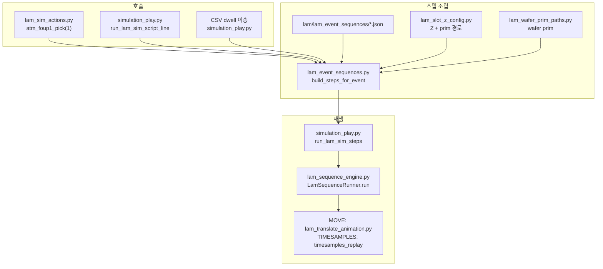

# LAM Control 유지보수 가이드

Kit 확장 `morph.lam_control` — **무엇을 어디서 수정하면 무엇이 바뀌는지**, **실행 코드 위치**를 정리한 문서입니다.

관련 문서:
- 시뮬 CSV·가상 설정 상세: `LAM_Simulation_Play_User_Config.md`
- 장비·wafer 모델: `LAM_Equipment_Model.md`
- 타임샘플 재생: `LAM_TimeSamples_Replay.md`

---

## 1. 전체 실행 흐름



| 단계 | 하는 일 | 파일·함수 |
|------|---------|-----------|
| 1 | 함수명 → JSON 파일명 | `lam_event_sequences.py` — `event_json_path()`, `LAM_EVENT_NAMES` |
| 2 | JSON 로드 + `{SLOT_WAFER}` 치환 | `build_steps_for_event()` |
| 3 | **자동 Z MOVE** 선행 삽입 | `build_steps_for_event()` → `_make_slot_z_move_step()` |
| 4 | 스텝 리스트 실행 | `simulation_play.run_lam_sim_steps()` → `LamSequenceRunner.run()` |
| 5 | MOVE 실제 이동 | `lam_sequence_engine._start_move()` → `lam_translate_animation.run_prim_translate_animation()` |
| 6 | 가시성 | `lam_sequence_engine` — PRIM_VISIBILITY 처리 |
| 7 | 팔 애니메이션 | JSON `TIMESAMPLES_REPLAY` — `lam_sequence_engine` |

---

## 2. SSOT — 수정 위치 한눈에

| 바꾸고 싶은 것 | 수정 파일 | 변수/위치 |
|----------------|-----------|-----------|
| 슬롯 Z (mm, CAD) | `lam_slot_z_config.py` | `ATM_SLOT_Z_ABSOLUTE`, `ATM_Z_APPLIED_REFERENCE`, VTM 동일 |
| Z MOVE **장비 prim** | `lam_slot_z_config.py` | `ATM_Z_MOVE_PRIM_PATH`, `VTM_Z_MOVE_PRIM_PATH` |
| Z MOVE **dz 스케일** | `lam_slot_z_config.py` | `Z_TBS_MOVE_UNIT_PER_MM` (기본 `1.0` = mm 그대로) |
| 웨이퍼 prim 경로 | `lam_wafer_prim_paths.py` | `WAFER_PRIM_BY_SLOT_KEY` dict |
| 이벤트별 애니·가시성 | `lam/lam_event_sequences/<이벤트명>.json` | TIMESAMPLES_REPLAY, PRIM_VISIBILITY 등 |
| pick/place **함수 목록** | `lam_sim_actions.py` | 46개 함수 → `LAM_SIM_MACRO_CALLABLES` |
| Z MOVE **시간** | `simulation_play.py` | `LamSimPlayVirtualConfig.lam_sim_z_slot_move_duration_sec` |
| USD 좌표계 보정 | `simulation_play.py` | `atm_z_usd_world_offset_m` (TBS/mm 단위) |

**런타임 캐시 갱신:** `lam_slot_z_config` / `LamSimPlayVirtualConfig` 를 코드에서 바꾼 뒤
`simulation_play.refresh_lam_sim_runtime_tables_from_config()` 호출.

---

## 3. 함수 ↔ JSON 매핑

### 3.1 규칙

- **함수명 = JSON 파일명** (확장자 제외)
  예: `atm_foup1_pick` → `lam/lam_event_sequences/atm_foup1_pick.json`
- 슬롯 번호가 필요한 함수: `atm_foup1_pick(7)` → `slot_key = "foup1_7"`
  (`lam_event_sequences.slot_key_for_event()`)

### 3.2 코드 위치

| 역할 | 파일 | 함수/상수 |
|------|------|-----------|
| 이벤트 이름 목록 | `lam_event_sequences.py` | `LAM_EVENT_NAMES` |
| JSON 경로 | `lam_event_sequences.py` | `event_json_path()`, `get_event_sequences_dir()` |
| 스텝 조립 | `lam_event_sequences.py` | `build_steps_for_event()` |
| 공개 함수 | `lam_sim_actions.py` | `atm_foup1_pick()` 등 → `_action()` |
| 매크로 등록 | `simulation_play.py` | `LAM_SIM_MACRO_CALLABLES` (import from `lam_sim_actions`) |

### 3.3 JSON 플레이(실행) 코드

```
lam_sim_actions._action()
  → lam_event_sequences.build_steps_for_event()   # 스텝 list 생성
  → simulation_play.run_lam_sim_steps()           # 실행 진입
  → lam_sequence_engine.LamSequenceRunner.run()   # 스텝 순차 실행
```

- **한 줄 매크로:** `simulation_play.run_lam_sim_script_line()` (~390행)
- **CSV 투어:** `simulation_play.run_simulation_from_csv()` — dwell 사이 이송에 `build_steps_for_event` 사용
- **시퀀스 편집기 Run:** `lam_sequence_editor.py` — 동일 `LamSequenceRunner.run()`
- **CSV 창 초기화:** `simulation_play.reset_lam_sim_to_initial_state()` — §11

---

## 4. Z 축 동시 이동

### 4.1 동작

1. `build_steps_for_event()` 가 JSON 스텝 **앞에** MOVE 한 스텝을 **자동 삽입**합니다.
2. 대상 prim: ATM → `ATM_Z_MOVE_PRIM_PATH`, VTM → `VTM_Z_MOVE_PRIM_PATH`
3. `dz` = `slot_z_move_target_dz(slot_key)` × `Z_TBS_MOVE_UNIT_PER_MM` + USD 오프셋
   - 예: `foup1_1` → **25.928** (TBS/mm, 기준 905.92 mm = 0)
4. `move_from_initial=True` → TBS_OFFSET **절대 목표 좌표** (편집기 “최초 위치 기준” 과 동일)
5. JSON **첫 스텝**에 `run_with_previous: true` 를 넣어 Z 와 동시 시작 가능

### 4.2 코드 위치

| 단계 | 파일 | 위치 |
|------|------|------|
| mm 테이블·prim 경로 SSOT | `lam_slot_z_config.py` | `ATM_SLOT_Z_*`, `ATM_Z_MOVE_PRIM_PATH` |
| dz 계산 | `lam_slot_z_config.py` | `slot_z_move_target_dz()` |
| Config 래퍼 | `simulation_play.py` | `LamSimPlayVirtualConfig.slot_z_move_target_m()` |
| MOVE 스텝 생성 | `lam_event_sequences.py` | `_make_slot_z_move_step()`, `build_steps_for_event()` ~520행 |
| 실제 prim 이동 | `lam_sequence_engine.py` | `_start_move()` ~984행 |
| TBS 애니메이션 | `lam_translate_animation.py` | `run_prim_translate_animation()` |

### 4.3 단위 (중요)

| 상수 | 기본값 | 의미 |
|------|--------|------|
| `Z_TBS_MOVE_UNIT_PER_MM` | `1.0` | MOVE `dz`에 mm 숫자 그대로 (25.928) |
| `Z_TBS_MOVE_UNIT_PER_MM` | `0.001` | 예전 m 스케일 (0.025928) — **비권장** |
| `Z_MM_TO_METERS` | `0.001` | `[m]` 테이블용 — **MOVE에는 사용 안 함** |

편집기에서 `dz=25.928` 이 맞다면 `Z_TBS_MOVE_UNIT_PER_MM = 1.0` 유지.

---

## 5. JSON 토큰 (wafer prim)

| 토큰 | 치환 결과 |
|------|-----------|
| `{SLOT_WAFER}` | 슬롯 웨이퍼 prim (`lam_wafer_prim_paths`) |
| `{ARM_WAFER}` | ATM arm / VTM EE 논리 슬롯 prim |
| `{SLOT_KEY}` | `foup1_1` 등 slot_key 문자열 |

치환: `lam_event_sequences._substitute_templates()`

---

## 6. 로그 해석 FAQ (`atm_foup1_pick` 예)

### 6.1 `[0] MOVE dz=25.928 … auto Z`

- **자동 Z MOVE** (Python이 JSON 앞에 삽입).
- `lam_slot_z_config` 의 Δ(mm) → `slot_z_move_target_dz`.
- prim 은 `ATM_Z_MOVE_PRIM_PATH` (로그 `Z 장비 prim` / `Z MOVE prim`).

### 6.2 `[1] MOVE dz=0.0` — 왜 나오나?

- **JSON 파일 안에 있는 스텝**입니다 (코드 버그 아님).
- 예전 스캐폴드에 placeholder MOVE (`prim: "/World/aaa"`, `dz: 0`) 가 남아 있으면 그대로 실행됩니다.
- **조치:** `lam/lam_event_sequences/atm_foup1_pick.json` 에서 **첫 번째 MOVE 블록 전체 삭제**.
  Z 는 자동 삽입만 쓰면 됩니다. (신규 스캐폴드는 MOVE 없이 생성됨)

### 6.3 `PRIM_VISIBILITY` prim 이 잘려 보임

- **경로가 잘못된 것이 아니라 로그 요약이 50자로 잘렸던 것**입니다.
- SLOT wafer 는 치환 **정상** (전체 경로 예:
  `LAM_WaferPosition_v01/.../Foup_01_Wafer_01`).
- Kit 재로드 후 로그는 `prim=전체경로` 를 **다음 줄**에 출력합니다.

### 6.4 `PRIM_VISIBILITY` ARM — `prim=(비어 있음)`

- **실제로 비어 있음** — `lam_wafer_prim_paths.py` 의
  `"LOGICAL:ATM_ARM": ""` 을 채워야 합니다.
- ATM pick/place 시 arm 웨이퍼 hide/show 대상 prim.

---

## 7. 이벤트 JSON 편집 체크리스트

1. `lam/lam_event_sequences/<이벤트명>.json` 편집 (또는 시퀀스 편집기).
2. **Z MOVE placeholder 삭제** — 자동 Z 가 담당.
3. `TIMESAMPLES_REPLAY` — in/out 프레임, `ref` (타임라인 인스턴스).
4. `PRIM_VISIBILITY` — pick/place 시 wafer show/hide.
5. Kit 재로드 후 `atm_foup1_pick(1)` 또는 CSV 시뮬로 검증.

---

## 8. 소스 코드 내 주석 (역할별)

파일 상단·섹션·핵심 함수에 **한국어 주석**을 두었다. 검색 키워드:

| 찾는 것 | 파일 | 검색/위치 |
|---------|------|-----------|
| 스텝 조립 전체 | `lam_event_sequences.py` | `build_steps_for_event` (단계 1~4 주석) |
| 자동 Z MOVE dict | `lam_event_sequences.py` | `_make_slot_z_move_step` |
| Z mm·prim·0.5s | `lam_slot_z_config.py` | `ATM_Z_MOVE_PRIM_PATH`, `Z_TBS_MOVE_UNIT_PER_MM` |
| Z duration 설정 | `simulation_play.py` | `lam_sim_z_slot_move_duration_sec` |
| 실제 재생 | `simulation_play.py` | `run_lam_sim_steps` |
| MOVE 실행 | `lam_sequence_engine.py` | `_start_move` |
| 46 함수 | `lam_sim_actions.py` | 모듈 docstring |
| wafer 치환 | `lam_wafer_prim_paths.py` | `WAFER_PRIM_BY_SLOT_KEY` |
| 초기화 | `simulation_play.py` | §11 `reset_lam_sim_to_initial_state` |
| EAP CSV | `simulation_play.py` | `load_csv_dwell_timeline`, `build_csv_playback_steps_from_dwells` |

---

## 9. 주요 파일 경로 (복사용)

```
source/extensions/morph.lam_control/morph/lam_control/
  lam_slot_z_config.py      # Z mm + Z MOVE prim
  lam_wafer_prim_paths.py   # wafer prim SSOT
  lam_event_sequences.py    # JSON 로드·Z 선행·토큰
  lam_sim_actions.py        # 46 pick/place 함수
  simulation_play.py        # CSV·매크로·run_lam_sim_steps
  lam_sequence_engine.py    # LamSequenceRunner (실행 엔진)
  lam_sequence_editor.py    # UI 편집기
  lam_translate_animation.py

lam/lam_event_sequences/*.json
```

---

## 10. EAP CSV 파싱·재생 규칙 (`simulation_play.py`)

실무 CSV (`prompt1.txt` §332–363) 기준 파이프라인:

| 단계 | 함수 | 설명 |
|------|------|------|
| 읽기 | `read_csv_rows` | `lot_id`, `cassette_id`/`cassette_slot`, `eqp_*_tm` 또는 `eqp_*_iso` |
| t=0 | `normalize_csv_timeline` | 전역 최소 `eqp_start_tm` = 0; `process_tm` 분→초 휴리스틱(필요 시) |
| FOUP | `build_lot_id_to_foup_index` | `eqp_start_tm` 순 **lot_id 최초 등장** → foup1, foup2, … |
| dwell | `rows_to_dwell_records` | 한 행 = 한 슬롯 **머무름**; `parse_module_nm_to_slot_key` |
| 정렬 | `sort_dwells_for_playback` | **전역** `eqp_start_tm` 오름차순 |
| 재생 | `run_csv_timed_playback` | 일반: 블록별 스레드·CSV ``t`` 대기. **공정만보기**: CSV ``t`` 유지·레인 내 빈 구간만 생략·배속1x |
| 블록 | `build_csv_timed_playback_blocks` | dwell(로그만) + pick/transfer/place(JSON) |

**해석**

- `process_tm` = 체류 시간(애니 길이 아님). 이송 애니는 JSON `TIMESAMPLES_REPLAY` + Z MOVE duration.
- 이송은 **다음 `module_nm`** 으로 추론 (`build_steps_for_dwell_transfer`).
- 웨이퍼 키 = `lot_id` + `cassette_id` (동일 cassette라도 lot 다르면 별도 웨이퍼).
- 투어 **시작/끝**이 `AtmArm-*` 이면 `atm_foupN_pick/place(slot)` 자동 삽입.
- `CoolStationAL3/4PML*` → `buffer3_*` / `buffer4_*`; `AL1` → `cooling_*`; `PMn-PML1` / `PMnPML1` → `chambern`.

**검증 (Kit 없이)**

```bash
cd source/extensions/morph.lam_control
set PYTHONPATH=morph
python morph/lam_control/simulation_play.py lam/csv/eap_tasjr91_sample_v1.csv
```

**UI 타임라인:** CSV 시뮬 창 **재생 배속**(1x/5x 등) + **CSV 재생 타임라인** 미리보기.
Play 시 `run_csv_timed_playback`: 각 블록이 **자체 스레드**에서 CSV ``eqp_start_tm``(÷배속)까지 대기 후 실행. **ATM** 과 **VTM** 은 CSV 시각에 맞춰 교차 시작(레인 락 분리); **같은 레인**은 이전 JSON 종료 후 ``max(종료 시각, 다음 CSV t)`` 에 시작. UI **공정만보기**만 dwell·**JSON 없는** 빈 대기(레인·전역, 예: ATM 마지막 후 VTM) 생략; **체크 해제** 시 위 일반 재생만 사용.
dwell 은 해당 시각 **로그만**, pick/transfer/place 는 그 시각에 이벤트 JSON **안의 모든 스텝**
(MOVE·Z·visibility·DELAY·TIMESAMPLES_REPLAY 있으면 포함)을 `LamSequenceRunner.run(speed_scale=…)` 로 실행.
TIMESAMPLES 가 없어도 JSON 에 있는 MOVE/Z 등은 **그대로** 재생된다. 배속은 CSV 대기·스텝 재생 **모두** ÷배속.

> ``morph.tbs_control_1`` 은 import/수정하지 않음. 배속은 LAM ``LamSequenceRunner.run(speed_scale)`` 만 사용.

**CSV 중지:** 시뮬 창 **CSV 중지** → ``request_stop_csv_playback()`` (대기 sleep 탈출 + ``LamSequenceRunner.stop()`` + ``scheduler.stop_all()``).

**Viewport CSV 미니 패널 (선택):** ``lam_csv_viewport_hud.py`` — Viewport 우측 상단에 본창과 **동일** ``_process_only_model``·배속·**재생 타임라인**(녹색 강조)·진행 표시. 공정만보기 체크 시 Play 배속 1x 고정. ``register_hud_timeline_ui`` 로 본창과 타임라인 동기.

---

## 11. CSV 시뮬 창 — 초기화 버튼

| UI | 코드 |
|----|------|
| **초기화** | `LamSimulationCsvPlayWindow._on_init_clicked()` |
| 본체 | `simulation_play.reset_lam_sim_to_initial_state()` |
| prim 수집 | `collect_lam_sim_reset_prim_paths(script_text=…)` |

동작:

1. `ATM_Z_MOVE_PRIM_PATH` / `VTM_Z_MOVE_PRIM_PATH` (및 config 동기값)
2. 스크립트 편집기 텍스트의 매크로 줄마다 `build_steps_for_event` 로 스텝을 만들고, 그 안의 MOVE/ROTATE/visibility prim
3. `stop_all_translate/rotate` + `scheduler.stop_all()` (가능 시)
4. `lam_sequence_engine._reset_tbs_offset_ops_for_paths` — TBS translate·rotate **(0,0,0)**

Z “원래 위치” = **기준 905.92 mm 를 TBS 0 으로 둔 상태** (MOVE `dz=0`).

---

## 12. 변경 이력 (문서)

| 날짜 | 내용 |
|------|------|
| 2026-05-17 | 초판 — 이벤트 JSON·Z MOVE·prim SSOT·로그 FAQ |
| 2026-05-17 | §9 CSV 창 초기화 버튼 |
| 2026-05-17 | §10 EAP CSV 파싱·재생 규칙 |
