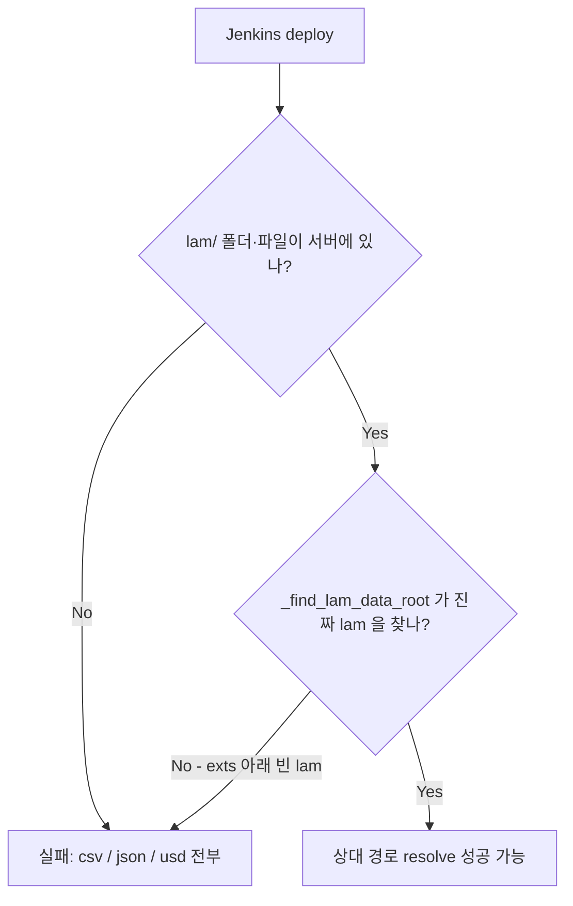

# LAM 데이터 배포 가이드 (Jenkins / Linux)

Kit 확장 `morph.lam_control` 이 사용하는 **레포 루트 `lam/`** 데이터(csv · USD · `lam_event_sequences` JSON)를
**로컬 Windows**와 **Jenkins 빌드·배포 Linux** 환경에서 동일하게 쓰기 위한 **현상 정리 · 진단 · 해결 · 테스트** 문서입니다.

**대상 독자:** 인프라(Jenkins) 담당, LAM 기능 검증 담당
**관련 문서:** `LAM_Control_Maintenance_Guide.md`, `lam/README.md`, `LAM_Simulation_Play_Field_Test_Guide.md`

---

## 0. 이 문서로 해결하려는 문제

### 0.1 증상 (실무에서 확인된 것)

| 구분 | 로컬 | Jenkins 배포 후 |
|------|------|-----------------|
| `lam/csv/*.csv` | 목록·재생 정상 | 목록 비거나 Play 실패 |
| `lam/lam_event_sequences/*.json` | 시뮬·이벤트 재생 정상 | JSON 못 찾음 / 스텝 빈 실행 |
| `lam/usd/...` (상대 경로 예: `lam/usd/LAM_v02/FBX/Combine_01.usd`) | Launch·Open Master 정상 | 파일 없음 / 자동 로드 실패 |
| 배포 서버 디스크 | 레포 `lam/` 에 실제 파일 있음 | **`lam/` 트리·파일이 없거나 빈 폴더만 있음** |

### 0.2 잘못된 원인 설명 (정리)

- **`os.path` / `os` 모듈이 “로컬 전용”이라서 Linux에서 안 된다** → **아님.** Linux에서도 동일 API로 동작합니다.
- **상대 경로 `lam/usd/...` 가 Jenkins에서 안 통한다** → **반만 맞음.** 상대 경로는 **“프로젝트 루트 + lam/…”** 로 풀리는데, **서버에 그 실제 파일이 없으면** 실패합니다. 로컬에서 상대 경로가 되는 것은 **경로 문법이 맞고 + 디스크에 `lam/` 이 있기 때문**입니다.

### 0.3 실제 원인 (코드베이스 기준, 2가지가 겹침)



1. **배포물에 `lam/` 데이터가 포함되지 않음** — `repo.sh build` / `premake5.lua` 는 **Python·docs만** `exts` 로 링크하고 **`lam/` 은 빌드 산출물에 넣지 않음.**
2. **런타임이 잘못된 `lam/` 을 잡음** — 서버에서 레포 루트 `lam/` 을 못 찾으면 `exts` 근처 **빈 `lam/`** 을 만들고 그쪽을 루트로 사용 (`lam_window.py`, `simulation_play.py`, `lam_event_sequences.py` 공통).

---

## 1. 프로젝트 구조 (LAM 관련)

```text
kit-app-template_mine/                 ← 프로젝트(레포) 루트 (_find_project_root)
├── source/
│   ├── apps/morph.editor.kit          ← morph.lam_control 로드
│   └── extensions/morph.lam_control/
│       ├── config/extension.toml
│       ├── morph/lam_control/*.py     ← 실행 코드 (데이터 없음)
│       └── premake5.lua               ← docs + morph 만 링크 (lam 미포함)
├── lam/                               ← ★ 데이터 SoT (코드와 분리)
│   ├── csv/                           ← dwell CSV
│   ├── lam_event_sequences/           ← 이벤트 JSON (함수명.json)
│   ├── usd/                           ← Master / reference USD
│   ├── lam_external_results/          ← 외부 시뮬 결과 JSON
│   └── README.md
└── _build/{windows|linux}-.../release/
    └── exts/morph.lam_control-0.1.0/
        ├── morph/lam_control/         ← 배포 시 보통 이 코드만 갱신
        └── (data/lam 없음 — 현재 premake 기준)
```

**설계 의도:** `lam/README.md` — 데이터는 확장 안 `data/` 가 아니라 **레포 루트 `lam/`**.

---

## 2. 코드가 경로를 찾는 방식 (현재 구현)

### 2.1 공통: `lam` 데이터 루트

다음 파일에 **동일한** `_find_lam_data_root()` 가 있습니다.

| 파일 | 용도 |
|------|------|
| `morph/lam_control/lam_window.py` | UI 기본 경로, USD 파일피커 시작 위치, autoload |
| `morph/lam_control/simulation_play.py` | `get_lam_csv_dir()` → `{lam}/csv` |
| `morph/lam_control/lam_event_sequences.py` | `get_event_sequences_dir()` → `{lam}/lam_event_sequences` |

**알고리즘 요약:**

1. `__file__` 의 디렉터리에서 시작해 부모를 최대 **12단계** 올라감.
2. 각 단계에서 `{현재}/lam` 이 **디렉터리이면** 그 경로를 반환.
3. 없으면 `__file__` 기준 **6단계 위** `{...}/lam` 을 fallback 으로 반환하고,
   `lam_event_sequences`, `lam_external_results`, `usd` 하위 폴더 **생성 시도** (비어 있을 수 있음).

**로컬에서 성공하는 이유:** 올라가다 **레포 루트의 `kit-app-template_mine/lam`** 을 만남.
**Jenkins에서 실패하는 이유:** 조상 경로에 **실제 데이터가 있는 `lam/` 이 없음** → 3번으로 **빈 `lam/`**.

### 2.2 CSV

| 항목 | 내용 |
|------|------|
| 디렉터리 | `get_lam_csv_dir()` = `Path(_find_lam_data_root()) / "csv"` |
| 목록 | `list_lam_csv_paths()` — `lam/csv/*.csv` |
| 기본 파일 | `DEFAULT_CSV_PATH` — 모듈 import 시 `LAM_SIM_CSV` env 또는 `_default_csv_path()` **한 번** 평가 |
| env | `LAM_SIM_CSV=/절대/경로/file.csv` → **해당 CSV 파일 하나**만 우회 가능 (목록·JSON·USD 는 대체 안 됨) |

### 2.3 애니메이션 JSON (`lam_event_sequences`)

| 항목 | 내용 |
|------|------|
| 디렉터리 | `get_event_sequences_dir()` = `{lam}/lam_event_sequences` |
| 파일 규칙 | `event_json_path("atm_foup1_pick")` → `{lam}/lam_event_sequences/atm_foup1_pick.json` |
| 호출 | `build_steps_for_event()`, CSV dwell 이송, `lam_sim_actions` 매크로 |

JSON 이 없으면 콘솔에 이벤트 빌드 실패·`NOT_FOUND` 류 로그가 날 수 있음 (`LAM_Control_Maintenance_Guide.md` 참고).

### 2.4 USD

| 항목 | 내용 |
|------|------|
| UI Master 경로 | `lam_window` — `_master_path_model` 기본값 `{lam}/usd/master.usd` |
| 자동 로드 | `load_automatically`, `default_load_usd_path` → `resolve_default_load_usd_path()` |
| 상대 경로 규칙 | `lam/usd/...` → `os.path.join(_find_project_root(), raw)`
  `_find_project_root()` = `dirname(_find_lam_data_root())` |
| Nucleus | `omniverse://...` 는 그대로 사용 (`lam_usd_path.is_omniverse_usd_url`) |

**실무 설정 예 (로컬에서 동작 확인됨):**

```python
default_load_usd_path = "lam/usd/LAM_v02/FBX/Combine_01.usd"
```

→ 풀린 경로: `{프로젝트루트}/lam/usd/LAM_v02/FBX/Combine_01.usd`
→ **서버에 이 파일이 없으면** 상대 경로여도 실패.

### 2.5 빌드가 `lam/` 을 포함하지 않음 (근거)

`source/extensions/morph.lam_control/premake5.lua`:

```lua
repo_build.prebuild_link {
    { "docs", ext.target_dir.."/docs" },
    { "morph", ext.target_dir.."/morph" },
}
```

`morph.measure_control_1` 은 `{ "data", ext.target_dir.."/data" }` 를 링크하지만, **`lam_control` 은 `data` / `lam` 링크 없음.**

`.github/workflows/.github-ci.yml` 은 `checkout` + `./repo.sh build` 만 수행 — **`lam/` 배포 단계 없음** (팀 Jenkins 파이프라인도 동일 패턴이면 동일 증상).

---

## 3. 권장 배포 레이아웃 (코드 수정 없이)

Kit 실행·exts 위치에 맞게 `DEPLOY_ROOT` 를 정한 뒤, **아래 구조를 만족**시키면 현재 코드의 상위 탐색이 로컬과 같아집니다.

```text
DEPLOY_ROOT/
├── _build/
│   └── linux-x86_64/
│       └── release/              ← Kit 바이너리·exts (Jenkins가 갱신하는 부분)
│           └── exts/
│               └── morph.lam_control-0.1.0/
└── lam/                          ← ★ 반드시 추가 (Git 또는 rsync)
    ├── csv/
    ├── lam_event_sequences/
    └── usd/
        └── LAM_v02/FBX/Combine_01.usd   (예)
```

**왜 `_build` 와 형제인가:**
exts → release → arch → `_build` → **`DEPLOY_ROOT`** 에서 `DEPLOY_ROOT/lam` 을 찾기 위함 (12단계 탐색 이내).

**잘못된 예:**

- `release/exts/.../lam/` 만 두고 상위에 `lam` 없음 → 탐색 실패 가능.
- exts 만 배포하고 **`lam/` 전체 미포함** → 현재 증상 그대로.

---

## 4. 해결 방안 전체 목록

| ID | 방안 | 코드 변경 | Jenkins/운영 | csv | json | usd | 로컬 영향 |
|----|------|-----------|--------------|-----|------|-----|-----------|
| **A** | `DEPLOY_ROOT/lam/` 동봉 (§3 구조) | 없음 | deploy 스크립트에 `lam/` rsync | ○ | ○ | ○ | 없음 |
| **B** | Git에 데이터 커밋 (대용량은 LFS) | 없음 | checkout 시 `lam/` 존재 | ○* | ○* | ○* | 없음 |
| **C** | `LAM_SIM_CSV` env (단일 CSV) | 없음 | env 설정 | △ | ✗ | ✗ | 없음 |
| **D** | USD만 Nucleus URL | 설정만 | `default_load_usd_path = omniverse://...` | — | — | ○ | 없음 |
| **E** | premake `data/lam` ← repo `lam` 링크 | premake | build 후 exts 안에 data | ○ | ○ | ○ | rebuild 필요 |
| **F** | `lam_data_paths.py` + ExtensionManager | Python | E와 병행 권장 | ○ | ○ | ○ | fallback 유지 시 없음 |

**내일 1차 검증 권장 순서:** **B 확인 → A 적용 → §5 진단 → §6 테스트**
**중장기:** E + F (exts만 배포해도 `data/lam` 포함).

---

## 5. 진단 절차 (배포 서버 / Linux)

각 단계 **통과/실패** 를 기록해 두면 원인이 A(파일 없음) vs D(잘못된 lam 루트) 인지 바로 갈립니다.

### 5.0 사전: Git·아티팩트에 파일이 있는지 (Jenkins 빌드 **전**, 개발 PC)

```bash
# 레포 루트에서
git ls-files lam/csv/
git ls-files lam/lam_event_sequences/ | head
git ls-files lam/usd/

# 배포에 쓸 USD가 tracked 인지 (예)
git ls-files "lam/usd/LAM_v02/FBX/Combine_01.usd"
```

- **출력 없음** → Jenkins `git checkout` 만으로는 **서버에 절대 안 생김**. → 방안 **B** (커밋 또는 별도 아티팯트) 필요.
- **untracked 로컬만 존재** → 로컬만 되고 Jenkins는 안 되는 전형적 패턴.

### 5.1 배포 서버: 파일 물리 존재

`DEPLOY_ROOT` 를 팀 실제 경로로 바꿉니다.

```bash
DEPLOY_ROOT=/opt/kit-lam-app   # 예시

test -d "$DEPLOY_ROOT/lam" && echo "OK: lam dir" || echo "FAIL: no lam"
test -d "$DEPLOY_ROOT/lam/csv" && echo "OK: csv" || echo "FAIL: no csv"
test -d "$DEPLOY_ROOT/lam/lam_event_sequences" && echo "OK: seq" || echo "FAIL: no seq"
test -d "$DEPLOY_ROOT/lam/usd" && echo "OK: usd" || echo "FAIL: no usd"

ls -la "$DEPLOY_ROOT/lam/csv/" | head
ls -la "$DEPLOY_ROOT/lam/lam_event_sequences/" | head
ls -la "$DEPLOY_ROOT/lam/usd/LAM_v02/FBX/" 2>/dev/null || echo "CHECK usd subpath"

# 사용 중인 Combine USD 예
test -f "$DEPLOY_ROOT/lam/usd/LAM_v02/FBX/Combine_01.usd" && echo "OK: Combine_01.usd" || echo "FAIL: missing USD"
```

**5.1 FAIL** → 방안 **A + B** 부터. 코드·상대경로와 무관.

### 5.2 Kit / LAM UI: 런타임이 가리키는 루트

1. Morph Editor(또는 팀 Kit 앱) Launch.
2. **LAM Window** 열기.
3. **Simulation CSV Play** 창에서 **CSV 디렉터리** 라벨/경로 확인.

| UI에 보이는 경로 패턴 | 의미 |
|----------------------|------|
| `.../kit-app-template_mine/lam/csv` 또는 `.../DEPLOY_ROOT/lam/csv` | **정상** (진짜 데이터 루트) |
| `.../exts/morph.lam_control-.../../../../../../../lam/csv` | **위험** — fallback 빈 `lam` 가능 |
| 목록 0개 | 루트는 잡혔으나 **csv 파일 미배포** 또는 빈 디렉터리 |

4. 콘솔에서 다음 prefix 검색:

| prefix | 파일 |
|--------|------|
| `[LAM/WIN]` | `lam_window.py` — autoload, file not found |
| `[LAM/SIMPLAY]` | `simulation_play.py` |
| `[LAM/EVSEQ]` | `lam_event_sequences.py` |

**자동 로드 실패 예:**

```text
[LAM/WIN] autoload: file not found: /wrong/path/lam/usd/...
```

### 5.3 상대 USD 경로가 풀리는 최종 경로 (개념)

- 설정: `default_load_usd_path = "lam/usd/LAM_v02/FBX/Combine_01.usd"`
- 코드: `resolve_default_load_usd_path()` → `{_find_project_root()}/lam/usd/LAM_v02/FBX/Combine_01.usd`
- **5.1** 에서 그 절대 경로에 파일이 있어야 Open Master / autoload 성공.

---

## 6. 테스트 시나리오 (내일 따라하기)

각 테스트 **전제:** §5.1 통과 (서버에 `lam/` 파일 있음).
**기록란**에 날짜·서버·DEPLOY_ROOT·통과 여부를 적습니다.

### Test 0 — 베이스라인 (로컬, 선택)

| # | 절차 | 기대 |
|---|------|------|
| 0.1 | Windows 로컬 Launch | LAM CSV 디렉터리 = `...\kit-app-template_mine\lam\csv` |
| 0.2 | CSV 목록에 `eap_tasjr91_sample_v1.csv` 등 표시 | 1개 이상 |
| 0.3 | `lam/lam_event_sequences/vtm_chamber5_right_place.json` 존재 | `ls` 또는 탐색기 |
| 0.4 | 상대 USD autoload 또는 Open `lam/usd/.../Combine_01.usd` | Stage 로드 |

→ 0.x 전부 OK 이면 **코드·상대경로 설정은 정상**, Jenkins는 **배포만** 의심.

---

### Test 1 — Jenkins 서버 `lam/` 배포 (방안 A)

| # | 절차 | 기대 |
|---|------|------|
| 1.1 | Jenkins job에 **Package lam** 단계 추가 (§7.1 스크립트) | 아티팩트에 `lam/` 포함 |
| 1.2 | Deploy 후 §5.1 명령 재실행 | 전부 OK |
| 1.3 | `lam/csv` 파일 개수가 로컬과 동일한지 `diff -qr` 또는 `wc` | 대략 일치 |

**실패 시:** deploy 스크립트가 `exts` 만 복사하는지 확인. `lam/` rsync 경로·권한 확인.

---

### Test 2 — CSV 로드

| # | 절차 | 기대 |
|---|------|------|
| 2.1 | Launch → LAM → Simulation CSV Play | CSV 디렉터리가 §5.2 정상 패턴 |
| 2.2 | 드롭다운/목록에서 CSV 선택 | 파일명 표시 |
| 2.3 | Play (짧은 구간) | `[LAM/SIMPLAY]` 에러 없이 진행 |
| 2.4 | (선택) `export LAM_SIM_CSV=...` 후 재시작 | 지정 파일로 재생 (방안 C 검증) |

**실패 분기:**

- 목록 비음 → `lam/csv` 미배포 또는 빈 루트.
- Play 시 JSON 에러 → Test 3 으로.

---

### Test 3 — `lam_event_sequences` JSON

| # | 절차 | 기대 |
|---|------|------|
| 3.1 | 서버: `ls lam/lam_event_sequences/vtm_chamber5_right_place.json` | 파일 있음 |
| 3.2 | CSV Play 또는 매크로로 chamber5 이벤트 유도 | 이동·애니 스텝 실행 |
| 3.3 | (선택) LAM JSON Test Window — 이벤트 JSON Add/Run | 스텝 진행 |

**실패 분기:**

- `event json not found` 류 → `get_event_sequences_dir()` 가 가리키는 경로에 파일 없음 (§5.2 UI 경로와 `ls` 경로 비교).

---

### Test 4 — USD 로드

| # | 절차 | 기대 |
|---|------|------|
| 4.1 | `default_load_usd_path` 가 `lam/usd/LAM_v02/FBX/Combine_01.usd` 인 빌드 사용 | 배포 브랜치·설정 확인 |
| 4.2 | §5.1 에서 해당 파일 EXISTS | OK |
| 4.3 | Launch (`load_automatically=True`) | Master 로드 또는 로그에 resolved 경로 |
| 4.4 | 실패 시 LAM Window → Open Master → `lam/usd/...` 수동 | 수동은 되고 autoload 만 안 되면 타이밍/설정 이슈 |

**실패 분기:**

- `file not found` + 경로가 `C:/Users/...` → **Windows 절대경로가 박힌 빌드** — 상대경로 빌드로 교체.
- 경로는 `.../lam/usd/...` 인데 없음 → §5.1 USD 미배포.

---

### Test 5 — (선택) 방안 E 검증 — exts 안 `data/lam`

코드/premake 수정 **이후** 별도 스프린트:

| # | 절차 | 기대 |
|---|------|------|
| 5.1 | `./repo.sh build` | `_build/.../exts/morph.lam_control-.../data/lam/csv` 존재 |
| 5.2 | `DEPLOY_ROOT` 에 `lam/` 없이 exts 만 배포 | Test 2~4 통과 |

---

## 7. Jenkins / 배포 스크립트 예시

팀 Job 이름·경로는 환경에 맞게 치환합니다.

### 7.1 Package 단계 (빌드 후 `lam/` 포함)

```bash
#!/bin/bash
set -euo pipefail

REPO_ROOT="${WORKSPACE:-$(pwd)}"
STAGING="${REPO_ROOT}/deploy_staging"
rm -rf "${STAGING}"
mkdir -p "${STAGING}"

# Kit 빌드 (기존)
./repo.sh build

# 빌드 산출물 (플랫폼 경로는 환경에 맞게)
LINUX_RELEASE="${REPO_ROOT}/_build/linux-x86_64/release"
if [ ! -d "${LINUX_RELEASE}" ]; then
  echo "ERROR: release dir not found: ${LINUX_RELEASE}"
  exit 1
fi

cp -a "${LINUX_RELEASE}" "${STAGING}/release"

# ★ LAM 데이터 — 반드시 포함
if [ ! -d "${REPO_ROOT}/lam" ]; then
  echo "ERROR: ${REPO_ROOT}/lam missing"
  exit 1
fi
cp -a "${REPO_ROOT}/lam" "${STAGING}/lam"

# 배포 아티팩트 (tar 예)
tar -czf "${REPO_ROOT}/kit-lam-deploy.tar.gz" -C "${STAGING}" release lam
ls -la "${REPO_ROOT}/kit-lam-deploy.tar.gz"
```

### 7.2 Deploy 단계 (서버)

```bash
#!/bin/bash
set -euo pipefail

DEPLOY_ROOT=/opt/kit-lam-app
ARTIFACT=kit-lam-deploy.tar.gz

sudo mkdir -p "${DEPLOY_ROOT}"
sudo tar -xzf "${ARTIFACT}" -C "${DEPLOY_ROOT}"

# 구조 확인: release 와 lam 이 형제여야 함
# DEPLOY_ROOT/release/...  DEPLOY_ROOT/lam/...
ls -la "${DEPLOY_ROOT}/lam/csv" | head
```

**주의:** 팀이 `release` 내용만 `DEPLOY_ROOT/_build/...` 로 풀는 경우, **`lam` 은 `DEPLOY_ROOT/lam`** (§3) 에 두도록 스크립트를 맞춥니다.

### 7.3 Git LFS (USD 대용량, 방안 B 보조)

```bash
# 최초 1회 (레포)
git lfs track "lam/usd/**/*.usd"
git add .gitattributes
git add lam/usd/LAM_v02/FBX/Combine_01.usd
git commit -m "Track LAM USD via Git LFS"
```

Jenkins agent 에 `git-lfs` 설치·`git lfs pull` 필요.

### 7.4 Kit 실행 시 env (선택)

```bash
export LAM_SIM_CSV="${DEPLOY_ROOT}/lam/csv/eap_tasjr91_sample_v1.csv"
# 향후 코드 추가 시:
# export LAM_DATA_ROOT="${DEPLOY_ROOT}/lam"
cd "${DEPLOY_ROOT}/_build/linux-x86_64/release"   # 팀 실행 방식에 맞게
./kit.sh morph.editor.kit   # 실제 실행 파일명은 팀 표준 따름
```

---

## 8. 트러블슈팅 FAQ

| 질문 | 답 |
|------|-----|
| 로컬은 되는데 Jenkins만 안 됨 | 서버에 **`lam/` 미배포** 또는 **Git 미추적 파일** 가능성 최대. §5.0·5.1 |
| 상대경로 `lam/usd/...` 썼는데 서버에서만 실패 | 상대경로는 맞음. **풀린 절대경로에 파일 없음** → §5.1 `test -f` |
| CSV만 되고 JSON은 안 됨 | 같은 `_find_lam_data_root()` — 드묾. `lam_event_sequences` 만 누락 배포·오타 확인 |
| UI CSV 경로가 exts 아래 `../../../../lam` | **빈 fallback lam** — §3 구조로 `DEPLOY_ROOT/lam` 배치 |
| exts만 최신인데 예전 lam | **lam 은 Jenkins 별도 복사** 필요. build 가 lam 을 갱신하지 않음 |
| `LAM_SIM_CSV` 넣었는데 JSON 실패 | 정상. C는 CSV 1파일만. **A 또는 E** 필요 |
| Open Master 는 되는데 autoload 만 실패 | `load_automatically`, post_update 타이밍, 로그 `[LAM/WIN] autoload` 확인 |

---

## 9. 향후 코드·빌드 개선 (Test 5 / 방안 E·F)

로컬 흐름을 깨지 않으면서 **exts만 배포**에 가깝게 가려면:

1. **`premake5.lua`** — repo `lam/` → `ext.target_dir/../data/lam` (상대경로는 premake 위치 기준 조정).
2. **`lam_data_paths.py`** (신규) — 조회 순서: `LAM_DATA_ROOT` → `get_extension_path` + `data/lam` → **현재 `_find_lam_data_root` 상위 탐색** → `${root}/lam`.
3. **`lam_window.py` / `simulation_play.py` / `lam_event_sequences.py`** — 위 모듈만 사용하도록 통일.
4. **`DEFAULT_CSV_PATH`** — import 시 고정하지 말고 Play 시점 조회.

이 작업은 **별도 PR** 로 진행하고, 본 문서 §6 Test 5 로 검증.

---

## 10. 관련 소스·함수 인덱스

| 데이터 | 디렉터리 | 주요 코드 |
|--------|----------|-----------|
| CSV | `lam/csv/` | `simulation_play.get_lam_csv_dir`, `list_lam_csv_paths`, `DEFAULT_CSV_PATH`, `LAM_SIM_CSV` |
| JSON | `lam/lam_event_sequences/` | `lam_event_sequences.get_event_sequences_dir`, `event_json_path`, `build_steps_for_event` |
| USD | `lam/usd/` | `lam_window._find_lam_data_root`, `resolve_default_load_usd_path`, `_open_master_at_path` |
| 빌드 | — | `premake5.lua`, `repo.sh`, `.github/workflows/.github-ci.yml` |

---

## 11. 내일 작업 체크리스트 (한 장 요약)

- [ ] **5.0** Git tracked 여부 확인 (`lam/csv`, `lam_event_sequences`, 사용 USD)
- [ ] **7.1** Jenkins package 에 `lam/` 포함 여부 확인·추가
- [ ] **7.2** Deploy 후 **5.1** 서버 파일 존재 테스트
- [ ] **Test 2** CSV 목록·Play
- [ ] **Test 3** JSON 이벤트 1건 (예: `vtm_chamber5_right_place`)
- [ ] **Test 4** USD autoload 또는 Open (`lam/usd/LAM_v02/FBX/Combine_01.usd`)
- [ ] UI CSV 경로·`[LAM/WIN]` autoload 로그 스크린샷/복사 보관
- [ ] 실패 시 §8 FAQ · 방안 A/B/E 표에서 다음 조치 선택

---

*문서 버전: 2026-05-19 — 현재 `morph.lam_control` 코드·premake 기준.*
