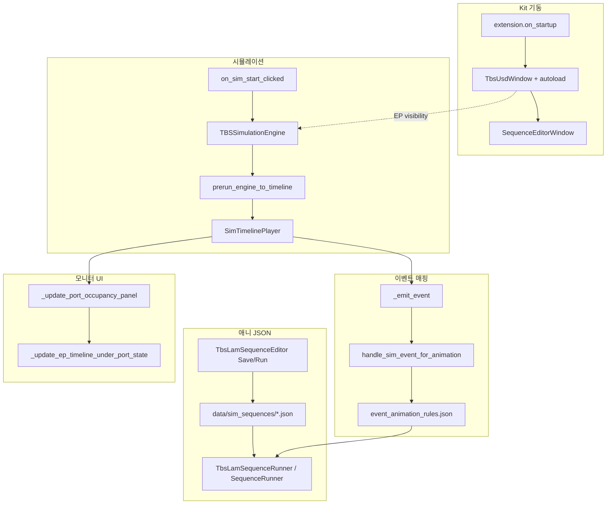

# TBS Control 2 — 실무 담당자 기술 가이드

> **대상 독자**: Omniverse Kit / USD를 어느 정도 아는 엔지니어  
> **목적**: `morph.tbs_control_2` 확장의 주요 기능을 **파일·코드·데이터 흐름**으로 따라갈 수 있게 설명  
> **패키지명**: `morph.tbs_control_2` (Python 모듈 경로는 `morph/tbs_control_1/` — 역사적 이름 유지)

---

## 0. 확장 구조 한눈에

Kit 앱이 로드하면 `extension.py`가 진입점입니다. 여기서 창·엔진·구독을 조립하고, 실제 로직은 기능별 모듈로 분리되어 있습니다.

```
source/extensions/morph.tbs_control_2/
├── morph/tbs_control_1/          ← Python 코드 (핵심)
│   ├── extension.py              ← 확장 on_startup / on_shutdown
│   ├── control_window.py         ← TBS 제어창 UI + 시뮬·애니·포트상태
│   ├── tbs_usd_window.py         ← USD Load (SSOT)
│   ├── tbs_lam_sequence_editor.py← 시퀀스 편집기 UI
│   ├── sequence_engine.py        ← JSON 실행 라우터
│   ├── tbs_lam_sequence_engine.py← LAM 스타일 step 실행기
│   ├── simulation_engine.py      ← SimPy 공정 시뮬 엔진
│   └── control_sim_prerun_playback.py ← 프리런·재생
├── config/
│   ├── event_animation_rules.json← 이벤트→JSON 매핑 규칙
│   └── port_lot_prim_paths.json  ← 포트별 LOT prim 경로
└── data/
    ├── sim_sequences/*.json      ← 시뮬용 애니메이션 JSON
    └── usd/                      ← Master USD 샘플
```

**읽는 순서 추천**

1. `extension.py` — 무엇이 언제 뜨는지  
2. `control_window.py` 상단 docstring — 전체 파이프라인 요약  
3. 이 문서 **§1.5** — JSON step 타입별 실행 원리·코드  
4. 이 문서 **§3.7~3.8** — 시뮬 시간·FOUP·material  
5. 이 문서 **§4.5 · §5.5** — 프리런·EP 막대 구현 코드

| 궁금한 것 | 문서 섹션 |
|-----------|-----------|
| JSON Save/Load · 편집기 Run | §1.2 · §1.3 |
| 시뮬 자동 JSON 실행 | §1.4 |
| MOVE/ROTATE **TranslateOp/RotateXYZOp.Set** | §1.5.1 · §1.5.2 |
| USD_TIMELINE **omni.timeline.play()** | §1.5.3 |
| TIMESAMPLES **attr.Get + mirror.Set** | §1.5.4 |
| Master USD open **ctx.open_stage()** | §2.3 |
| EP visibility **MakeInvisible** | §2.5 |
| 시뮬 시작·정지·prim 복원 | §3.1 · §3.2 |
| 이벤트 큐 · rules 매칭 | §3.3 · §3.5 |
| SimPy **env.timeout** 랜덤 시간 | §3.7 |
| FOUP **MaterialBinding + translate** | §3.8 |
| 프리런 수집·재생 | §4.5 |
| EP 막대 **ui.Rectangle** | §5.5 |

**문서 작성 규칙 (전 섹션 공통)**

이 가이드의 **기능 설명 섹션**은 아래 형식을 따릅니다.

| 표기 | 의미 |
|------|------|
| **① 호출부** | UI·엔진·이벤트가 **어떤 함수/모듈을 호출**하는지 (래퍼·오케스트레이션) |
| **② 원초 구현** | 그 호출 **안에서** USD/Kit/SimPy/UI API로 **실제 상태가 바뀌는** 코드 (마지막 write 한 줄까지) |

개념·설계·체크리스트(§0, §2.1, §6~§8)는 표 형식을 생략할 수 있으나, **코드가 있는 소절은 반드시 ①②를 병기**합니다.

---

## 1. 애니메이션 JSON 만들기 · 저장 · 실행

### 1.1 JSON이란?

시퀀스 JSON은 **prim을 어떻게 움직일지**를 step 배열로 적은 파일입니다.  
최상위는 반드시 **JSON 배열(`[]`)** 이고, 각 원소가 step 하나입니다.

**① 호출부**: 편집기 Run·시뮬 자동 실행이 `json.load` → step list → `TbsLamSequenceRunner.run()` (§1.3·§1.4).

**② 원초 구현**: JSON 파일 자체는 **데이터**일 뿐 — prim/USD 변경은 Run 이후 §1.5 step 실행에서만 발생.

**지원 step 타입** (`tbs_lam_sequence_editor.py`의 `STEP_TYPES`):

| type | 의미 |
|------|------|
| `USD_TIMELINE` | USD에 저장된 타임라인 애니 재생 (인스턴스 `ref` 필요) |
| `TIMESAMPLES_REPLAY` | timeSamples 기반 재생 |
| `MOVE` | TBS_OFFSET translate 델타 이동 |
| `ROTATE` | TBS_OFFSET rotate 델타 회전 |
| `DELAY` | 대기(초) |
| `PRIM_VISIBILITY` | prim 숨김/표시 |

**MOVE step 예시** (`data/sim_sequences/arrived_ep1.json` 참고):

```json
{
  "type": "MOVE",
  "prim": "/World/aaa",
  "duration": 5.0,
  "dx": 500.0,
  "dy": 0.0,
  "dz": 0.0
}
```

- `prim`: 이동할 USD prim 경로 (또는 짧은 이름 — 스테이지에서 resolve)
- `duration`: 초 단위 재생 시간
- `dx/dy/dz`: **현재 위치 기준** 델타 (절대 좌표가 아님)
- `move_from_initial: true` 를 넣으면 **초기 위치 → (dx,dy,dz) 목표** 로 이동

---

### 1.2 편집기에서 JSON 만드는 방법 (실무 워크플로)

1. Kit 실행 → **TBS Sequence Editor** 창이 자동으로 열림 (`extension.py` → `SequenceEditorWindow.show()`)
2. Step 추가 버튼으로 `MOVE` / `ROTATE` / `USD_TIMELINE` 등 선택
3. prim 경로, duration, 델타 값 입력
4. **Run** — 뷰포트에서 즉시 테스트
5. **Save…** — JSON 파일로 저장 (기본 폴더: `data/sim_sequences/`)

**관련 파일**

| 역할 | 파일 |
|------|------|
| 확장에서 편집기 띄우기 | `extension.py` |
| 편집기 래퍼 (기본 저장 폴더 지정) | `sequence_editor.py` |
| UI·Save/Load/Run/Reset 본체 | `tbs_lam_sequence_editor.py` |
| data 경로 해석 | `tbs_data_paths.py` → `resolve_local_data_path("sim_sequences")` |

`sequence_editor.py`는 저장 기본 경로만 잡고, UI는 LAM과 동일한 `TbsLamSequenceEditor`에 위임합니다:

```python
# sequence_editor.py
seq_dir = resolve_local_data_path("sim_sequences") or ""
self._editor = TbsLamSequenceEditor(registry, scheduler, default_dir=seq_dir, ...)
```

**① 호출부 — Save** (`tbs_lam_sequence_editor.py`):

```python
# [Save…] → FilePicker → _do_save_json(path)
with open(path, "w", encoding="utf-8") as f:
    json.dump(self._steps, f, ensure_ascii=False, indent=2)
```

**② 원초 구현**: Python 표준 `json.dump`가 `self._steps` (메모리상 list[dict])를 디스크 JSON 파일로 직렬화합니다. USD/prim에는 아직 write 없음.

**① 호출부 — Load**:

```python
# [Load…] → _do_load_json(path)
data = json.load(f)                    # 최상위 list 여부 검증
self._steps = [_coerce_loaded_step(s) for s in data]
self._rebuild_step_ui()                # UI 스텝 목록 + JSON 텍스트 갱신
```

**② 원초 구현**: `_coerce_loaded_step()`이 `type` 대문자 정규화, `duration`/`dx` 등 필드 타입 보정만 수행. 스테이지 prim은 건드리지 않음.

시뮬에서 쓰려면 `data/sim_sequences/README.md`의 **파일명 규칙**에 맞춰 저장하거나, `event_animation_rules.json`의 `use.json` 경로와 일치시키면 됩니다.

---

### 1.3 편집기 Run — JSON 실행 경로 (수동 테스트)

**① 호출부**:

```python
# tbs_lam_sequence_editor.py — [Run] 클릭
def _run_now(self, reset=False):
    self._run_thread = threading.Thread(
        target=self._runner.run,
        kwargs={"steps": self._steps, "reset_each_start": reset},
        daemon=True,
    )
    self._run_thread.start()

# sequence_engine.py — 편집기는 usd_context_name 없음 → LAM 엔진
if _use_lam_engine(registry, scheduler, usd_context_name=None):
    runner = TbsLamSequenceRunner(registry, scheduler, ...)
```

**② 원초 구현**: `TbsLamSequenceRunner.run()`이 step 배열을 그룹 단위로 순회하며 `_start_step()` → §1.5 각 타입의 USD write까지 실행.  
MOVE/ROTATE의 최종 write는 `xformOp:translate:TBS_OFFSET` / `xformOp:rotateXYZ:TBS_OFFSET` 의 `op.Set()` (§1.5.1·§1.5.2).

**TBS_OFFSET이란?**  
자산 USD 본체 xform은 유지하고, suffix `TBS_OFFSET` op만 애니메이션합니다. Reset 시 `zero_tbs_offset_*_at_path()`로 `(0,0,0)` 복원 (§3.1).

---

### 1.4 시뮬에서 JSON 실행 경로 (자동)

시뮬 중 이벤트가 발생하면 **같은 JSON 파일**이 자동 실행됩니다.  
분할 화면 USD 컨텍스트가 있으면 **레거시 엔진** (`usd_context_name` 전달 시)을 씁니다.

**① 호출부** — 이벤트 → JSON 실행 체인:

```python
# simulation_engine.py
self._on_event(merged_payload)          # _emit_event() 마지막

# control_window.py — 메인 스레드 큐 drain
handle_sim_event_for_animation(ext, payload)
  → _resolve_event_animation_entry()    # rules 매칭
  → _execute_mapped_sequence_stub(ext, json_path, ...)

# _execute_mapped_sequence_stub()
parsed = json.loads(path.read_text())   # 빈 [] 이면 skip
SequenceRunner(registry, ...).run(parsed, usd_context_name=ctx_nm, speed_scale=sp)
```

**② 원초 구현**: `SequenceRunner.run()` 내부에서 LAM 또는 legacy 분기 후, 결국 §1.5와 동일한 step 실행·USD write가 일어납니다.  
차이점은 `usd_context_name`이 있으면 `translate_animation.py` 등 **컨텍스트별 stage**를 쓰는 legacy 경로가 선택될 수 있다는 점뿐입니다.

---

### 1.5 JSON step 실행 원리 — 타입별 코드 따라가기

**코드 읽는 방법 (2단계)**

| 단계 | 무엇을 보나 | 예 |
|------|------------|-----|
| **① 호출부** | JSON step → 엔진이 어떤 함수를 부르는지 | `_start_rotate()` → `run_prim_rotate_animation()` |
| **② 원초 구현** | 그 함수 **안에서** USD/Kit API로 실제로 움직이는 코드 | `RotateXYZOp.Set()`, `update_event_stream` 매 프레임 보간 |

아래 각 소절은 **① 호출부** 다음에 **② 원초 구현** (`tbs_lam_*_animation.py` 등)을 붙입니다.  
“함수 이름만 알면 된다”가 아니라, **prim이 화면에서 움직이는 마지막 한 줄**까지 따라갈 수 있게 정리했습니다.

JSON 배열의 각 step은 `TbsLamSequenceRunner._start_step()` (`tbs_lam_sequence_engine.py`)에서 **type 문자열**로 분기됩니다.

```python
# tbs_lam_sequence_engine.py — _start_step() 핵심 분기
t = str(step.get("type") or "").upper()

if step_kind_is_instance_playback(t):
    # USD_TIMELINE 또는 TIMESAMPLES_REPLAY
    duration = self._start_usd_timeline(idx, step, speed_scale, reset_each_start)
elif t == "MOVE":
    duration = self._start_move(idx, step, speed_scale)
elif t == "ROTATE":
    duration = self._start_rotate(idx, step, speed_scale)
elif t == "DELAY":
    duration = float(step.get("duration", 1.0)) / speed_scale
elif step_kind_is_prim_visibility(t):
    duration = self._start_set_prim_visibility(idx, step, speed_scale)
```

러너는 step duration만큼 `sleep`한 뒤 다음 step으로 넘어갑니다.  
**USD write( prim 이동·회전·타임라인 )는 반드시 Kit 메인 스레드**에서 실행되므로 `_dispatch_main()` / `_dispatch_main_wait()`로 넘깁니다.

---

#### 1.5.1 MOVE — TBS_OFFSET translate 보간

**JSON 예시**

```json
{
  "type": "MOVE",
  "prim": "/World/aaa",
  "duration": 2.0,
  "dx": 100.0,
  "dy": 0.0,
  "dz": 0.0
}
```

**실행 흐름**

```
_start_move()
  → prim_id "/World/aaa" 를 stage 에서 경로 목록으로 resolve
  → duration = step.duration / speed_scale
  → _dispatch_main(_do_in_main)   # 백그라운드 스레드 안전
       → tbs_lam_translate_animation.run_prim_translate_animation(
            prim_path,
            [{"duration": 2.0, "delta": (100, 0, 0)}],
            speed_ref=speed_scale,
          )
```

**① 호출부** (`tbs_lam_sequence_engine.py` → `tbs_lam_translate_animation.py`):

```python
def _do_in_main() -> None:
    _ltx.run_prim_translate_animation(
        p,
        [{"duration": duration, "delta": (dx, dy, dz)}],
        loop=False,
        speed_ref=sp,
    )
_dispatch_main(_do_in_main)
```

**② 원초 구현** — USD `TranslateOp` 생성·읽기·쓰기 (`tbs_lam_translate_animation.py`):

```python
_OFFSET_SUFFIX = "TBS_OFFSET"

def _get_or_create_offset_translate_op(prim):
    x = UsdGeom.Xformable(prim)
    for op in x.GetOrderedXformOps():
        if op.GetOpType() == UsdGeom.XformOp.TypeTranslate and _OFFSET_SUFFIX in op.GetName():
            return op                    # 이미 있으면 재사용
    return x.AddTranslateOp(opSuffix=_OFFSET_SUFFIX)  # 없으면 새 op author

def _get_prim_local_translate(prim):
    op = _get_or_create_offset_translate_op(prim)
    v = op.Get()
    return Gf.Vec3f(float(v[0]), float(v[1]), float(v[2]))

def _set_prim_translate(prim, position):
    op = _get_or_create_offset_translate_op(prim)
    op.Set(Gf.Vec3f(float(position[0]), float(position[1]), float(position[2])))
    # ↑ 이 한 줄이 매 프레임 prim 위치를 바꾸는 **실제 USD write**
```

**② 원초 구현** — 매 프레임 보간 루프 (`run_prim_translate_animation` + `_on_update`):

```python
# 등록 시: 현재 TBS_OFFSET 값을 start_pos 로 저장
start_pos = _get_prim_local_translate(prim)
_animations[prim_path] = {
    "start_pos": start_pos,
    "segments": [{"duration": 2.0, "delta": (100, 0, 0)}],
    "segment_index": 0,
    "elapsed_in_segment": 0.0,
}
# Kit 매 프레임 tick 구독
stream = omni.kit.app.get_app().get_update_event_stream()
_update_sub = stream.create_subscription_to_pop(_on_update, name="...translate_animation")

def _on_update(e):
    dt = float(e.payload.get("dt", 0.0) or (1.0 / 60.0))
    elapsed = state["elapsed_in_segment"] + dt
    t = elapsed / duration                      # 0.0 → 1.0 선형 보간
    current = Gf.Vec3f(
        base_pos[0] + delta[0] * t,
        base_pos[1] + delta[1] * t,
        base_pos[2] + delta[2] * t,
    )
    _set_prim_translate(prim, current)          # 매 tick op.Set → 뷰포트에서 이동
```

**원리 한 줄**: 자산 USD 본체 xform은 건드리지 않고, `xformOp:translate:TBS_OFFSET` op의 **default 값만** 매 프레임 `Set()` 합니다.

**직접 테스트**: 시퀀스 편집기에서 MOVE step 1개 넣고 Run → 콘솔에 `[TBS/SEQ] _start_move` / `[TBS/MOVE]` 로그 확인.

---

#### 1.5.2 ROTATE — TBS_OFFSET rotateXYZ 보간

MOVE와 동일한 2단계 구조입니다.

```json
{
  "type": "ROTATE",
  "prim": "/World/aaa",
  "duration": 1.5,
  "rx": 0.0,
  "ry": 90.0,
  "rz": 0.0
}
```

**① 호출부** (`tbs_lam_sequence_engine.py` — `_start_rotate()`):

```python
rx, ry, rz = float(step["rx"]), float(step["ry"]), float(step["rz"])
duration = float(step["duration"]) / speed_scale
paths = _resolve_prim_paths(stage, prim_id)

def _do_in_main() -> None:
    _lrx.run_prim_rotate_animation(
        p,
        [{"duration": duration, "delta": (rx, ry, rz)}],
        loop=False,
        speed_ref=sp,
    )
_dispatch_main(_do_in_main)
```

`rotate_from_initial: true` 이면 `read_tbs_offset_rotate_xyz_deg()`로 **현재 TBS_OFFSET 각도**를 읽고, 목표 `(rx,ry,rz)`와의 차이를 델타로 바꿉니다 (MOVE의 `move_from_initial`과 동일).

**② 원초 구현** — USD `RotateXYZOp` 생성·읽기·쓰기 (`tbs_lam_rotate_animation.py`):

```python
_OFFSET_SUFFIX = "TBS_OFFSET"

def _get_or_create_offset_rotate_op(prim):
    x = UsdGeom.Xformable(prim)
    for op in x.GetOrderedXformOps():
        if op.GetOpType() == UsdGeom.XformOp.TypeRotateXYZ and _OFFSET_SUFFIX in op.GetName():
            return op
    return x.AddRotateXYZOp(opSuffix=_OFFSET_SUFFIX)   # xformOp:rotateXYZ:TBS_OFFSET

def _get_prim_local_rotate_xyz(prim):
    op = _get_or_create_offset_rotate_op(prim)
    v = op.Get()
    return Gf.Vec3f(float(v[0]), float(v[1]), float(v[2]))   # (rx, ry, rz) degree

def _set_prim_rotate_xyz(prim, euler_deg_xyz):
    op = _get_or_create_offset_rotate_op(prim)
    op.Set(Gf.Vec3f(
        float(euler_deg_xyz[0]),
        float(euler_deg_xyz[1]),
        float(euler_deg_xyz[2]),
    ))
    # ↑ 회전이 화면에 반영되는 **실제 USD write** (Euler XYZ, degree)
```

**② 원초 구현** — 매 프레임 보간 (`run_prim_rotate_animation` + `_on_update`):

```python
# 등록: 시작 각도 저장
start_rot = _get_prim_local_rotate_xyz(prim)
_rot_animations[prim_path] = {
    "start_rot": start_rot,
    "segments": [{"duration": 1.5, "delta": (0.0, 90.0, 0.0)}],
    "segment_index": 0,
    "elapsed_in_segment": 0.0,
}
_ensure_update_sub()   # omni.kit.app update_event_stream → _on_update

def _on_update(e):
    dt = float(e.payload.get("dt", 0.0) or (1.0 / 60.0))
    elapsed = state["elapsed_in_segment"] + dt
    t = elapsed / duration
    current_rot = Gf.Vec3f(
        base_rot[0] + delta[0] * t,   # ry: 0° → 90° 선형 보간
        base_rot[1] + delta[1] * t,
        base_rot[2] + delta[2] * t,
    )
    _set_prim_rotate_xyz(prim, current_rot)   # 매 tick RotateXYZOp.Set
```

**직접 테스트 (Kit Script Editor)** — wrapper 없이 원초 API만 호출:

```python
from morph.tbs_control_1 import tbs_lam_rotate_animation as rot
rot.run_prim_rotate_animation(
    "/World/aaa",
    [{"duration": 2.0, "delta": (0.0, 45.0, 0.0)}],
)
# 2초 동안 Y축 45° 회전. 콘솔 [TBS/ROT] 로그 확인.
```

---

#### 1.5.3 USD_TIMELINE — Kit omni.timeline + Master stage

인스턴스 registry에 등록된 prim의 **USD 타임라인(프레임)** 을 Master 뷰에서 재생합니다.  
step에 `ref` 블록이 필요합니다 (편집기에서 인스턴스 선택 시 자동 채움).

```json
{
  "type": "USD_TIMELINE",
  "ref": { "prim_path": "/World/CharA", "instance_id": "CharA" },
  "start_frame": 0,
  "end_frame": 90,
  "speed_scale": 1.0
}
```

**① 호출부** (`_start_usd_timeline`, type == `USD_TIMELINE`):

```python
result = resolve_step_ref(self._registry.all_instances(), ref)

def _tl_begin() -> None:
    self._scheduler.begin_master_timeline_mode(prim_path)
    begin_play_frame_range(start_frame=play_sf, end_frame=play_ef, speed_scale=combined_speed, fps=30)
_dispatch_main_wait(_tl_begin, timeout=15.0)

self._sleep(est, allow_stop=True)   # 재생 길이만큼 러너 스레드 대기

def _tl_end() -> None:
    end_play_pause()
    self._scheduler.end_master_timeline_mode(prim_path, ...)
_dispatch_main_wait(_tl_end, timeout=15.0)
```

**② 원초 구현** — Kit `omni.timeline` API (`tbs_master_timeline_play.py`):

```python
import omni.timeline as ot

def begin_play_frame_range(*, start_frame, end_frame, speed_scale=1.0, fps=30.0):
    tl = ot.get_timeline_interface()
    tps = float(tl.get_time_codes_per_seconds()) or float(fps)
    start_time = float(start_frame) / tps
    end_time   = float(end_frame)   / tps

    tl.pause()
    tl.set_time_codes_per_second(float(fps))
    tl.set_start_time(start_time)
    tl.set_end_time(end_time)
    tl.set_current_time(start_time)   # 슬라이더를 시작 프레임으로 이동
    tl.set_time_scale(speed_scale)    # 배속 (Kit 버전별 API 이름 다를 수 있음)
    tl.play()                         # ← USD timeSamples 가 Kit 엔진에 의해 평가됨
    return True

def end_play_pause():
    tl = ot.get_timeline_interface()
    tl.pause()                        # 재생 정지 → 마지막 프레임에 고정
```

**원리**: `tl.play()`가 Master stage 전체의 **current time**을 전진시키고, USD가 reference에 baked된 timeSamples를 프레임마다 평가합니다. `TBS_OFFSET` 보간(MOVE/ROTATE)과 달리 **prim op를 직접 Set하지 않습니다**.

---

#### 1.5.4 TIMESAMPLES_REPLAY — 인스턴스 sublayer + virtual_time

자산 prim에 baked된 **timeSamples**를 instance 전용 sublayer default로 덮어써 재생합니다 (Option E).

```json
{
  "type": "TIMESAMPLES_REPLAY",
  "ref": { "prim_path": "/World/CharA", "instance_id": "CharA" },
  "start_frame": 0,
  "end_frame": 60
}
```

**USD_TIMELINE과의 차이**

| | USD_TIMELINE | TIMESAMPLES_REPLAY |
|---|--------------|-------------------|
| 재생 수단 | omni.timeline (전역) | scheduler + evaluator (per prim) |
| freeze/sublayer | master timeline | inst sublayer default write |
| loop=true | Option E로 폴백 | scheduler.start(loop=True) |

**① 호출부** (`_start_usd_timeline` 하단 TIMESAMPLES 분기):

```python
replay_prim = result.instance.prim_path

def _do_begin_replay_in_main() -> None:
    self._scheduler.begin_replay_mode(replay_prim)

def _do_start_in_main() -> None:
    self._scheduler.start(replay_prim, reset=reset_each_start, speed=combined_speed, loop=loop, ...)

_dispatch_main_wait(_do_begin_replay_in_main)
_dispatch_main_wait(_do_start_in_main)
self._sleep(est, allow_stop=True)   # virtual_time 진행 동안 러너 대기
```

**② 원초 구현** — timeSamples 샘플 읽기 + default write (`tbs_instance_runtime.py`):

```python
# 매 Kit update tick (RuntimeEvaluator._on_update) 에서 호출
def evaluate_and_write(self, virtual_time=None):
    vt = float(virtual_time or self._instance.virtual_time)
    timecode = round(vt * 30.0)   # TBS_FIXED_FPS=30, 정수 프레임 스냅

    # offscreen stage: reference USD 를 이 timeCode 로 평가
    self._offscreen_stage.SetCurrentTimeCode(float(timecode))

    for entry in self._attr_cache:          # GetNumTimeSamples()>0 인 attr 목록
        val = entry.attr.Get(timecode)      # USD 평가 API — omni.timeline 미사용
        if val is None:
            continue
        entry.mirror_attr.Set(val)          # master inst sublayer 에 default 로 author
        # ↑ stronger layer default 가 reference timeSamples 를 덮어씀 → 화면에 포즈 반영
```

**virtual_time 진행** (`tbs_runtime_evaluator.py`):

```python
def _advance_virtual_time(inst, dt):
    new_t = inst.virtual_time + dt * inst.speed
    inst.virtual_time = new_t
    # 이후 evaluate_and_write(inst.virtual_time) 호출
```

**원리**: 인스턴스마다 **독립 virtual_time**을 두고, reference timeSamples를 읽어 master sublayer default에 복사합니다. Reset 시 mirror default를 지우면 reference가 다시 보입니다.

---

#### 1.5.5 DELAY · PRIM_VISIBILITY

```json
{ "type": "DELAY", "duration": 0.5 }
```

**① 호출부** (`DELAY`):

```python
# _start_step() — type == "DELAY"
return float(step["duration"]) / speed_scale
# 러너가 반환값만큼 _sleep() 후 다음 step
```

**② 원초 구현**:

```python
# tbs_lam_sequence_engine.py — background thread
time.sleep(duration_sec)   # USD write 없음, 시계만 대기
```

```json
{
  "type": "PRIM_VISIBILITY",
  "prim": "/World/hide_me",
  "visibility": "hide",
  "duration": 0.0
}
```

**① 호출부** (`_start_set_prim_visibility` in `tbs_lam_sequence_engine.py`):

```python
visible = str(step.get("visibility", "show")).lower() != "hide"
paths = _resolve_prim_paths(stage, prim_id)

def _do_in_main() -> None:
    for p in paths:
        prim = stage.GetPrimAtPath(p)
        img = UsdGeom.Imageable(prim)
        if visible:
            img.MakeVisible()
        else:
            img.MakeInvisible()
_dispatch_main_wait(_do_in_main, timeout=5.0)
```

**② 원초 구현** — USD visibility attribute (`tbs_lam_sequence_engine.py` 동일 패턴):

```python
from pxr import UsdGeom

img = UsdGeom.Imageable(prim)
if visible:
    img.MakeVisible()                    # visibility = inherited
else:
    img.MakeInvisible()                  # visibility = invisible
# ↑ prim:GetVisibilityAttr() 에 opinion author — 별도 보간 없이 즉시 반영
```

---

#### 1.5.6 그룹 실행 · run_with_previous

여러 step이 `run_with_previous: true` 이면 **한 그룹으로 병렬** 시작됩니다.

**① 호출부** (`tbs_lam_sequence_engine.py` — `_execute_group()`):

```python
# 그룹 [a..b]: leader(step a) 즉시 _start_step()
leader_dur = self._start_step(leader_idx, steps[leader_idx], sp, reset_each_start)

# follower(step a+1..b): 각각 별도 thread
for i in range(a + 1, b + 1):
    delay = step["step_delay_ms"] / 1000.0 / speed_scale
    threading.Thread(target=_runner_for).start()   # delay 후 _start_step(i, ...)

self._wait_for_motion_complete(...)   # MOVE/ROTATE/TIMESAMPLES 실제 종료까지 폴링
```

**② 원초 구현**: follower thread마다 독립적으로 §1.5 step 타입의 USD write가 **동시에** 진행됩니다 (예: prim A MOVE + prim B ROTATE 병렬).  
앵커(그룹 맨 아래 step) duration + `_wait_for_motion_complete`로 그룹 전체 완료를 보장한 뒤 다음 그룹으로 넘어갑니다.

테스트용 최소 JSON (순차 MOVE 2개 — 병렬 아님):

```json
[
  { "type": "MOVE", "prim": "/World/aaa", "duration": 1.0, "dx": 100, "dy": 0, "dz": 0 },
  { "type": "MOVE", "prim": "/World/aaa", "duration": 1.0, "dx": 0, "dy": 50, "dz": 0 }
]
```

---

## 2. USD Load — Master USD 열기 · 자동 로드 · EP 레이아웃

### 2.1 설계 원칙 (SSOT)

USD 관련 설정은 **`tbs_usd_window.py` 한 파일**이 단일 진실 원천(SSOT)입니다.

**① 호출부**: `tbs_ep_port_visibility`, `extension`, HTTP `load_usd` 등이 모두 `tbs_usd_window`의 상수·`TbsUsdWindow` 메서드를 import/호출.

**② 원초 구현**: 런타임 write 없음 — 해당 파일 **상단 변수** (`load_automatically`, `default_load_usd_path`, `EP*_PORT_LAYOUT`) 가 설정의 실체.

| 설정 | 변수 | 기본값 |
|------|------|--------|
| 앱 시작 시 자동 로드 | `load_automatically` | `True` |
| Master USD 경로 | `default_load_usd_path` | `"usd/master_1.usd"` |
| EP2 레이아웃 | `EP2_PORT_LAYOUT` | hide/show prim 튜플 |
| EP3 레이아웃 | `EP3_PORT_LAYOUT` | hide/show prim 튜플 |

경로 변경은 **이 파일 상단만** 수정하면 됩니다.  
`equipment_autoload` / `load_window` 등 구 모듈은 제거되었습니다.

---

### 2.2 확장 시작 시 무슨 일이 일어나는가

**① 호출부** (`extension.py` — `on_startup()`):

```python
self._registry = AnimationInstanceRegistry()
self._scheduler = PlaybackScheduler(self._registry, self._evaluator)
build_control_window(self)                    # EBS 제어창
self._tbs_usd_window = TbsUsdWindow(...)
self._tbs_usd_window.show()
if load_automatically:
    schedule_open_default_master(...)         # 3프레임 후 자동 open
set_master_open_listener(lambda: apply_ep_port_layout(...))
SequenceEditorWindow(registry, scheduler).show()
```

**② 원초 구현**: `TbsUsdWindow.show()`가 Kit `ui.Window`를 생성하고, autoload 시 `omni.kit.app` update 구독으로 N프레임 뒤 `_open_master_at_path()` 호출 (§2.3).  
Registry/Evaluator는 빈 dict·구독 객체만 생성 — USD stage는 아직 없음.

---

### 2.3 Master USD Open 흐름

**UI**: TBS USD Load 창 → `Open Master…` 또는 autoload

**① 호출부** (`tbs_usd_window.py`):

```python
def _open_master_at_path(self, path):
    ok = self._master.open_master(path)
    if ok:
        self._master.set_root_layer_edit_target()
        self._clear_registry_for_master_reload()
        self._discovery.discover()                    # 인스턴스 registry 등록
        self._auto_extract_after_master_open()
        self._master_open_listener()                  # EP visibility (§2.5)
```

HTTP: `POST /api/command {"cmd":"load_usd","path":"..."}` → `open_master_at_path(path)`

**② 원초 구현** — Kit stage 열기 (`tbs_master_stage.py`):

```python
ctx = omni.usd.get_context(context_name)
ok = ctx.open_stage(path)          # ← USD 파일을 viewport stage 로 로드
# open 성공 시 self._master_path = path, fps 30 강제
```

이후 `CompositionDiscovery.discover()`가 stage를 traverse해 `AnimationInstance`를 registry에 등록합니다 (애니 JSON의 `ref` 대상).

---

### 2.4 EP2 / EP3 포트 수 — prim visibility (USD 재로드 없음)

예전에는 EP 콤보 변경 시 **다른 USD**를 열었습니다. 현재는 Master 1개 + prim show/hide만 사용합니다.

**① 호출부** — 적용 트리거:

```python
# (1) Master open 직후
extension.schedule_apply_ep_port_layout(reason="master_opened")

# (2) 제어창 EP 콤보 변경
control_window.on_sim_ep_count_combo_changed(idx)
  → apply_ep_port_layout(ep_count_from_combo_idx(idx))
```

**② 원초 구현**: §2.5 — `MakeInvisible()` / `MakeVisible()`. USD 파일 재로드(`open_stage`) 없음.

| 설정 SSOT | `tbs_usd_window.py` — `EP2_PORT_LAYOUT`, `EP3_PORT_LAYOUT` |
| 적용 로직 | `tbs_ep_port_visibility.py` |

EP 콤보 idx `0`=EP2, `1`=EP3. 테스트 prim: EP2 → `aaa` 표시 / EP3 → `aaa_1` 표시.

---

### 2.5 EP visibility — prim show/hide

**설정** (`tbs_usd_window.py` — SSOT):

```python
EP2_PORT_LAYOUT = EpPortLayout(hide_prims=("/World/aaa_1",), show_prims=("/World/aaa",))
EP3_PORT_LAYOUT = EpPortLayout(hide_prims=("/World/aaa",),   show_prims=("/World/aaa_1",))
```

**① 호출부** (`tbs_ep_port_visibility.py`):

```python
def apply_ep_port_layout(ep_count: int, *, reason: str = "") -> bool:
    layout = EP3_PORT_LAYOUT if ep_count >= 3 else EP2_PORT_LAYOUT
    for path in prev_layout.show_prims:
        _restore_baseline(path)           # 이전 EP show prim → 로드 시점 visibility 복원
    for path in layout.hide_prims:
        _set_visible(path, False)
    for path in layout.show_prims:
        _set_visible(path, True)
```

**② 원초 구현** — USD visibility token (`tbs_ep_port_visibility.py`):

```python
def _apply_token(path, token):
    prim = stage.GetPrimAtPath(path)
    img = UsdGeom.Imageable(prim)
    if token == "invisible":
        img.MakeInvisible()
    else:
        img.GetVisibilityAttr().Set(UsdGeom.Tokens.inherited)
        img.MakeVisible()
```

Master open 직후·EP 콤보 변경 시 호출. **USD 재로드 없이** prim visibility attribute만 author.

**테스트**: Master open 후 EP 콤보 2↔3 전환 → `/World/aaa` ↔ `/World/aaa_1` 토글 확인.

---

## 3. 시뮬레이션 구성 · 이벤트 발생 · 애니메이션 연결

### 3.1 시뮬레이션이 모델링하는 것

`simulation_engine.py`의 `TBSSimulationEngine`은 **SimPy** 기반 이산사건 시뮬입니다.

- 포트: INOUT, BP1~BP4, EP1~EP3  
- LOT(웨이퍼) 생성·이동·공정·회수  
- 이벤트마다 `on_event` 콜백 → UI·애니 파이프라인으로 전달

**시작 / 정지 / 리셋** (`control_window.py`):

| 버튼 | 함수 | prim 위치 |
|------|------|-----------|
| 시작 | `on_sim_start_clicked` | **초기 위치로 복원 후** 시작 |
| 정지 | `on_sim_stop_clicked` | **현재 위치 유지**, 애니·스레드만 중단 |
| 리셋 | `on_sim_reset_clicked` | 정지 + **초기 위치** + UI 초기화 |

**① 호출부 — 시작·리셋 시 prim 초기화**:

```python
# on_sim_start_clicked / on_sim_reset_clicked
_restore_sim_prim_motion_to_initial(ext)
```

**② 원초 구현** (`control_window.py` + `tbs_lam_sequence_engine.py`):

```python
# 애니 중지
_ltx.stop_all_translate_animations()
_lrx.stop_all_rotate_animations()

# main thread 에서 TBS_OFFSET 0 복원
for p in paths:   # port_lot + 시퀀스 prim + registry 인스턴스
    _ltx.zero_tbs_offset_translate_at_path(p)   # TranslateOp.Set(0,0,0)
    _lrx.zero_tbs_offset_rotate_at_path(p)    # RotateXYZOp.Set(0,0,0)

# TIMESAMPLES/USD_TIMELINE 인스턴스
inst.virtual_time = range_start
inst.state = "stopped"
evaluator.end_replay_mode(prim_path)
```

정지(`on_sim_stop_clicked`)는 `runner.pause()`만 — 위 복원 코드는 **호출하지 않음**.

---

### 3.2 시뮬 시작 흐름

**① 호출부**:

```python
# [시작] → on_sim_start_clicked()
on_sim_stop_clicked()                        # 이전 실행 정리
_restore_sim_prim_motion_to_initial(ext)     # §3.1 ②
TBSSimulationEngine(...).start()             # SimPy env + _run_serial_flow
Thread(_prerun_thread_body).start()          # §4.5 프리런 수집
```

웹: `POST {"cmd":"sim_start"}` → 동일 `on_sim_start_clicked()`

**② 원초 구현**: `TBSSimulationEngine.start()`가 `simpy.Environment`에 `_run_serial_flow` generator를 `env.process()`로 등록하고, `tick(dt)`마다 `env.run(until=env.now+dt)`로 **SimPy 시계만** 전진 (USD write 없음).  
USD/prim 변경은 이후 `_emit_event` → §3.4 체인에서 발생.

---

### 3.3 이벤트가 발생하는 곳

공정 로직(`_move_bp_to_ep`, `_run_ep_foup_process` 등)에서 LOT 상태가 바뀔 때 `_emit_event()`가 호출됩니다.

**① 호출부** (`simulation_engine.py`):

```python
def _emit_event(self, payload):
    payload["sim_time"] = f"{self.env.now:.2f}"
    payload["ports_occupancy"] = {p: lot.lot_id or "" for p in self._all_ports}
    self._on_event(merged_payload)    # control_window 에 주입된 콜백
```

**② 원초 구현**: `self._on_event`는 `control_window`가 등록한 `post_sim_anim_event()` → 내부 **thread-safe 큐**에 payload 적재.  
메인 스레드 `_drain_sim_log_queue()`가 dequeue 후 `handle_sim_event_for_animation()` 호출. (SimPy 스레드에서 직접 USD write 하지 않음)

**payload 주요 필드**: `seq`, `from_port_id`, `to_port_id`, `port_id`, `lot_id`, `sim_time`, `ports_occupancy`

---

### 3.4 이벤트 → 애니메이션 JSON 연결 (핵심)

**① 호출부** (`control_window.py` — `handle_sim_event_for_animation()`):

```python
seq = payload.get("seq")
if seq in ("FOUP_PROCESS_START", "FOUP_PROCESS_END"):
    # §3.8 — translate + material 직접 처리, return
    ...

seq = SIM_SEQ_ALIAS.get(seq, seq)
xml = build_xml_string(payload)
parsed_ports = parse_xml_string(xml)
entry = _resolve_event_animation_entry(seq, parsed_ports, ...)
_execute_mapped_sequence_stub(ext, entry.json_path, ...)
```

**② 원초 구현**:

- **FOUP 분기**: §3.8 — `run_prim_translate_animation` + `bind_material_to_prim`
- **일반 분기**: §1.4 — `SequenceRunner.run()` → §1.5 step USD write

---

### 3.5 어떤 JSON이 선택되는가 — 규칙 우선순위

`_resolve_event_animation_entry()` (`control_window.py`) 순서:

| 순위 | 소스 | 설명 |
|------|------|------|
| 1 | `EVENT_JSON_CASE_MAP` | 코드 내 하드코딩 테이블 (운영 최우선) |
| 2 | `config/event_animation_rules.json` | 상태·포트 조건 기반 규칙 |
| 3 | `config/event_animation_map.json` | 단순 fallback |

**rules.json 한 줄 해석 예**

```json
{
  "name": "move_bp1_ep1",
  "priority": 30,
  "when": {
    "sequence": "EISEAP_PORT_MOVE_REQ",
    "from_port": "BP1",
    "to_port": "EP1"
  },
  "use": {
    "json": "data/sim_sequences/move_bp1_ep1.json",
    "runner": "sequence_editor",
    "description": "BP1->EP1 이송"
  }
}
```

→ 시뮬에서 `EISEAP_PORT_MOVE_REQ` 이벤트가 **BP1→EP1** 일 때  
→ `data/sim_sequences/move_bp1_ep1.json` 실행

**① 호출부** (`control_window.py` — `_resolve_event_animation_entry()`):

```python
# 1) EVENT_JSON_CASE_MAP (코드 내 하드코딩, 최우선)
# 2) event_animation_rules.json — priority 순 _resolve_rule_entry()
# 3) event_animation_map.json fallback
for r in sorted(rules, key=lambda x: -x["priority"]):
    if when["sequence"] in ("", seq) and when["from_port"] in ("", p_from) ...:
        return r["use"]["json"]
```

**② 원초 구현**: 순수 Python dict/list 비교 — USD write 없음. 반환된 JSON 경로가 §1.4 `_execute_mapped_sequence_stub`로 이어짐.

**새 애니 실무 절차**: 편집기 Run 테스트 → Save → rules 추가 → 시뮬에서 `[ANIM]` 로그 확인

---

### 3.6 포트 LOT prim 가시성 (애니와 별도)

`config/port_lot_prim_paths.json` — 포트 ID → prim 경로 매핑.

**① 호출부** (`_sim_ui_sink_anim_event` → `port_lot_visibility.py`):

```python
apply_port_lot_prim_visibility_for_context(ctx_nm, payload["ports_occupancy"])
```

**② 원초 구현**:

```python
for port, prim_path in mapping.items():
    has_lot = bool(occ.get(port, "").strip())
    if not has_lot:
        bind_material_to_prim(stage, prim_path, MATERIAL_PATH_FOUP_DEFAULT)
    img = UsdGeom.Imageable(stage.GetPrimAtPath(prim_path))
    if has_lot:
        img.MakeVisible()
    else:
        img.MakeInvisible()
```

LOT 유무에 따라 prim 표시/숨김 + 비었을 때 material 기본값 복원.

---

### 3.7 시뮬 시간 규칙 — 랜덤 구간과 SimPy 진행

시뮬 “다음 단계까지 기다림”은 `SimulationTimingConfig` min/max에서 `random.uniform`으로 샘플링합니다.

**① 호출부** — 시간 샘플링 (`simulation_engine.py`):

```python
@dataclass
class SimulationTimingConfig:
    oht_to_bp1_min: float = 15.0
    oht_to_bp1_max: float = 40.0
    bp_to_ep_min: float = 10.0
    bp_to_ep_max: float = 25.0
    foup_process_min: float = 30.0
    foup_process_max: float = 60.0
    lot_spawn_interval_min: float = 15.0
    lot_spawn_interval_max: float = 40.0

    def rand_bp_to_ep(self) -> float:
        lo, hi = self._norm(self.bp_to_ep_min, self.bp_to_ep_max)
        return random.uniform(lo, hi)   # 예: 17.3초

    def rand_foup_process_time(self) -> float:
        lo, hi = self._norm(self.foup_process_min, self.foup_process_max)
        return random.uniform(lo, hi)   # 예: 45.8초
```

**② 원초 구현**: `random.uniform(lo, hi)`가 float 하나 반환 — 이 값이 아래 `env.timeout(move_sec)`의 **대기 길이**가 됩니다.

UI 설정은 `on_sim_start_clicked` → `_timing_and_init_from_snapshot`으로 `SimulationTimingConfig` 필드에 반영.

---

#### 3.7.1 메인 오케스트레이터 — `_run_serial_flow`

**① 호출부**:

SimPy **generator** 하나가 while 루프로 “지금 뭘 할지”를 결정합니다.

```python
def _run_serial_flow(self):
    yield self.env.timeout(0.1)
    while self._running and len(self.completed_lots) < self._total_lots:
        if yield from self._step_bp1_to_buffer():   continue
        if yield from self._step_pickup_to_oht():   continue
        if yield from self._step_buffer_to_ep():    continue
        if yield from self._step_oht_input():       continue
        yield from self._step_idle_wait()           # 할 일 없으면 0.2초 sleep
```

**우선순위** (위에서 아래):

1. INOUT → 버퍼 이송  
2. EP → OHT 회수  
3. 버퍼 → EP 이송  
4. OHT LOT 투입  
5. idle 대기

**② 원초 구현** — SimPy generator (`simpy`):

```python
yield self.env.timeout(0.2)    # env.now += 0.2 (시뮬 시계만 전진, blocking)
```

`yield from self._step_*()`가 True면 `continue`로 상태 즉시 재평가.

---

#### 3.7.2 이동 시간 + 이벤트 emit — 버퍼→EP

**① 호출부**:

```python
def _move_bp_to_ep(self, bp_port: str, ep_port: str, lot: Lot):
    move_sec = self._timing.rand_bp_to_ep()   # 10~25초 랜덤

    # (a) UI/애니: MOVE_REQ → rules → move_bp*_ep*.json
    self._emit_event({
        "seq": "MOVE_REQ",
        "from_port_id": bp_port,
        "to_port_id": ep_port,
        "lot_id": lot.lot_id,
    })

    # (b) SimPy 시간 진행 + progress emit
    yield self.env.process(self._wait_with_progress(
        total_sec=move_sec,
        label=f"{bp_port}→{ep_port}",
        proc_sec=move_sec,
        anim_sec=move_sec,
        event_seq="MOVE_REQ",
    ))

    # (c) 포트 상태 갱신
    self.ports[bp_port] = None
    self.ports[ep_port] = lot
    self._emit_event({"seq": "ARRIVED", "port_id": ep_port, ...})
    self.env.process(self._run_ep_foup_process(ep_port, lot))  # FOUP 공정 시작
```

**② 원초 구현** — `_wait_with_progress` 내부:

```python
# SimPy: env.now 를 move_sec 만큼 전진 (공정 시간)
yield self.env.timeout(move_sec)

# 진행 중 주기적으로 _emit_progress({"sim_time": str(env.now), ...})
# → EP 막대그래프 §5.5 가 이 sim_time 으로 세그먼트 누적
```

- `env.now` = 시뮬 공정 시간(초) = 막대 X축  
- `_emit_event` = 그 순간 UI 큐에 애니 job (프리런 재생 시 동일 timestamp 재emit)

---

#### 3.7.3 rules 매칭 — (§3.5와 동일, 요약)

**① 호출부**:

```python
# control_window.py — _resolve_rule_entry() 요약
for r in rules:   # event_animation_rules.json, priority 순
    when = r["when"]
    if when.get("sequence") not in ("", seq):        continue
    if when.get("from_port") not in ("", p_from):    continue
    if when.get("to_port")   not in ("", p_to):      continue
    if when.get("port")      not in ("", p_port):    continue
    return (r["use"]["json"], r["use"], r["name"])   # 매칭 성공
```

**② 원초 구현**: JSON 파일 `json.load` + Python 문자열 equality — USD write 없음. (§3.5 상세)

**테스트 시나리오**

1. `move_bp1_ep2.json`에 MOVE step 작성·저장  
2. rules에 `"from_port":"BP1","to_port":"EP2"` 규칙 확인  
3. 시뮬 시작 → BP1→EP2 이송 이벤트 시 해당 JSON Run 로그 `[ANIM] 실행준비완료` 확인

---

### 3.8 FOUP 공정 — prim 이동 + material 변경

FOUP는 **JSON/rules를 타지 않습니다**. 엔진이 이벤트를 쏘고 `control_window.py`가 translate + material을 직접 처리합니다.

#### 단계 1: 엔진 — 공정 시간·이벤트

**① 호출부** (`simulation_engine.py`):

```python
def _run_ep_foup_process(self, ep_port: str, lot: Lot):
    proc_time = self._timing.rand_foup_process_time()  # 30~60초 랜덤

    with self._ep_foup_process_res.request():  # 전역 1개만 동시 공정
        # START → UI/애니
        self._emit_event({"seq": "FOUP_PROCESS_START", "port_id": ep_port, ...})
        yield self.env.timeout(1.0)   # +Y 이동 1초 (시뮬 시간)

        yield self.env.timeout(proc_time)  # 공정 대기

        # END → UI/애니
        self._emit_event({"seq": "FOUP_PROCESS_END", "port_id": ep_port, ...})
        yield self.env.timeout(1.0)   # -Y 이동 1초
```

**② 원초 구현**: `yield env.timeout(sec)` — SimPy 시계만 `env.now += sec`.  
실제 prim Y이동·material 변경은 `_emit_event(FOUP_PROCESS_*)` 직후 §3.4가 메인 스레드에서 처리.

#### 단계 2: prim 경로 조회

**① 호출부** (`control_window.py` — FOUP 분기):

```python
port_id = payload["port_id"]
prim_path = load_port_lot_prim_paths()[port_id]   # port_lot_prim_paths.json
```

**② 원초 구현**: `json.load` + dict lookup — USD write 없음.

#### 단계 3: material 변경

**① 호출부** (`control_window.py` — FOUP 이벤트):

```python
mat_path = (
    _plv.MATERIAL_PATH_FOUP_PROCESSING   # START → case_02
    if seq == "FOUP_PROCESS_START"
    else _plv.MATERIAL_PATH_FOUP_DONE    # END   → case_03
)
_plv.apply_port_lot_prim_material_for_context(ctx_nm, prim_path, mat_path)
```

**② 원초 구현** — USD MaterialBinding (`port_lot_visibility.py`):

```python
from pxr import Sdf, UsdShade

MATERIAL_PATH_FOUP_PROCESSING = "/Root/Looks/case_02"
MATERIAL_PATH_FOUP_DONE       = "/Root/Looks/case_03"
MATERIAL_PATH_FOUP_DEFAULT    = "/Root/Looks/case_01"

def bind_material_to_prim(stage, prim_path, material_path) -> bool:
    prim = stage.GetPrimAtPath(Sdf.Path(prim_path))
    mat_prim = stage.GetPrimAtPath(Sdf.Path(material_path))
    mat = UsdShade.Material(mat_prim)
    UsdShade.MaterialBindingAPI(prim).Bind(mat)
    # ↑ prim 의 material:binding rel 을 Looks/case_xx 에 연결 — 렌더 색/텍스처 즉시 변경
    return True

def apply_port_lot_prim_material_for_context(usd_context_name, prim_path, material_path):
    ctx = omni.usd.get_context(usd_context_name or "")
    stage = ctx.get_stage()
    return bind_material_to_prim(stage, prim_path, material_path)
```

#### 단계 4: Y축 이동 (`control_window.py` → `translate_animation.py` 또는 `tbs_lam_translate_animation.py`)

**① 호출부**:

```python
dy = 320 if seq == "FOUP_PROCESS_START" else -320
stop_prim_translate_animation(prim_path, usd_context_name=ctx_nm)
run_prim_translate_animation(
    prim_path,
    [{"duration": 1.0, "delta": (0.0, float(dy), 0.0)}],
    loop=False,
    on_completed=on_completed_cb,
    usd_context_name=ctx_nm,
)
return   # JSON/rules 파이프라인 미진입
```

**② 원초 구현**: §1.5.1 MOVE와 동일 — `xformOp:translate:TBS_OFFSET` op에 매 tick `op.Set(Gf.Vec3f(x, y+dy*t, z))` 보간.  
FOUP는 JSON 없이 **같은 translate 애니메이터**를 직접 호출합니다.

#### FOUP 전체 타임라인 (한 눈에)

```
EP 안착
  → _run_ep_foup_process 시작
  → FOUP_PROCESS_START emit
       → prim +Y 320 (1초 애니) + case_02 material
  → rand 30~60초 대기 (시뮬 env.now 진행)
  → FOUP_PROCESS_END emit
       → prim -Y 320 (1초 애니) + case_03 material
  → awaiting_pickup = True (이제 회수 가능)
```

**material만 단독 테스트** (Kit Script Editor 또는 확장 콘솔):

```python
from morph.tbs_control_1 import port_lot_visibility as plv
plv.apply_port_lot_prim_material_for_context(
    None,                          # 기본 viewport context
    "/wafer_01/_07",              # port_lot_prim_paths.json 의 EP2
    plv.MATERIAL_PATH_FOUP_PROCESSING,
)
```

---

## 4. 프리런(Pre-run) 기능

### 4.1 왜 프리런을 쓰는가

실시간 tick으로 시뮬+애니+UI를 동시에 돌리면 배속·동기·막대 타이밍이 복잡해집니다.  
**프리런** = (1) 시뮬 전체를 최대 속도로 계산해 타임라인 기록 → (2) wall-clock 배속 재생.

**① 호출부**: `on_sim_start_clicked` → `_prerun_thread_body` → §4.5.

**② 원초 구현**: 수집=`engine.tick(1e6)` (SimPy만), 재생=`emit_fn` → §3.4·§5.5 USD/UI write.

### 4.2 관련 파일

| 파일 | ① 호출부 | ② 원초 구현 |
|------|----------|-------------|
| `control_sim_prerun_playback.py` | `prerun_engine_to_timeline`, `SimTimelinePlayer.tick` | `items.append`, `time.perf_counter` |
| `control_window.py` | `_prerun_thread_body`, `_tick_playback` | `emit_fn` → 큐 drain |

### 4.3 데이터 구조

**① 호출부** — 메모리 모델:

```python
SimTimelineItem(t, kind, payload)   # kind: "log" | "event" | "progress"
SimPreRunResult(screen, final_sim_time, total_est_sec, items)
SimTimelinePlayer(results_by_screen, emit_fn, speed_supplier)
```

**② 원초 구현**: Python `dataclass` / `tuple` / `list` — 디스크·USD write 없음.

### 4.4 흐름도 (요약)

```
시작 → 엔진 start + 프리런 스레드(§4.5 수집) → 완료 후 SimTimelinePlayer(§4.5 재생)
재생 중 event → §3.4 애니 / progress → §5.5 막대
```

프리런 중에는 애니 USD write 없이 **이벤트만 리스트에 기록**. 재생 시 같은 payload가 다시 emit되어 애니 실행.

### 4.5 프리런 — 수집 · 재생

#### 4.5.1 수집 — `prerun_engine_to_timeline()`

**① 호출부** (`control_window.py` — `_prerun_thread_body`):

```python
for screen, engine in engines.items():
    result = prerun_engine_to_timeline(screen=screen, engine=engine)
    results[screen] = result
ext._sim_prerun_results_by_screen = results
ext._sim_prerun_done_evt.set()
```

**② 원초 구현** (`control_sim_prerun_playback.py`):

```python
items: List[SimTimelineItem] = []

def on_event(payload):
    items.append(SimTimelineItem(t=float(payload["sim_time"]), kind="event", payload=payload))

engine._on_event = on_event          # 콜백을 "기록용"으로 덮어씀
engine._on_progress = on_progress

while not engine.is_done():
    engine.tick(1e6)                 # SimPy env.now 를 큰 delta 로 빠르게 전진

return SimPreRunResult(items=tuple(sorted(items, key=lambda x: x.t)))
```

수집 단계에서는 `items.append`만 — **USD/prim write 없음**.

#### 4.5.2 재생 — `SimTimelinePlayer.tick()`

**① 호출부** (`control_window.py` — 매 UI update):

```python
if prerun_done and not playback_started:
    player = SimTimelinePlayer(results, emit_fn=_emit, speed_supplier=get_speed)
    player.start()
    subscribe_update(_tick_playback)   # 매 프레임 player.tick()
```

**② 원초 구현** (`control_sim_prerun_playback.py`):

```python
def tick(self):
    wall_dt = time.perf_counter() - self._t0_wall
    t_sim = wall_dt * speed            # wall-clock × 배속 → sim_now

    while cursor < len(items) and items[cursor].t <= t_sim:
        self._emit(items[cursor].kind, items[cursor].payload, screen)
        cursor += 1
```

**② 원초 구현** — `emit_fn` 분기 (`control_window.py`):

```python
if kind == "event":
    handle_sim_event_for_animation(ext, payload)   # → §1.5 USD write
elif kind == "progress":
    _update_sim_progress(ext, payload)             # → §5.5 막대 세그먼트
elif kind == "log":
    append_history_line(ext, payload)
```

**테스트**: 프리런 완료 로그 → 재생 후 `[ANIM]`·포트상태가 **시간 순**으로 재현되는지 확인.

### 4.6 타임테이블 / Excel

**① 호출부**: `_build_prerun_timetable_text()` — `SimPreRunResult.items`를 텍스트 테이블로 직렬화.

**② 원초 구현**: Python 문자열 join — `on_copy_sim_progress` / Excel export에서 재사용. USD write 없음.

---

## 5. 포트상태 · EP 타임라인 막대그래프

### 5.1 화면에서 어디에 보이는가

**① 호출부**: `_create_sim_monitor_channel_column()`이 `ep_timeline_host` VStack을 생성 — 시뮬 모니터 탭 빌드 시 1회.

**② 원초 구현**: Kit `ui.VStack` / `ui.HStack` 위젯 트리 — USD write 없음, 순수 UI 레이아웃.

TBS 제어창 **시뮬 모니터** 영역:

```
[포트상태]  INOUT | BP1 | BP2 | … | EP1 | EP2 | EP3
     ↓ (각 EP 행 아래)
[EP 타임라인 막대]  EP1 ████░░  EP2 ░░████  …  ALL_EP …
                    └─ 빨강=EMPTY 구간, 초록=FULL(LOT 점유) 구간
                    우측: EMPTY 누적 시간(초)
```

분할 화면(N=2~4)이면 **화면마다** 독립 막대가 있습니다.

### 5.2 관련 코드

| 역할 | ① 호출부 | ② 원초 구현 |
|------|----------|-------------|
| UI host | `_create_sim_monitor_channel_column()` | `ui.VStack` 생성 |
| 막대 갱신 | `_update_ep_timeline_under_port_state()` | `rows_state` 누적 + `ui.Rectangle` |
| 포트 연동 | `_update_port_occupancy_panel()` | `occ` dict → EP 셀 텍스트 |
| 상태 저장 | `ext._sim_ep_occ_timeline_state_by_screen` | Python dict in-memory |
| 시계 소스 | `_emit_progress(sim_time=env.now)` | SimPy `env.now` float |

### 5.3 막대가 갱신되는 경로

**① 호출부**:

```python
# simulation_engine.py
self._emit_progress({"timeline_only": "1", "sim_time": str(env.now), "ep_occ": {...}})
  → post_sim_progress_update()
  → _update_sim_progress()
  → _update_ep_timeline_under_port_state(ext, ch, occ, sim_time)
```

프리런 재생 중에도 `SimTimelinePlayer`가 동일 progress를 재emit (§4.5.2).

### 5.4 막대 내부 로직 (요약)

`_update_ep_timeline_under_port_state()` 입력: `occ`, `sim_time` → virtual time 보간 → 세그먼트 누적 → `ui.Rectangle` rebuild.

### 5.5 막대 세그먼트 누적 · UI 그리기

**① 호출부** — 세그먼트 누적 (`control_window.py`):

```python
# _update_ep_timeline_under_port_state() 핵심

# occ 예: {"EP1": "LOT-001", "EP2": "", "EP3": "LOT-002", ...}
# "" 이면 EMPTY → 빨간 막대, LOT ID 있으면 FULL → 초록 막대

dt = t_bar - t_last          # virtual time 기준 경과 초
rows_state = st["rows"]      # {"EP1": [...], "EP2": [...], "ALL_EP": [...]}

for ep in ("EP1", "EP2", "EP3"):
    empty = not bool(str(occ.get(ep, "") or "").strip())
    segs = rows_state[ep]
    if segs and segs[-1]["empty"] == empty:
        # 같은 상태 연속 → 마지막 세그먼트 duration 만 늘림
        segs[-1]["dur"] += dt
    else:
        # 상태 전환 → 새 세그먼트 추가
        segs.append({"empty": empty, "dur": dt})

    empty_acc[ep] = sum(s["dur"] for s in segs if s["empty"])
```

**② 원초 구현** — virtual time 보간 (막대 버스트 방지):

```python
dt_wall = perf_counter() - last_wall
dt_adv = min(0.20 * speed, dt_wall * speed)
vnow = vprev + dt_adv
if vnow > t_now: vnow = t_now          # sim_time 보다 막대가 앞서지 않게 clamp
dt = vnow - t_last                     # 세그먼트 누적에 쓰는 dt
```

**② 원초 구현** — Kit UI 위젯 (`ui.Rectangle`):

```python
for seg in rows_state["EP2"]:
    width_ratio = seg["dur"] / total_est
    color = 0xFF4444 if seg["empty"] else 0x44CC44
    ui.Rectangle(width=width_ratio * bar_width, style={"background_color": color})
```

**① 호출부** — occ 입력 (`_update_port_occupancy_panel`):

```python
_update_ep_timeline_under_port_state(ext, ch, occ, sim_time=t)
```

**테스트**: EP2 셀 `-` ↔ `LOT-xxx` 전환 시 빨강/초록 구간 누적 확인.

### 5.6 웹 / 스트리밍 UI 연동

**① 호출부** (`kit_remote_http_bridge.py`):

```python
GET /api/state → _serialize_ep_timeline_for_screen(ext, screen)
# → channels[].ep_timeline JSON
```

**② 원초 구현** — 직렬화 + 웹 렌더:

```json
{ "t_now": 12.5, "total_est": 120.0, "rows": {"EP1":[...]}, "empty_acc": 45.2 }
```

`TbsControlTab.tsx` — `EpTimelinePanel` / `tbs_panel.js` — `renderEpBarHtml()`  
Kit과 웹이 **동일 직렬화**를 사용 — 막대 의미 일치.

---

## 6. 전체 End-to-End (한 장 요약)

아래 다이어그램의 각 박스는 위 섹션의 **① 호출부** 체인입니다. prim/USD가 실제로 바뀌는 지점은 **② 원초 구현** (§1.5, §2.5, §3.8, §5.5)을 따르세요.



---

## 7. 실무 체크리스트

각 항목의 **① 호출부·② 원초 구현** 상세는 위 섹션을 참고하세요.

### 애니 JSON 새로 붙일 때

- [ ] 시퀀스 편집기 Run으로 prim·duration 확인  
- [ ] `data/sim_sequences/`에 저장 (파일명 규칙)  
- [ ] `event_animation_rules.json` 규칙 추가  
- [ ] 시뮬 시작 → 해당 이벤트에서 재생 확인  
- [ ] 정지 = 위치 유지 / 리셋·시작 = 초기 위치 확인

### USD / EP 레이아웃

- [ ] `tbs_usd_window.py` — `default_load_usd_path`, `load_automatically`  
- [ ] `EP2_PORT_LAYOUT` / `EP3_PORT_LAYOUT` prim 경로  
- [ ] Master open 후 EP 콤보 전환 테스트

### 포트 LOT / FOUP

- [ ] `port_lot_prim_paths.json` 경로가 스테이지와 일치  
- [ ] FOUP 이벤트는 별도 분기(Y±320) — JSON 불필요

### EP 막대가 안 움직일 때

- [ ] 프리런 재생이 시작됐는지 (`_sim_playback_started`)  
- [ ] `timeline_only` progress가 emit되는지  
- [ ] `ep_count` 콤보와 EP3 행 visible 여부

---

## 8. 관련 문서

본 가이드 §1~§5의 **① 호출부 / ② 원초 구현**과 함께 읽으면 좋은 보조 문서입니다.

| 문서 | 내용 |
|------|------|
| `data/sim_sequences/README.md` | JSON 파일명 규칙 |
| `docs/TBS_Web_API_Flow_Guide.md` | HTTP 브리지·원격 패널 |
| `docs/TBS_Control_2_Modification_Requirements.md` | 최근 구조 변경 이력 |
| `docs/ep_timeline_progress_postmortem.md` | 막대 깜빡임·버스트 대응 기록 |
| `docs/USD_Timeline_Spec.md` | USD_TIMELINE step 상세 스펙 |

---

*문서 버전: 2026-06 v4 — 전 섹션 ①호출부 / ②원초 구현 형식 통일*
