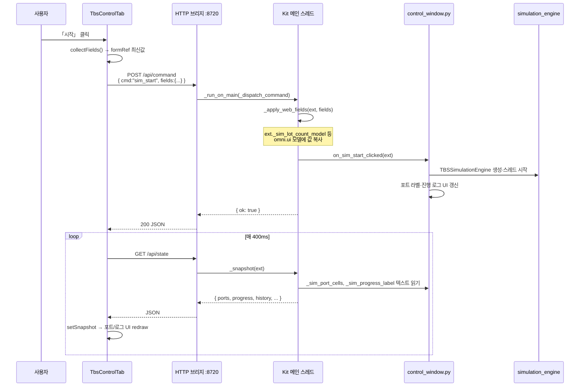

# TBS 확장 API → 웹(control-tab) 적용 흐름 가이드

> **대상:** `TbsControlTab.tsx` 를 읽을 때 「버튼을 누면 Kit에서 실제로 무슨 일이 일어나는지」를 따라가기 위한 문서  
> **관련 코드:** `kit_remote_http_bridge.py`, `control_window.py`, `web/streaming_ui/TbsControlTab.tsx`

---

## 1. 전체 그림 — 웹과 Kit는 어떻게 연결되는가

```
┌─────────────────────────────────────────────────────────────────────────┐
│  회사 React 앱 (Vite :5173)                                              │
│  ┌──────────────────────┐   ┌──────────────────────────────────────┐  │
│  │ control-tab          │   │ kit-app-streaming-area                 │  │
│  │ TbsControlTab.tsx    │   │ StreamManager (WebRTC)                 │  │
│  │                      │   │ → Viewport 영상만                       │  │
│  │ fetch /api/*  ───────┼───┼──► (스트리밍과 무관)                    │  │
│  └──────────────────────┘   └──────────────────────────────────────┘  │
└───────────────────────────────┬─────────────────────────────────────────┘
                                │ HTTP (프록시 또는 :8720 직접)
                                ▼
┌─────────────────────────────────────────────────────────────────────────┐
│  Kit 프로세스 (morph.editor.kit + morph.tbs_control_2)                   │
│  ┌──────────────────────────────────────────────────────────────────┐  │
│  │ kit_remote_http_bridge.py  (ThreadingHTTPServer, 기본 :8720)      │  │
│  │   GET  /api/state      → _snapshot(ext)                           │  │
│  │   GET  /api/resources  → get_resource_usd_list()                  │  │
│  │   POST /api/command    → _dispatch_command(ext, body)             │  │
│  └───────────────────────────────┬──────────────────────────────────┘  │
│                                  │ _run_on_main (Kit 메인 스레드)       │
│                                  ▼                                      │
│  ┌──────────────────────────────────────────────────────────────────┐  │
│  │ extension.py (ext = TbsControl2Extension 인스턴스)                │  │
│  │   ext._sim_lot_count_model, ext._control_window, …                │  │
│  └───────────────────────────────┬──────────────────────────────────┘  │
│                                  ▼                                      │
│  control_window.py  ·  load_window.py  ·  sim_multi_view.py  ·  …       │
│  (Kit 데스크톱 제어창과 **동일** Python 함수 호출)                       │
└─────────────────────────────────────────────────────────────────────────┘
```

**핵심:** 웹은 **Kit UI(omni.ui)를 직접 조작하지 않습니다.**  
- **쓰기:** JSON `cmd` → 브리지 → Python 핸들러 (제어창 버튼과 같은 함수)  
- **읽기:** Kit가 이미 갱신해 둔 **라벨/포트셀 텍스트**를 JSON으로 **복사**해 옴 (`_snapshot`)

---

## 2. Kit 쪽 기동 — 브리지가 언제 켜지는가

1. `morph.editor.kit` 에 `morph.tbs_control_2` 확장 로드  
2. `extension.py` → `on_startup()`  
3. 환경변수 `TBS_REMOTE_UI=0` 이 **아니면** `start_tbs_remote_http_bridge(self)` 호출  
4. 백그라운드 스레드에서 `127.0.0.1:8720` (또는 `TBS_REMOTE_UI_PORT`) 에 HTTP 서버 대기  
5. `_ext_ref = ext` — 이후 모든 API가 **이 확장 인스턴스**를 가리킴  

웹(`TbsControlTab`)은 이 서버에 `fetch` 만 하면 됩니다.

---

## 3. 스레드 규칙 — 왜 `_run_on_main` 이 있는가

Kit의 USD·UI·시뮬은 **메인 스레드**에서만 안전합니다.  
HTTP 요청은 **별도 스레드**에서 들어오므로:

```
HTTP 스레드 (do_GET / do_POST)
    │
    └─► _run_on_main(lambda: _snapshot(ext))     또는
        _run_on_main(lambda: _dispatch_command(ext, data))
              │
              │  (큐에 넣고 Future.result() 대기)
              ▼
Kit update 이벤트 (_pump_main_queue)
    │
    └─► 실제 Python 함수 실행 (메인 스레드)
```

웹 입장에서는 `fetch` 가 **최대 ~120초** 블로킹될 수 있지만, 보통 sim_start 등은 그 안에 `{ "ok": true }` 를 받습니다.

---

## 4. 웹 쪽 — TbsControlTab 이 API를 쓰는 두 갈래

| 갈래 | 방향 | 웹 함수 | 주기/트리거 |
|------|------|---------|-------------|
| **읽기** | Kit → 웹 | `pollState()` | **400ms** `setInterval` |
| **쓰기** | 웹 → Kit | `apiCommand({ cmd, ... })` | 버튼·체크박스·일부 effect |

### 4.1 읽기: `pollState` → 화면 갱신

```text
[매 400ms]

TbsControlTab.pollState()
  → fetch GET http://127.0.0.1:8720/api/state
  → setSnapshot(json)
  → React re-render

snapshot 필드          →  웹 UI에 반영되는 것
─────────────────────────────────────────────
usd_status             →  USD Load 상태 줄
ports, port_header     →  포트 그리드 (BP1~EP3)
progress, history      →  진행현황 / 이력 로그 패널
ep_timeline            →  EpTimelinePanel (EP 막대)
channels[]             →  멀티 분할 시 SimMonitorColumn 여러 개
gate_pending           →  공정 확인 모달 표시/숨김
kit_chrome_hidden      →  「메뉴 숨기기」 체크박스 동기
viewport_split_count   →  1~4화면 radio 선택
per_screen_snapshots   →  「화면N 불러오기」 버튼 생성
```

**중요:** `progress`/`ports` 는 시뮬 엔진 JSON 이 아니라, Kit `control_window` 의 **라벨 텍스트**입니다.  
시뮬이 돌면 Kit UI가 먼저 갱신되고, 웹은 그 결과를 **따라 그립니다**.

### 4.2 쓰기: `apiCommand` → Kit 동작

```text
사용자 클릭 (예: 「시작」)
  → runCmd(() => apiCommand({ cmd: "sim_start", fields: collectFields() }))
  → fetch POST /api/command  body: JSON
  → Kit _dispatch_command
  → (성공) { "ok": true }
  → runCmd 가 busy 해제

이후 ~400ms 이내 pollState 가 새 progress/ports 를 가져옴
```

---

## 5. POST `/api/command` — cmd별 Kit 내부 연결

| cmd | 웹에서 보내는 것 | Kit에서 호출되는 것 |
|-----|------------------|---------------------|
| `apply_fields` | `{ fields: WebFields }` | `_apply_web_fields(ext, f)` → `ext._sim_*_model` 갱신 |
| `sim_start` | `{ fields }` (선택) | `_apply_web_fields` + **`on_sim_start_clicked(ext)`** |
| `sim_stop` | — | `on_sim_stop_clicked(ext)` |
| `sim_reset` | — | `on_sim_reset_clicked(ext)` |
| `load_usd` | `{ path, resource_index }` | path/콤보 반영 + **`load_window.on_load_usd(ext)`** |
| `xml_ok` | `{ fields }` | `_apply_web_fields` + `on_xml_ok_clicked(ext)` |
| `xml_run` | — | `on_xml_run_clicked(ext)` |
| `kit_chrome_hide` | `{ hidden: bool }` | `apply_kit_chrome_hidden(ext, hidden)` |
| `ui_windows` | `{ hide: bool }` | TBS 제어창·시퀀스 편집기 `visible` 토글 |
| `sim_viewport_split` | `{ count: 1..4 }` | `sim_multi_view.apply_sim_viewport_split_layout` |
| `save_sim_screen` | `{ screen: N }` | `_on_save_sim_settings_to_screen(ext, N)` |
| `apply_per_screen_snapshot` | `{ snapshot: {...} }` | `_apply_per_screen_snapshot` + EP 개수 동기 |
| `gate_confirm` | — | `_close_sim_gate_dialog` (공정 확인 통과) |
| `copy_progress` | — | `on_copy_sim_progress` (Kit 클립보드) |
| `prim_refresh` | — | `refresh_object_list(ext)` |

---

## 6. 예시 A — 「시뮬 시작」 전체 시퀀스 (가장 중요)



### 6.1 `_apply_web_fields` — fields 한 필드가 가는 곳

웹 `WebFields.lot_count` → `ext._sim_lot_count_model.set_value_as_int(...)`  
웹 `WebFields.fault_bp1` → `ext._sim_fault_bp1_model.set_value_as_bool(...)`  
… (전체 매핑은 `kit_remote_http_bridge._apply_web_fields`)

**즉:** 웹 입력 = Kit 제어창 위젯에 타이핑한 것과 **같은 모델**에 쓰입니다.

### 6.2 `on_sim_start_clicked` 이후

- Kit **데스크톱 제어창**과 **동일** 시뮬 엔진 기동  
- Viewport 애니·포트 상태는 Kit 내부에서 처리  
- 웹은 **`/api/state` 폴링**으로 결과만 표시  
- `confirm_each` 켜져 있으면 Kit가 `gate_pending` 을 state 에 넣고, 웹이 모달 → `gate_confirm` POST

---

## 7. 예시 B — 「USD Load」

```text
1. 마운트 시 loadResources()
     GET /api/resources → { items: [{name, path}, ...] }
     → USD 샘플 <select> 채움

2. 사용자 Load 클릭
     POST { cmd:"load_usd", path:"...", resource_index:1 }
     → ext._path_model, _resource_combo 반영
     → asyncio.ensure_future(load_window.on_load_usd(ext))
     → Kit 스테이지에 USD 오픈, 분할 UI 활성화 등

3. pollState 의 usd_status
     → load_window._load_status_label.text 를 _snapshot 이 읽음
     → 웹 USD Load 섹션 하단 상태 줄에 표시
```

---

## 8. 예시 C — EP 개수 변경 (웹만 바꿔도 Kit에 즉시 반영)

```text
사용자 EP 개수 2 → 3 변경
  → setField("ep_count_index", 1)
  → useEffect (ep_count_index 의존)
  → apiCommand({ cmd:"apply_fields", fields })
  → _apply_web_fields + on_sim_ep_count_changed
  → Kit: BP4/EP3 포트 칸 visible 변경

다음 pollState:
  snapshot.ep3_visible, bp4_visible
  → 웹 포트 그리드 EP3/BP4 칸 show/hide
```

---

## 9. `fields` 객체 — 웹 ↔ Kit 키 대응표 (요약)

| 웹 `fields` 키 | Kit 모델 / 동작 |
|----------------|-----------------|
| `lot_count` | `_sim_lot_count_model` |
| `ep_count_index` | `_sim_ep_count_combo` (0→EP2, 1→EP3) |
| `lot_spawn_min/max` | `_sim_lot_spawn_*_model` |
| `pickup_min/max` | `_sim_pickup_evt_*_model` |
| `foup_proc_min/max` | `_sim_foup_proc_*_model` |
| `init_bp1` … `init_ep3` | `_sim_init_*_model` |
| `fault_bp1` … `fault_ep3` | `_sim_fault_*_model` |
| `oht_min/max` | `_sim_oht_bp1_*_model` |
| `bp1_bp_min/max` | `_sim_bp1_bp_*_model` |
| `speed` | `_sim_speed_model` |
| `confirm_each` | `_sim_confirm_each_step_model` |
| `xml_seq_index` | `_xml_seq_combo` + `on_xml_seq_changed` |
| `priority_prefix` | `_priority_prefix_model` |
| `usd_path` | `_path_model` (load_usd 시) |

화면별 스냅샷(`per_screen_snapshots`)은 Kit 키 이름이 다름 (`spawn_min`, `pue_min` …) →  
웹 `perScreenSnapToWebFields()` 가 변환.

---

## 10. 회사 Vite 앱에서 URL이 어떻게 잡히는가

| 설정 | 웹 fetch URL | 설명 |
|------|--------------|------|
| Vite proxy `/api` → `:8720` | `fetch("/api/state")` | same-origin, **권장** |
| `VITE_TBS_KIT_API_BASE=http://127.0.0.1:8720` | `fetch("http://127.0.0.1:8720/api/state")` | CORS 허용됨 (브리지 `Access-Control-Allow-Origin: *`) |
| 미설정 + proxy 없음 | 기본 `:8720` 직접 | TbsControlTab `resolveApiBase()` fallback |

**스트리밍 URL**은 StreamManager 설정 — `apiBase` 와 **별개**입니다.

---

## 11. 웹에 **안** 오는 것 (한계)

| Kit 기능 | 웹 control-tab | 이유 |
|----------|----------------|------|
| Viewport 3D 화면 | ✗ (스트리밍 영역) | HTTP 브리지는 **텍스트/명령**만 |
| prim 드롭다운 목록 | △ 새로고침만 | `GET /api/prim_list` 없음 — Kit 창에서만 목록 UI |
| 시퀀스 JSON 편집기 | ✗ | 별도 Window, cmd 없음 |
| FOUP EP별 라벨 줄 | △ progress 텍스트에 포함 | 전용 state 필드 없음 |

---

## 12. TbsControlTab.tsx 에서 흐름 따라 읽는 순서 (추천)

1. **`resolveApiBase` / `apiCommand` / `pollState`** — HTTP 진입점  
2. **`useEffect` (setInterval pollState)** — 읽기 루프  
3. **`runCmd` + 버튼 `onClick`** — 쓰기 패턴  
4. **`collectFields` + `formRef`** — sim_start 시 stale 값 방지  
5. **JSX `§6.5 시뮬레이션`** — UI ↔ cmd 매핑 주석  
6. Kit 쪽 **`kit_remote_http_bridge._dispatch_command`** — cmd 실제 처리  

---

## 13. 변경 이력

| 날짜 | 내용 |
|------|------|
| 2026-05-28 | 초안 — API 읽기/쓰기·스레드·sim_start 시퀀스·fields 매핑 |
